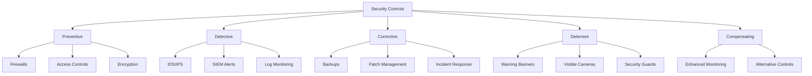
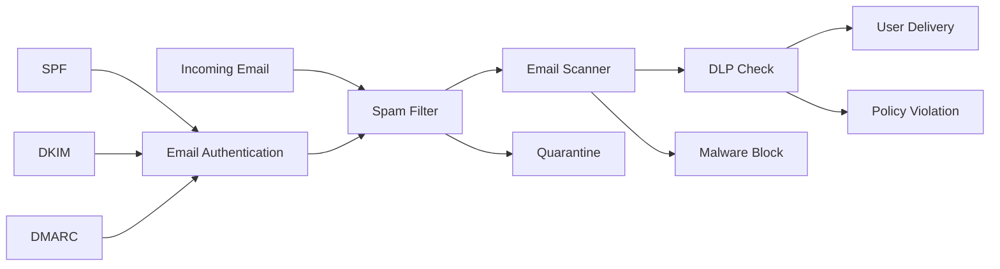

# Module 1: Security Fundamentals

Security fundamentals form the bedrock of any effective cybersecurity program. This module covers essential concepts, technologies, and frameworks that every blue team professional must understand to build and maintain robust defensive postures.

---

## 🎯 Learning Objectives

By completing this module, you will understand:
- Core security principles and control classifications
- Physical and endpoint security fundamentals
- Network architecture and security controls
- Email security mechanisms and threat mitigation
- Risk management frameworks and compliance requirements
- Authentication, authorization, and accountability (AAA)

---

## 📚 Module Contents

### Core Security Concepts
- [**01: Core Concepts**](./01-core-concepts.md)
  - Physical security controls and classifications
  - Endpoint protection strategies (HIDS/HIPS, AV, EDR/XDR)
  - Security control categories (Preventive, Detective, Corrective)
  - Vulnerability scanning approaches

### Network Foundations
- [**02: Networking Essentials**](./02-networking-essentials.md)
  - OSI Model and protocol stack
  - TCP vs. UDP vs. ICMP comparison
  - Essential ports and services
  - Network devices and their functions
  - Command-line diagnostic tools

### Network Defense Systems
- [**03: Network Security Controls**](./03-network-security-controls.md)
  - NIDS vs. NIPS deployment strategies
  - Log monitoring and SIEM integration
  - Network Access Control (NAC) implementation
  - Traffic analysis and threat detection

### Email Protection
- [**04: Email Security**](./04-email-security.md)
  - Spam filtering techniques and technologies
  - Email scanning and malware detection
  - Data Loss Prevention (DLP) policies
  - Anti-phishing measures

### Governance and Compliance
- [**05: Management & Compliance**](./05-management-and-compliance.md)
  - AAA framework implementation
  - Risk management methodologies
  - Policy development and documentation
  - Regulatory compliance frameworks (GDPR, PCI DSS, HIPAA)

---

## 🛡️ Security Control Framework



---

## 🔧 Essential Tools and Technologies

| Category | Tools/Technologies | Purpose | Key Features |
|----------|-------------------|---------|--------------|
| **Network Analysis** | `ping`, `traceroute`, `netstat`, `nmap` | Network diagnostics and discovery | Connectivity testing, path analysis |
| **DNS Tools** | `nslookup`, `dig` | Domain name resolution | DNS queries and troubleshooting |
| **Traffic Monitoring** | NIDS/NIPS, Firewalls, Proxy logs | Network security monitoring | Real-time threat detection |
| **Email Security** | SPF, DKIM, DMARC | Anti-spoofing protection | Email authentication |
| **Endpoint Protection** | EDR/XDR, Antivirus, HIPS | Host-based security | Malware detection and response |
| **Access Control** | NAC, 802.1X, Certificates | Network access management | Device authentication and compliance |

---

## 📊 OSI Model Reference

| Layer | Name | Protocols/Technologies | Security Considerations |
|-------|------|----------------------|-------------------------|
| **7** | Application | HTTP(S), SMTP, DNS, FTP | Application firewalls, DLP, email security |
| **6** | Presentation | TLS/SSL, JPEG, encryption | Data encryption, compression security |
| **5** | Session | APIs, NetBIOS, session tokens | Session management, authentication |
| **4** | Transport | TCP, UDP | Stateful firewalls, port filtering |
| **3** | Network | IP, ICMP, routing protocols | Network firewalls, IPS, routing security |
| **2** | Data Link | Ethernet, MAC addressing, switches | MAC filtering, VLAN segmentation |
| **1** | Physical | Cables, hubs, wireless signals | Physical security, cable protection |

---

## 🌐 Common Ports and Security Implications

| Port | Protocol | Service | Security Notes |
|------|----------|---------|----------------|
| **21** | FTP | File Transfer | ⚠️ Insecure - use SFTP (22) instead |
| **22** | SSH | Secure Shell | ✅ Encrypted remote access |
| **25** | SMTP | Email Transfer | ⚠️ Often targeted for spam relay |
| **53** | DNS | Name Resolution | 🔍 Monitor for DNS tunneling |
| **80** | HTTP | Web Traffic | ⚠️ Unencrypted - prefer HTTPS (443) |
| **443** | HTTPS | Secure Web | ✅ Encrypted web communications |
| **445** | SMB | File Sharing | 🔍 Common attack vector - monitor closely |
| **3389** | RDP | Remote Desktop | 🔍 Frequent brute-force target |

---

## 📋 Risk Management Matrix

| Risk Level | Likelihood | Impact | Treatment Strategy | Examples |
|------------|------------|--------|-------------------|----------|
| **Critical** | High | High | Immediate mitigation | Zero-day exploits, data breaches |
| **High** | High | Medium OR Medium | High | Priority patching, enhanced monitoring |
| **Medium** | Medium | Medium | Planned mitigation | Routine vulnerabilities, policy gaps |
| **Low** | Low | Low | Accept or monitor | Minor configuration issues |

### Risk Treatment Options
- **🛡️ Mitigation**: Implement controls to reduce risk
- **📋 Transfer**: Shift risk to third parties (insurance, outsourcing)
- **✅ Acceptance**: Acknowledge and tolerate acceptable risk
- **🚫 Avoidance**: Eliminate the risk-causing activity

---

## 📧 Email Security Framework



---

## 🏛️ Compliance Framework Comparison

| Framework | Scope | Key Requirements | Industry Focus |
|-----------|-------|------------------|----------------|
| **GDPR** | EU Data Protection | Consent, data minimization, breach notification | All organizations processing EU citizen data |
| **PCI DSS** | Payment Card Security | Secure networks, protect cardholder data, regular testing | Organizations handling credit card data |
| **HIPAA** | Healthcare Data | Administrative, physical, technical safeguards | Healthcare providers and business associates |
| **ISO 27001** | Information Security | Risk management, ISMS, continual improvement | Global standard for all organizations |

---

## 🔐 AAA Framework Implementation

| Component | Technologies | Implementation Examples |
|-----------|-------------|------------------------|
| **Authentication** | Passwords, MFA, biometrics, certificates | Active Directory, LDAP, SAML, OAuth |
| **Authorization** | RBAC, ACLs, policies | Permission groups, file system ACLs |
| **Accountability** | Logging, auditing, SIEM | Event logs, access logs, compliance reports |

---

## 🚨 Network Security Controls Comparison

| Control Type | NIDS | NIPS | Firewall | NAC |
|--------------|------|------|----------|-----|
| **Deployment** | Passive (SPAN port) | Inline | Inline | Inline |
| **Primary Function** | Detection & alerting | Prevention & blocking | Traffic filtering | Access control |
| **Performance Impact** | Minimal | Moderate | Low | Moderate |
| **Failure Mode** | Fail open (no impact) | Fail closed (blocks traffic) | Fail closed | Fail closed |
| **Best Use Case** | Monitoring & forensics | Active threat prevention | Perimeter security | Device compliance |

---

## 📚 Policy Hierarchy

```mermaid
pyramid
    title Security Documentation Hierarchy
    "Guidelines" : 25
    "Procedures" : 35
    "Standards" : 40
    "Policies" : 50
```

- **Policies**: High-level statements of intent (*What* we do)
- **Standards**: Mandatory rules supporting policies (*How* we do it consistently)
- **Procedures**: Step-by-step task instructions (*How* to perform specific tasks)
- **Guidelines**: Recommended best practices (*What* we suggest)

---

## 🔗 Quick Reference Resources

- [NIST Cybersecurity Framework](https://www.nist.gov/cyberframework)
- [SANS Security Controls](https://www.sans.org/critical-security-controls/)
- [OWASP Security Guidelines](https://owasp.org/)
- [CIS Controls](https://www.cisecurity.org/controls)
- [ISO 27001 Standard](https://www.iso.org/isoiec-27001-information-security.html)

---

[⬆️ Back to Main Course](../README.md)
