# Module 2: Phishing Analysis

Phishing attacks remain one of the most prevalent and effective cyber threats. This module provides a comprehensive methodology for analyzing phishing emails, from initial artifact collection through final reporting and defensive implementation.

---

## 🎯 Learning Objectives

By completing this module, you will understand:
- Email structure and header analysis techniques
- Safe artifact collection and handling procedures
- URL and file reputation analysis methodologies
- Malware sandboxing and behavioral analysis
- Defensive countermeasures (preventive and reactive)
- Professional report writing and artifact sanitization

---

## 📚 Module Contents

### Email Fundamentals and Collection
- [**01: Email Anatomy and Artifact Collection**](./01-email-anatomy-and-collection.md)
  - Email header structure and manipulation techniques
  - Key header fields (`From`, `Reply-To`, `Received`, `Message-ID`)
  - Manual vs. automated artifact collection
  - PhishTool automation capabilities

### Threat Assessment and Analysis
- [**02: Artifact Analysis and Sandboxing**](./02-artifact-analysis-and-sandboxing.md)
  - URL reputation and safe visualization
  - File hash analysis and malware detection
  - Static vs. dynamic analysis approaches
  - Malware sandboxing with Hybrid Analysis
  - MITRE ATT&CK technique mapping

### Defense Implementation
- [**03: Defensive Measures**](./03-defensive-measures.md)
  - Preventive controls (SPF, DKIM, DMARC)
  - Email filtering and sandboxing
  - User awareness training strategies
  - Reactive response procedures
  - Blocking tactics across control points

### Documentation and Reporting
- [**04: Report Writing**](./04-report-writing.md)
  - Professional report structure and formatting
  - Artifact sanitization (defanging) techniques
  - Evidence documentation standards
  - Defensive action tracking

---

## 🔍 Phishing Investigation Workflow

```mermaid
graph TD
    A[📧 Suspicious Email Received] --> B[🔒 Safe Environment Setup]
    B --> C[📋 Artifact Collection]
    C --> D{Automated or Manual?}
    
    D -->|Automated| E[🛠️ PhishTool Analysis]
    D -->|Manual| F[👁️ Manual Extraction]
    
    E --> G[🔍 Reputation Analysis]
    F --> G
    
    G --> H[📊 URL Analysis]
    G --> I[🗂️ File Analysis]
    
    H --> J[🖼️ Safe Visualization]
    H --> K[🌐 WHOIS Lookup]
    
    I --> L[📈 VirusTotal Check]
    I --> M[🧪 Sandbox Analysis]
    
    J --> N[📝 Verdict Determination]
    K --> N
    L --> N
    M --> N
    
    N --> O[🛡️ Defensive Actions]
    O --> P[📄 Report Writing]
    P --> Q[📬 User Notification]
```



---

## 🔧 Essential Tools and Platforms

| Category | Tools | Purpose | Key Features |
|----------|-------|---------|--------------|
| **Artifact Collection** | PhishTool, Text editors | Extract IOCs from emails | Automated parsing, hash generation |
| **URL Analysis** | URLScan.io, URL2PNG, VirusTotal | Safe visualization and reputation | Screenshot capture, blacklist checking |
| **File Analysis** | VirusTotal, Cisco Talos, Hybrid Analysis | Malware detection and behavior | Multi-engine scanning, sandbox execution |
| **Domain Intelligence** | WHOIS, URLhaus, PhishTank | Domain reputation and history | Registration data, community feeds |
| **Sandboxing** | Hybrid Analysis, Any.run, Joe Sandbox | Dynamic malware analysis | Behavioral monitoring, MITRE mapping |
| **Artifact Sanitization** | CyberChef, Manual defanging | Safe IOC sharing | URL/IP defanging operations |

---

## 📧 Email Header Analysis Guide

| Header Field | Security Significance | Analysis Technique |
|--------------|----------------------|-------------------|
| **From** | Easily spoofed display address | ⚠️ Never trust alone - verify with authentication |
| **Reply-To** | Alternate response address | 🔍 Often redirects to attacker-controlled email |
| **Received** | Mail server routing trail | 📍 Read bottom-to-top for true origin IP |
| **Message-ID** | Unique email identifier | 🔍 Search logs for campaign correlation |
| **X-Sender-IP** | Actual sending IP address | 🌐 Check reputation and geolocation |
| **Authentication-Results** | SPF/DKIM/DMARC status | ✅ Verify legitimate vs. spoofed domains |

---

## 🛡️ Defensive Control Points

```mermaid
graph LR
    A[📧 Phishing Email] --> B[Email Gateway]
    A --> C[Web Proxy]
    A --> D[DNS Server]
    A --> E[Endpoint Protection]
    
    B --> B1[Block Sender]
    B --> B2[Block Domain]
    B --> B3[Block Subject]
    
    C --> C1[Block URLs]
    C --> C2[Block Domains]
    
    D --> D1[DNS Blackholing]
    D --> D2[Educational Pages]
    
    E --> E1[Block File Hashes]
    E --> E2[Quarantine Files]
```



### Blocking Decision Matrix

| Infrastructure Type | Block Scope | When to Use | Risk Level |
|---------------------|-------------|-------------|------------|
| **Exclusive Malicious** | Entire domain/IP | Infrastructure solely for attacks | ✅ Low Risk |
| **Compromised Legitimate** | Specific URLs only | Legitimate sites hosting malicious content | ⚠️ Medium Risk |
| **Shared Hosting** | Targeted paths/parameters | Multiple sites on same infrastructure | 🔍 Requires Analysis |

---

## 🔍 Artifact Collection Checklist

### Email Artifacts
- [ ] **Sender Information**
  - [ ] Display name and email address
  - [ ] Reply-To address (if different)
  - [ ] Actual sending IP address
- [ ] **Message Details**
  - [ ] Subject line and Message-ID
  - [ ] Recipient list
  - [ ] Timestamp and timezone
- [ ] **Authentication Status**
  - [ ] SPF, DKIM, DMARC results
  - [ ] Domain reputation

### Web Artifacts
- [ ] **URL Analysis**
  - [ ] Full URLs (all links in email)
  - [ ] Root domains and subdomains
  - [ ] URL parameters and paths
- [ ] **Domain Intelligence**
  - [ ] WHOIS registration data
  - [ ] Domain age and registrar
  - [ ] DNS resolution details

### File Artifacts
- [ ] **Attachment Details**
  - [ ] Original filename
  - [ ] File type and size
  - [ ] SHA256 hash (primary)
  - [ ] MD5 hash (secondary)
- [ ] **Embedded Content**
  - [ ] Images with hidden links
  - [ ] Macros or scripts
  - [ ] Archive contents

---

## 📊 Analysis Techniques Comparison

| Analysis Type | Speed | Depth | Safety | Best Use Case |
|---------------|-------|-------|--------|---------------|
| **Static Analysis** | ⚡ Fast | 📖 Surface | ✅ Very Safe | Initial triage, known indicators |
| **Dynamic Analysis** | 🐌 Slow | 🔬 Deep | ⚠️ Controlled | Unknown files, behavior analysis |
| **Reputation Checks** | ⚡ Instant | 📊 Historical | ✅ Safe | Quick verdict, community intelligence |
| **Sandboxing** | ⏱️ Moderate | 🎯 Behavioral | ✅ Isolated | Zero-day detection, TTPs |

---

## 🚨 Phishing Indicators and Red Flags

### Email Characteristics
- **Urgency Language**: "Act now", "Limited time", "Immediate action required"
- **Generic Greetings**: "Dear Customer" instead of specific names
- **Grammar/Spelling**: Poor language quality and obvious mistakes
- **Mismatched URLs**: Display text doesn't match actual destination
- **Suspicious Attachments**: Unexpected files, double extensions

### Technical Indicators
- **Failed Authentication**: SPF, DKIM, or DMARC failures
- **Suspicious Headers**: Mismatched routing, suspicious X-headers
- **New Domains**: Recently registered domains (< 30 days)
- **Suspicious IPs**: Known malicious ranges, residential IPs for business email

---

## 📝 Report Template Structure

```
1. Executive Summary
   └── One-sentence threat description
   
2. Email Artifacts
   ├── Header analysis (sender, IP, authentication)
   ├── Subject and content analysis
   └── Recipient impact assessment
   
3. Technical Analysis
   ├── URL analysis and verdict
   ├── File analysis (if attachments)
   └── IOC reputation checks
   
4. Defensive Actions Taken
   ├── Immediate blocking measures
   ├── User notifications sent
   └── Preventive controls updated
   
5. Recommendations
   ├── Additional security measures
   ├── User training needs
   └── Process improvements
```

---

## 🔐 Artifact Sanitization (Defanging) Reference

| Original | Defanged | Purpose |
|----------|----------|---------|
| `https://evil.com` | `hxxps://evil[.]com` | Prevent accidental clicks |
| `http://malware.net` | `hxxp://malware[.]net` | Break hyperlink functionality |
| `192.168.1.1` | `192[.]168[.]1[.]1` | Prevent automatic IP recognition |
| `user@domain.com` | `user[@]domain[.]com` | Prevent email client activation |

### CyberChef Defanging Recipe
1. **Defang URL** operation
2. **Defang IP Addresses** operation
3. **Find/Replace** for custom patterns

---

## 🎯 Preventive vs. Reactive Measures

### Preventive Measures (Proactive)
- **Email Authentication**: SPF, DKIM, DMARC implementation
- **Content Filtering**: Spam filters, attachment restrictions
- **User Training**: Awareness programs, simulated phishing
- **Technical Controls**: Sandboxing, link protection

### Reactive Measures (Incident Response)
- **Immediate Actions**: Email retrieval, user notification
- **Analysis Phase**: Artifact collection, reputation checking
- **Containment**: IOC blocking, system isolation
- **Recovery**: User remediation, security updates

---

## 🔗 Quick Reference Resources

- [PhishTool Community Platform](https://www.phishtool.com/)
- [URLScan.io Service](https://urlscan.io/)
- [VirusTotal Analysis](https://www.virustotal.com/)
- [Hybrid Analysis Sandbox](https://hybrid-analysis.com/)
- [SANS Phishing Resources](https://www.sans.org/phishing/)
- [Anti-Phishing Working Group](https://apwg.org/)

---

[⬆️ Back to Main Course](../README.md)
