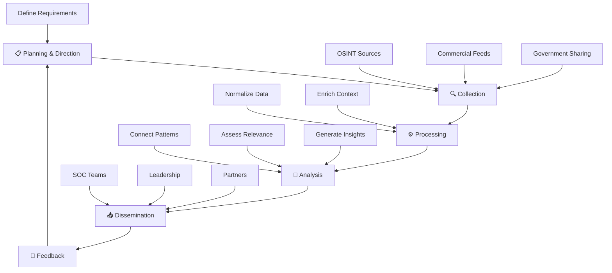
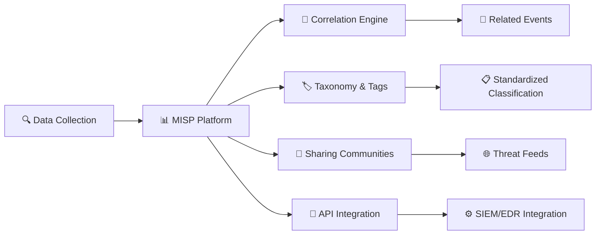
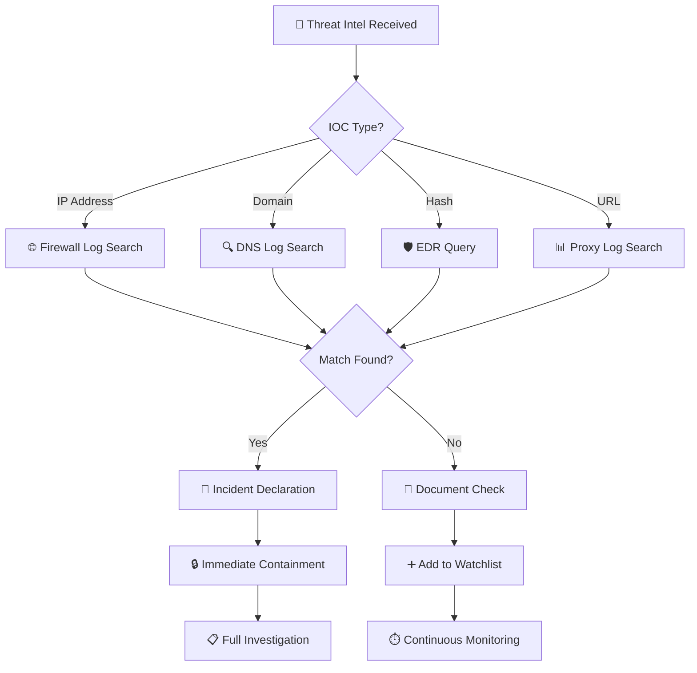
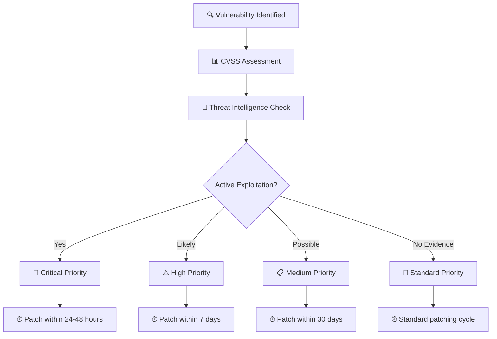

# Module 3: Threat Intelligence

Cyber Threat Intelligence (CTI) transforms raw data into actionable insights that enable organizations to anticipate, prevent, and respond to cyber threats. This module covers the complete intelligence lifecycle from collection through strategic application.

---

## 🎯 Learning Objectives

By completing this module, you will understand:
- The intelligence lifecycle and collection methodologies
- Threat actor categorization and TTPs analysis
- Strategic, operational, and tactical intelligence applications
- Attribution challenges and intelligence sharing protocols
- Threat intelligence platforms and automation
- IOC management and threat exposure assessments

---

## 📚 Module Contents

### Intelligence Foundations
- [**01: Introduction to Threat Intelligence**](./01-introduction-to-threat-intel.md)
  - CTI definition and intelligence lifecycle
  - Types of intelligence (OSINT, HUMINT, SIGINT, GEOINT)
  - Strategic vs. operational vs. tactical intelligence
  - Vulnerability intelligence and predictive prioritization

### Adversary Analysis
- [**02: Threat Actors and TTPs**](./02-threat-actors-and-ttp.md)
  - Threat actor categorization and motivations
  - Advanced Persistent Threats (APTs)
  - Vendor naming conventions
  - MITRE ATT&CK framework application

### Operational Intelligence
- [**03: Operational Intelligence**](./03-operational-intel.md)
  - Precursors vs. Indicators of Compromise (IOCs)
  - The Pyramid of Pain framework
  - Attribution challenges and methodologies
  - TTPs analysis and defensive mapping

### Tactical Implementation
- [**04: Tactical Intelligence and Platforms**](./04-tactical-intel-and-platforms.md)
  - Threat exposure checks and workflows
  - IOC watchlist management
  - Threat Intelligence Platforms (TIPs)
  - MISP platform capabilities

### Strategic Intelligence
- [**05: Strategic Intelligence**](./05-strategic-intel.md)
  - Intelligence sharing and partnerships (ISACs)
  - Traffic Light Protocol (TLP)
  - Permissible Action Protocol (PAP)
  - Community collaboration frameworks

---

## 🔄 Intelligence Lifecycle



---

## 🎭 Threat Actor Landscape

| Actor Type | Primary Motivation | Sophistication | Persistence | Examples |
|------------|-------------------|----------------|-------------|----------|
| **🏴‍☠️ Cyber Criminals** | Financial gain | Low to High | Moderate | Ransomware groups, fraud syndicates |
| **🏛️ Nation-States (APTs)** | Espionage, sabotage | Very High | Very High | APT28 (Fancy Bear), APT1 (Comment Crew) |
| **✊ Hacktivists** | Political/social causes | Low to Moderate | Low | Anonymous, Syrian Electronic Army |
| **🏢 Insider Threats** | Various (revenge, money) | Varies | High | Disgruntled employees, compromised accounts |

### APT Naming Conventions

| Security Vendor | Naming Pattern | Example | Focus |
|-----------------|----------------|---------|-------|
| **CrowdStrike** | `[Animal] [Adjective]` based on origin | Fancy Bear (Russia) | Country-based categorization |
| **Mandiant/FireEye** | `APTxx` for nation-states, `FINxx` for financial | APT28, FIN7 | Numerical tracking system |
| **Microsoft** | Chemical elements | Nobelium, Hafnium | Periodic table elements |
| **Kaspersky** | Geographic/cultural terms | Lazarus, Equation Group | Descriptive naming |

---

## 🏗️ Intelligence Pyramid (Levels)

```
                    ┌─────────────────────┐
                    │   STRATEGIC         │ ← Leadership decisions
                    │   Intelligence      │   (Risks, trends, geopolitics)
                    └─────────────────────┘
                           │
                    ┌─────────────────────┐
                    │   OPERATIONAL       │ ← Security managers
                    │   Intelligence      │   (TTPs, campaigns, attribution)
                    └─────────────────────┘
                           │
                    ┌─────────────────────┐
                    │   TACTICAL          │ ← SOC analysts
                    │   Intelligence      │   (IOCs, signatures, rules)
                    └─────────────────────┘
```

| Level | Audience | Timeframe | Focus | Actionability |
|-------|----------|-----------|-------|---------------|
| **Strategic** | C-Suite, Board | Months/Years | Business impact, risk trends | Policy decisions, budget allocation |
| **Operational** | Security managers, IR teams | Weeks/Months | Adversary TTPs, campaign analysis | Response procedures, hunting |
| **Tactical** | SOC analysts, Engineers | Hours/Days | IOCs, signatures, technical details | Immediate blocking, detection rules |

---

## ⚡ The Pyramid of Pain

```mermaid
pyramid
    title Adversary Adaptation Difficulty
    "Hash Values" : 10
    "IP Addresses" : 20
    "Domain Names" : 35
    "Network/Host Artifacts" : 50
    "Tools" : 70
    "TTPs" : 90
```

| Level | Detection Focus | Adversary Pain | Change Difficulty | Examples |
|-------|----------------|----------------|-------------------|----------|
| **🔥 TTPs** | Behavioral patterns | 😭 Maximum | Fundamental retooling | PowerShell usage, lateral movement techniques |
| **🛠️ Tools** | Specific software | 😫 Very High | Find/develop alternatives | Cobalt Strike, Mimikatz, custom malware |
| **📊 Network/Host Artifacts** | Unique signatures | 😖 High | Modify code/configs | Registry keys, user agents, file paths |
| **🌐 Domain Names** | Infrastructure | 😒 Moderate | Register new domains | C2 domains, phishing sites |
| **📍 IP Addresses** | Network indicators | 😑 Low | Change hosting/proxies | C2 IPs, malicious hosts |
| **# Hash Values** | File signatures | 😄 Trivial | Single bit change | File hashes, malware samples |

---

## 🔧 Threat Intelligence Tools Ecosystem

| Category | Tools/Platforms | Purpose | Key Features |
|----------|----------------|---------|--------------|
| **Collection** | Shodan, Censys, Social media APIs | OSINT gathering | Internet scanning, public data |
| **Processing** | STIX/TAXII, Custom parsers | Data normalization | Standard formats, automated ingestion |
| **Analysis** | MITRE ATT&CK Navigator, Maltego | Pattern analysis | TTP mapping, link analysis |
| **Sharing** | MISP, ThreatConnect, Anomali | Intelligence platforms | Community sharing, correlation |
| **Application** | SIEM integrations, EDR feeds | Operational use | Automated blocking, alerting |

### Featured Platform: MISP Capabilities



---

## 🚨 IOC Management Workflow

### Threat Exposure Check Process



### Watchlist Management

| IOC Type | Retention Period | Auto-Expiry | Review Frequency |
|----------|-----------------|-------------|------------------|
| **Critical APT IOCs** | 2+ years | No | Quarterly |
| **Commodity Malware** | 6-12 months | Yes | Monthly |
| **Phishing Infrastructure** | 3-6 months | Yes | Bi-weekly |
| **Suspicious but Unconfirmed** | 30-90 days | Yes | Weekly |

---

## 🤝 Intelligence Sharing Protocols

### Traffic Light Protocol (TLP)

| Classification | Color | Sharing Restrictions | Use Case |
|----------------|-------|---------------------|----------|
| **TLP:CLEAR** | ⚪ White | No restrictions, publicly shareable | Public threat reports, IOC feeds |
| **TLP:GREEN** | 🟢 Green | Community sharing only | ISAC member intelligence |
| **TLP:AMBER** | 🟡 Amber | Organization + need-to-know partners | Internal + trusted partners |
| **TLP:AMBER+STRICT** | 🟠 Amber+ | Organization only, no external sharing | Sensitive internal intelligence |
| **TLP:RED** | 🔴 Red | Recipient eyes only | Classified or highly sensitive data |

### Permissible Action Protocol (PAP)

| Classification | Allowed Actions | Restrictions | Intelligence Value |
|----------------|----------------|--------------|-------------------|
| **PAP:CLEAR** | ⚪ No restrictions | Can act freely | High operational value |
| **PAP:GREEN** | 🟢 Defensive actions permitted | Block, monitor, hunt | Moderate operational value |
| **PAP:AMBER** | 🟡 Passive observation only | No blocking actions | Intelligence gathering |
| **PAP:RED** | 🔴 Extreme caution required | No attributable actions | Strategic intelligence only |

---

## 📊 Vulnerability Intelligence Framework

### CVE vs. CVSS vs. Predictive Scoring

| Metric | Purpose | Limitations | Best Use |
|--------|---------|-------------|----------|
| **CVE** | Unique vulnerability identifier | No priority guidance | Tracking and communication |
| **CVSS** | Static severity scoring (0-10) | Doesn't reflect real-world risk | Initial assessment |
| **VPR/EPSS** | Predictive exploitation likelihood | Requires threat intelligence | Patch prioritization |

### Threat-Informed Vulnerability Management



---

## 🏛️ Information Sharing Organizations

### Industry-Specific ISACs

| ISAC | Industry Focus | Key Services | Member Benefits |
|------|----------------|--------------|-----------------|
| **FS-ISAC** | Financial Services | Threat sharing, incident coordination | Real-time financial threats |
| **H-ISAC** | Healthcare | Medical device security, patient data protection | Healthcare-specific IOCs |
| **E-ISAC** | Energy/Utilities | Critical infrastructure protection | Power grid threat intelligence |
| **Aviation ISAC** | Aviation Industry | Airport/airline security | Transportation threat data |
| **Auto-ISAC** | Automotive | Connected vehicle security | Vehicle cybersecurity threats |

---

## 📈 CTI Program Maturity Model

| Maturity Level | Characteristics | Capabilities | Focus Areas |
|----------------|----------------|--------------|-------------|
| **🌱 Initial** | Ad-hoc, reactive | Basic IOC blocking | Threat feeds, signature updates |
| **📊 Managed** | Defined processes | Structured analysis | TIP implementation, workflows |
| **🎯 Integrated** | Cross-functional | Proactive hunting | MITRE ATT&CK mapping, automation |
| **🚀 Optimized** | Continuous improvement | Predictive analysis | Threat modeling, strategic planning |

---

## 🔍 MITRE ATT&CK Application

### Tactic Categories (The "Why")

| Phase | Tactic | Purpose | Common Techniques |
|-------|--------|---------|-------------------|
| **🚪 Initial Access** | T1566 | Gain entry | Phishing, exploits, supply chain |
| **⚙️ Execution** | T1059 | Run malicious code | Command line, scripts, malware |
| **🔒 Persistence** | T1547 | Maintain access | Registry, services, scheduled tasks |
| **🆙 Privilege Escalation** | T1068 | Gain higher privileges | Exploits, credential access |
| **🙈 Defense Evasion** | T1055 | Avoid detection | Process injection, obfuscation |
| **🔑 Credential Access** | T1003 | Steal credentials | Dumping, keylogging, brute force |
| **🗺️ Discovery** | T1083 | Learn environment | File discovery, network scanning |
| **↔️ Lateral Movement** | T1021 | Spread through network | Remote services, admin shares |
| **📥 Collection** | T1005 | Gather target data | File collection, screen capture |
| **📡 Command & Control** | T1071 | Communicate with attackers | Application protocols, web services |
| **📤 Exfiltration** | T1041 | Steal data | Network protocols, removable media |
| **💥 Impact** | T1486 | Disrupt operations | Ransomware, data destruction |

---

## 🎯 Tactical Intelligence Operations

### Daily CTI Analyst Workflow

```
07:00 - 📰 Threat Feed Review
        ├── Government advisories (CISA, NCSC)
        ├── Commercial intelligence updates
        └── Community sharing platforms

09:00 - 🔍 Threat Exposure Checks
        ├── New IOCs against internal logs
        ├── Watchlist alert review
        └── False positive analysis

11:00 - 📊 Analysis & Enrichment
        ├── IOC contextualization
        ├── Campaign attribution
        └── TTP mapping to ATT&CK

14:00 - 🤝 Intelligence Sharing
        ├── Community contribution
        ├── Internal stakeholder updates
        └── Partner coordination

16:00 - 🛠️ Platform Management
        ├── TIP maintenance
        ├── Feed optimization
        └── Automation tuning
```

---

## 🔗 Essential CTI Resources

### Government Sources
- [CISA Cybersecurity Advisories](https://www.cisa.gov/cybersecurity-advisories)
- [NCSC Threat Reports](https://www.ncsc.gov.uk/threat-reports)
- [FBI Internet Crime Reports](https://www.ic3.gov/)

### Community Platforms
- [MISP Project](https://www.misp-project.org/)
- [ThreatConnect Community](https://threatconnect.com/)
- [OTX AlienVault](https://otx.alienvault.com/)

### Research & Analysis
- [MITRE ATT&CK](https://attack.mitre.org/)
- [NIST Cybersecurity Framework](https://www.nist.gov/cyberframework)
- [SANS CTI Resources](https://www.sans.org/cyber-threat-intelligence/)

---

[⬆️ Back to Main Course](../README.md)
