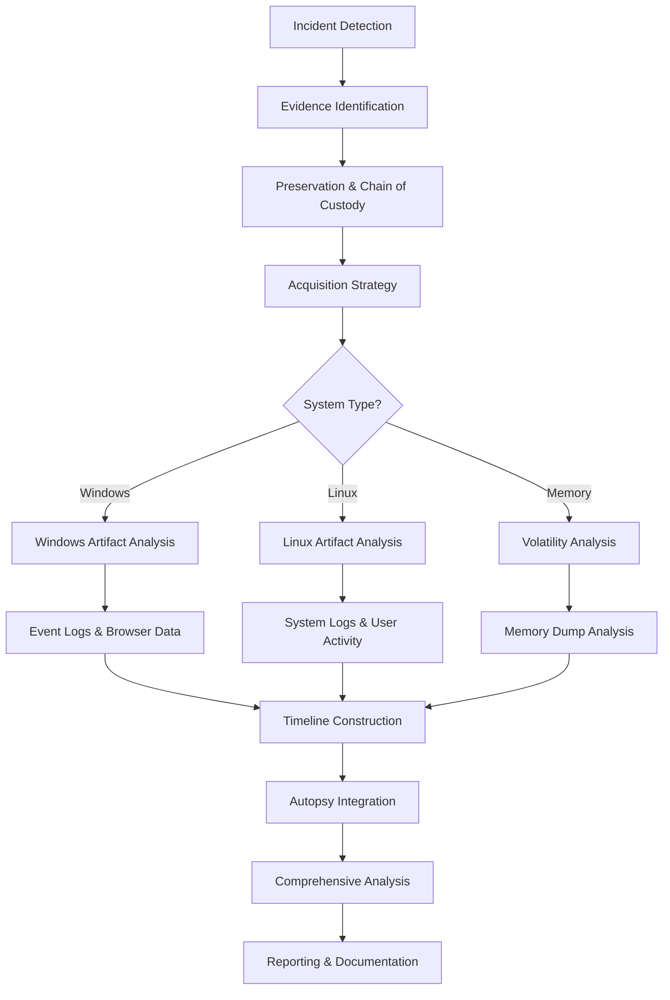

# Module 4: Digital Forensics

Digital forensics is the systematic process of collecting, preserving, analyzing, and presenting digital evidence in a legally admissible manner. This module covers the essential principles, methodologies, and tools required for conducting thorough digital investigations.

---

## 🎯 Learning Objectives

By completing this module, you will understand:
- Core forensic principles and legal requirements
- Evidence handling and chain of custody procedures
- Data acquisition and analysis techniques
- Windows and Linux artifact analysis
- Memory forensics and file system examination
- Advanced forensic frameworks and tools

---

## 📚 Module Contents

### Foundation Concepts
- [**01: Introduction to Digital Forensics**](./01-introduction-to-digital-forensics.md)
  - Forensic process overview and methodology
  - Core principles and terminology
  - Chain of custody fundamentals
  - Essential tools and techniques

- [**02: Data Representation and Encoding**](./02-data-representation-and-encoding.md)
  - Binary, hexadecimal, and octal systems
  - ASCII and Base64 encoding
  - CyberChef for data transformation
  - Obfuscation and encoding techniques

### Storage and File Systems
- [**03: Storage Media Fundamentals**](./03-storage-media-fundamentals.md)
  - Hard Disk Drives (HDD) and Solid-State Drives (SSD)
  - Storage mechanics and forensic challenges
  - Slack space and data recovery
  - Critical procedures for evidence preservation

- [**04: File Systems**](./04-file-systems.md)
  - Windows and Linux file system structures
  - File allocation and storage methods
  - File system identification and analysis
  - Journaling and recovery mechanisms

### Evidence Management
- [**05: Evidence Handling and Integrity**](./05-evidence-handling-and-integrity.md)
  - Digital evidence principles and handling
  - ACPO guidelines and best practices
  - Chain of custody documentation
  - Hash verification and integrity checks

- [**06: Memory and System Files**](./06-memory-and-system-files.md)
  - Memory forensics fundamentals
  - Windows and Linux system file analysis
  - Volatile data collection and preservation
  - Swap files and hibernation analysis

### Data Recovery and Analysis
- [**07: Metadata and File Carving**](./07-metadata-and-file-carving.md)
  - Metadata extraction techniques
  - File carving methods and tools
  - Hidden data discovery
  - Deleted file recovery

- [**08: Evidence Collection and Acquisition**](./08-evidence-collection-and-acquisition.md)
  - Forensic equipment and toolkits
  - Live vs. dead acquisition strategies
  - Imaging techniques and verification
  - Rapid triage and artifact collection

- [**09: Evidence Destruction**](./09-evidence-destruction.md)
  - Secure destruction methods
  - Physical vs. logical destruction
  - Compliance and regulatory requirements
  - Data sanitization standards

### Windows Forensic Analysis
- [**10: Windows Logon Events**](./10-windows-logon-events.md)
  - Windows Event Log analysis
  - Logon event types and interpretation
  - Authentication tracking and investigation
  - Timeline reconstruction from events

- [**11: Windows Browser Artifacts**](./11-windows-browser-artifacts.md)
  - Browser history and cache analysis
  - Cookie and session investigation
  - Download history and file tracking
  - Cross-browser artifact comparison

- [**12: Windows Recycle Bin Artifacts**](./12-windows-recycle-bin-artifacts.md)
  - Recycle Bin structure and analysis
  - Deleted file recovery techniques
  - User attribution and timeline analysis
  - Advanced investigation methodologies

### Linux Forensic Analysis
- [**13: Linux User Account Artifacts**](./13-linux-user-account-artifacts.md)
  - User account structure and analysis
  - Authentication logs and tracking
  - Permission analysis and investigation
  - Account activity reconstruction

- [**14: Linux System Logs and Package Management**](./14-linux-system-logs-and-package-management.md)
  - System log analysis and interpretation
  - Package management forensics
  - Installation and update tracking
  - System configuration analysis

- [**15: Linux User Activity and Hidden Files**](./15-linux-user-activity-and-hidden-files.md)
  - User activity tracking and analysis
  - Hidden file discovery and investigation
  - Shell history and command analysis
  - File access pattern analysis

- [**16: Linux Memory Artifacts**](./16-linux-memory-artifacts.md)
  - Linux memory structure and analysis
  - Process and kernel investigation
  - Memory dump acquisition and analysis
  - Volatile data extraction techniques

### Advanced Forensic Frameworks
- [**17: Introduction to Volatility Framework**](./17-intro-to-volatility-framework.md)
  - Volatility framework overview
  - Memory analysis capabilities
  - Plugin architecture and usage
  - Advanced memory investigation techniques

- [**18: Volatility Evolution and Modern Techniques**](./18-volatility-evolution-and-modern-techniques.md)
  - Evolution of memory analysis
  - Modern volatility techniques
  - Advanced plugin development
  - Cutting-edge analysis methods

- [**19: Introduction to Autopsy**](./19-intro-to-autopsy.md)
  - Autopsy digital forensics platform
  - Case management and workflow
  - Automated analysis capabilities
  - Reporting and documentation features

- [**20: Autopsy Practical Investigation**](./20-autopsy-practical-investigation.md)
  - Hands-on investigation techniques
  - Case study walkthroughs
  - Advanced analysis features
  - Real-world application scenarios

---

## 🔧 Key Tools and Technologies

| Tool Category | Tools | Purpose |
|---------------|-------|---------|
| **Memory Analysis** | Volatility Framework | RAM analysis and volatile data extraction |
| **Platform Investigation** | Autopsy Digital Forensics | Comprehensive case management and analysis |
| **Imaging & Acquisition** | FTK Imager, dd, KAPE | Creating forensic images and artifact collection |
| **File Analysis** | `exiftool`, `scalpel`, file carving tools | Metadata extraction and file recovery |
| **Windows Analysis** | Eric Zimmerman tools, Event Viewer | Windows-specific artifact parsing |
| **Linux Analysis** | CLI tools, log analyzers | Linux system and user activity analysis |

---

## 📊 Investigation Workflow

---

## 🖥️ Windows vs Linux Forensics

| Aspect | Windows Analysis | Linux Analysis |
|--------|-----------------|----------------|
| **Event Logging** | Windows Event Logs (Security, System, Application) | Syslog, auth.log, systemd journals |
| **User Artifacts** | Registry, Prefetch, Jump Lists | Shell history, .bashrc, user configs |
| **Browser Data** | Multiple browsers, consistent locations | Browser-specific locations, varied formats |
| **System Activity** | Logon events, process tracking | Command history, package management |
| **Memory Analysis** | Hibernation files, page files | Swap files, core dumps |
| **Tools** | Windows-specific parsers | Command-line utilities, log analyzers |

---

## 🧠 Memory Forensics Progression

### Volatility Framework Evolution
1. **Introduction to Volatility** - Basic concepts and framework overview
2. **Modern Techniques** - Advanced analysis and evolution of methods
3. **Practical Application** - Real-world investigation scenarios

### Key Memory Artifacts
- **Process Analysis** - Running processes and their characteristics
- **Network Connections** - Active and historical network activity
- **Registry Analysis** - In-memory registry examination
- **Malware Detection** - Hidden processes and code injection
- **Timeline Reconstruction** - Temporal analysis of memory contents

---

## 🔍 Platform-Specific Analysis

### Windows Investigation Focus
- **Authentication Events** - Logon/logoff patterns and anomalies
- **Browser Forensics** - Web activity and download analysis
- **File System Analysis** - NTFS artifacts and deleted file recovery
- **Registry Examination** - System and user configuration analysis

### Linux Investigation Focus
- **User Account Analysis** - Account creation, modification, and access
- **System Configuration** - Package installation and system changes
- **Log Analysis** - Comprehensive system and security log review
- **Command History** - Shell activity and user behavior analysis

---

## 🚀 Advanced Forensic Platforms

### Autopsy Digital Forensics Platform
- **Case Management** - Centralized investigation workflow
- **Automated Analysis** - Built-in modules and plugins
- **Timeline Analysis** - Comprehensive event correlation
- **Reporting Capabilities** - Professional investigation documentation

### Integration Benefits
- **Unified Interface** - Single platform for multiple analysis types
- **Automated Processing** - Reduced manual analysis overhead
- **Correlation Engine** - Cross-artifact analysis and linking
- **Collaborative Features** - Team-based investigation support

---

## 🔗 Essential Resources

### Memory Analysis
- [Volatility Foundation](https://www.volatilityfoundation.org/)
- [Memory Analysis Techniques](https://github.com/volatilityfoundation/volatility)

### Digital Forensics Platforms
- [Autopsy Digital Forensics](https://www.autopsy.com/)
- [SANS Digital Forensics](https://www.sans.org/cyber-security-courses/digital-forensics/)

### Standards and Guidelines
- [NIST Digital Forensics Framework](https://www.nist.gov/cyberframework)
- [ACPO Digital Evidence Guidelines](https://www.college.police.uk/)

### Tool Collections
- [Eric Zimmerman Tools](https://ericzimmerman.github.io/)
- [DFIR Tool Collection](https://github.com/ForensicArtifacts/artifacts)

---

[⬆️ Back to Main Course](../README.md)
