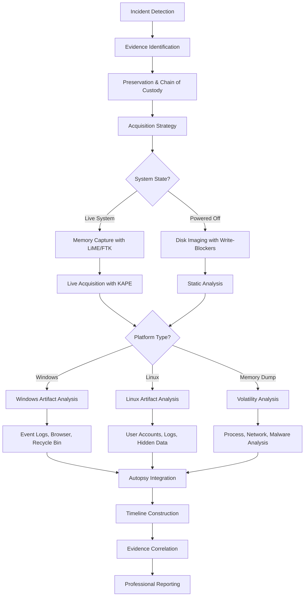

# Module 4: Digital Forensics

Digital forensics is the systematic process of collecting, preserving, analyzing, and presenting digital evidence in a legally admissible manner. This module covers the essential principles, methodologies, and tools required for conducting thorough digital investigations.

---

## 🎯 Learning Objectives

By completing this module, you will understand:
- Core forensic principles and legal requirements
- Evidence handling and chain of custody procedures
- Data acquisition and analysis techniques
- Windows and Linux artifact analysis
- Memory forensics and advanced analysis frameworks
- Professional investigation platforms and workflows

---

## 📚 Module Contents

### Foundation Concepts
- [**01: Introduction to Digital Forensics**](./01-introduction-to-digital-forensics.md)
  - The digital forensics process (Identification, Preservation, Collection, Analysis, Reporting)
  - Core principles (Chain of Custody, Write-Blocking)
  - Essential tools and terminology (IOCs, TTPs, PCAP, FTK Imager, KAPE)

- [**02: Data Representation and Encoding**](./02-data-representation-and-encoding.md)
  - Binary, hexadecimal, octal, and Base64 encoding
  - ASCII character encoding standards
  - CyberChef for data transformation and analysis

### Storage and File Systems
- [**03: Storage Media Fundamentals**](./03-storage-media-fundamentals.md)
  - HDD mechanics (platters, sectors, clusters, slack space)
  - SSD challenges (TRIM, garbage collection, wear leveling)
  - Critical forensic procedures for evidence preservation

- [**04: File Systems**](./04-file-systems.md)
  - Windows file systems (FAT16/32, NTFS features and security)
  - Linux file systems (Ext3/4, journaling capabilities)
  - File system identification using FTK Imager

### Evidence Management
- [**05: Evidence Handling and Integrity**](./05-evidence-handling-and-integrity.md)
  - Digital evidence definition and fragility
  - ACPO principles for evidence handling (4 core principles)
  - Chain of custody maintenance and hash verification (MD5, SHA1, SHA256)
  - Order of volatility (RFC 3227 guidelines)

- [**06: Memory and System Files**](./06-memory-and-system-files.md)
  - Memory forensics importance (fileless malware, runtime activity)
  - Windows system files (Pagefile.sys, hiberfil.sys)
  - Linux swap space analysis and commands

### Data Recovery and Analysis
- [**07: Metadata and File Carving**](./07-metadata-and-file-carving.md)
  - Metadata extraction with `exiftool`
  - File carving using `scalpel` (configuration and workflow)
  - Permission management with `chown` command

- [**08: Evidence Collection and Acquisition**](./08-evidence-collection-and-acquisition.md)
  - Forensic equipment toolkit (write-blockers, Faraday bags, documentation)
  - Live forensics importance and techniques
  - FTK Imager disk imaging workflow
  - KAPE rapid triage and artifact collection

- [**09: Evidence Destruction**](./09-evidence-destruction.md)
  - Physical destruction methods (shredding, hydraulic crushing, degaussing)
  - Secure wiping standards (DoD 5220.22-M three-pass method)
  - Reusable vs. permanent destruction decisions

### Windows Forensic Analysis
- [**10: Windows Logon Events**](./10-windows-logon-events.md)
  - Event log analysis (Security.evtx location)
  - Key event IDs (4624, 4625, 4634, 4672)
  - Logon types and session correlation techniques
  - Failed logon error codes and attack pattern detection

- [**11: Windows Browser Artifacts**](./11-windows-browser-artifacts.md)
  - Browser artifact categories (cookies, history, downloads, cache)
  - Live acquisition methods (KAPE, Browser History Capturer)
  - Analysis with Browser History Viewer (BHV)
  - Multi-browser forensics (Chrome, Firefox, Edge)

- [**12: Windows Recycle Bin Artifacts**](./12-windows-recycle-bin-artifacts.md)
  - Forensic significance and evidence recovery opportunities
  - Artifact structure ($R and $I file pairs, SID mapping)
  - Analysis methodology with RBCmd tool
  - Advanced investigation techniques and limitations

### Linux Forensic Analysis
- [**13: Linux User Account Artifacts**](./13-linux-user-account-artifacts.md)
  - /etc/passwd and /etc/shadow file analysis
  - User account enumeration and suspicious account detection
  - Group membership analysis and consistency checks
  - Attack pattern recognition and persistence mechanisms

- [**14: Linux System Logs and Package Information**](./14-linux-system-logs-and-packet-info.md)
  - /var/lib directory analysis (dpkg status, package management)
  - /var/log analysis (auth.log, dpkg.log, Apache access logs)
  - Authentication event investigation and timeline creation
  - Web server log forensics and attack pattern detection

- [**15: Linux User Activity and Hidden Data**](./15-linux-user-activity-and-hidden-data.md)
  - Bash history analysis (.bash_history vs terminal history)
  - Hidden file and directory discovery techniques
  - Steganography detection (archive concatenation, steghide, metadata)
  - Comprehensive analysis workflow and evidence documentation

- [**16: Linux Memory Artifacts**](./16-linux-memory-artifacts.md)
  - Linux memory forensics fundamentals and challenges
  - Memory acquisition tools (LiME, memdump utility)
  - Analysis with Volatility framework (Linux profiles and plugins)
  - Live memory analysis using /proc filesystem

### Advanced Forensic Frameworks
- [**17: Introduction to Volatility Framework**](./17-intro-to-volatility-framework.md)
  - Framework overview and core capabilities
  - Memory forensics fundamentals and volatile evidence recovery
  - Plugin-based architecture and profile-based analysis (Volatility 2)
  - Essential commands for process, network, and file analysis

- [**18: Volatility Evolution and Modern Usage**](./18-volatility-evolution-and-modern-usage.md)
  - Evolution from Volatility 2 to Volatility 3
  - Profile system elimination and symbol table approach
  - Plugin naming convention changes (OS-specific plugins)
  - Volatility Workbench GUI solution and hybrid analysis strategy

- [**19: Introduction to Autopsy**](./19-intro-to-autopsy.md)
  - Platform overview and core architecture (Sleuth Kit frontend)
  - Data source support and analysis capabilities
  - Investigation workflow and case management structure
  - Professional applications (law enforcement, corporate security, eDiscovery)

- [**20: Autopsy Practical Investigation Workflow**](./20-autopsy-practical-investigation-workflow.md)
  - Case initialization and data source integration
  - Ingest module configuration and execution monitoring
  - Evidence analysis methodology (partition analysis, file recovery)
  - Advanced techniques (timeline correlation, evidence tagging, reporting)

---

## 🔧 Essential Tools and Technologies

| Tool Category | Tools | Purpose | Key Features |
|---------------|-------|---------|---------------|
| **Memory Analysis** | Volatility 2/3, Volatility Workbench | RAM analysis and volatile data extraction | Profile/symbol-based analysis, plugin ecosystem |
| **Platform Investigation** | Autopsy, The Sleuth Kit | Comprehensive case management and analysis | Automated ingest modules, timeline analysis |
| **Imaging & Acquisition** | FTK Imager, LiME, KAPE | Creating forensic images and artifact collection | Live acquisition, hash verification, rapid triage |
| **File Analysis** | `exiftool`, `scalpel`, RBCmd, BHC/BHV | Metadata extraction and specialized parsing | File carving, browser forensics, Windows artifacts |
| **Data Transformation** | CyberChef | Encoding/decoding and data analysis | Multi-format support, recipe chaining |
| **Linux Analysis** | Command-line utilities, dpkg tools | System and user activity analysis | Log analysis, package management, steganography |

---

## 📊 Investigation Workflow

---

## 🖥️ Windows vs Linux Forensics Comparison

| Aspect | Windows Analysis | Linux Analysis |
|--------|-----------------|----------------|
| **Event Logging** | Windows Event Logs (4624, 4625, 4634, 4672) | auth.log, syslog, system journals |
| **User Artifacts** | Registry, Prefetch, Jump Lists, Recycle Bin | .bash_history, /etc/passwd, hidden files |
| **Browser Data** | BHC/BHV tools, consistent artifact locations | Manual extraction, varied browser locations |
| **Package Management** | Programs and Features, MSI logs | dpkg status, /var/log/dpkg.log |
| **Memory Analysis** | hiberfil.sys, Pagefile.sys | Swap files, LiME acquisition |
| **Specialized Tools** | RBCmd, Windows File Analyzer | exiftool, scalpel, steghide |

---

## 🧠 Memory Forensics Evolution

### Volatility Framework Progression

| Version | Key Features | Analysis Approach | Best Use Cases |
|---------|--------------|------------------|----------------|
| **Volatility 2** | Profile-based analysis | `--profile=Win7SP1x64` specification | Established investigations, extensive plugin library |
| **Volatility 3** | Symbol tables, performance optimized | `windows.pslist` OS-specific plugins | Modern investigations, faster analysis |
| **Volatility Workbench** | GUI interface, session persistence | Point-and-click analysis | Training, rapid triage, collaborative analysis |

### Memory Analysis Capabilities
- **Process Analysis** - Running/hidden processes, command-line arguments
- **Network Forensics** - Active connections, listening ports, routing tables
- **Malware Detection** - Code injection, rootkit detection, YARA scanning
- **File System Artifacts** - Cached files, open handles, deleted file recovery
- **Registry Analysis** - In-memory registry examination
- **Timeline Reconstruction** - Temporal correlation across all memory artifacts

---

## 🔍 Specialized Analysis Techniques

### Windows-Specific Investigations
- **Authentication Analysis** - Logon event correlation, session tracking, brute force detection
- **Browser Forensics** - Multi-browser artifact collection, cached content analysis
- **Data Recovery** - Recycle Bin analysis, SID mapping, deletion timeline reconstruction
- **System Activity** - Event log correlation, program execution tracking

### Linux-Specific Investigations
- **User Account Analysis** - /etc/passwd enumeration, privilege escalation detection
- **Command History** - .bash_history vs terminal history, activity reconstruction
- **Package Forensics** - Software installation timeline, security tool detection
- **Steganography** - Hidden file discovery, steghide analysis, metadata examination

### Advanced Techniques
- **Memory Forensics** - Volatile data extraction, malware analysis, encryption key recovery
- **Timeline Analysis** - Multi-source correlation, activity pattern recognition
- **Cross-Platform** - Unified analysis approach, evidence correlation
- **Automation** - KAPE triage, Autopsy ingest modules, scripted analysis

---

## ⚖️ Legal and Professional Considerations

### ACPO Principles Implementation
1. **No alteration** of original evidence during analysis
2. **Competent personnel** requirement for evidence handling
3. **Documented audit trail** of all forensic processes
4. **Case officer responsibility** for adherence to principles

### Chain of Custody Requirements
- **Hash verification** at each stage (MD5, SHA1, SHA256)
- **Write-blocker usage** for evidence preservation
- **Documentation standards** for all actions taken
- **Evidence tracking** from collection to court presentation

### Order of Volatility (RFC 3227)
1. **Registers & Cache** (most volatile)
2. **Memory (RAM)** - Running processes, network connections
3. **Network State** - ARP cache, routing tables
4. **Running Processes** - Current execution state
5. **Disk Storage** - Files on HDD/SSD
6. **Remote Logging** - Centralized log servers
7. **Physical Configuration** - Offline media (least volatile)

---

## 📋 Professional Development Path

### Skill Progression Framework

| Level | Focus Areas | Key Tools | Capabilities |
|-------|-------------|-----------|--------------|
| **Foundation** | Core concepts, evidence handling | FTK Imager, basic commands | Proper evidence preservation, basic analysis |
| **Intermediate** | Platform-specific analysis | Volatility, Autopsy, RBCmd | Windows/Linux artifacts, memory analysis |
| **Advanced** | Specialized techniques | Custom tools, automation | Steganography, advanced correlation, expert testimony |
| **Expert** | Research and development | Framework development | Tool creation, methodology advancement |

---

## 🔗 Essential Resources

### Official Documentation
- [Volatility Foundation](https://www.volatilityfoundation.org/) - Memory analysis framework
- [Autopsy Digital Forensics](https://www.autopsy.com/) - Open-source investigation platform
- [The Sleuth Kit](https://www.sleuthkit.org/) - Command-line forensic tools

### Tool Collections
- [Eric Zimmerman Tools](https://ericzimmerman.github.io/) - Windows artifact analysis
- [SANS DFIR Tools](https://www.sans.org/tools/) - Comprehensive forensic toolkit
- [DFIR Artifact Collection](https://github.com/ForensicArtifacts/artifacts) - Community artifacts

### Training and Certification
- [SANS Digital Forensics Courses](https://www.sans.org/cyber-security-courses/digital-forensics/)
- [Autopsy Training Programs](https://www.autopsy.com/support/training/)
- [NIST Digital Forensics Framework](https://www.nist.gov/cyberframework)

### Standards and Guidelines
- [ACPO Digital Evidence Guidelines](https://www.college.police.uk/)
- [RFC 3227 - Evidence Collection Guidelines](https://tools.ietf.org/html/rfc3227)
- [ISO/IEC 27037:2012](https://www.iso.org/standard/44381.html) - Digital evidence guidelines

---

[⬆️ Back to Main Course](../README.md)
