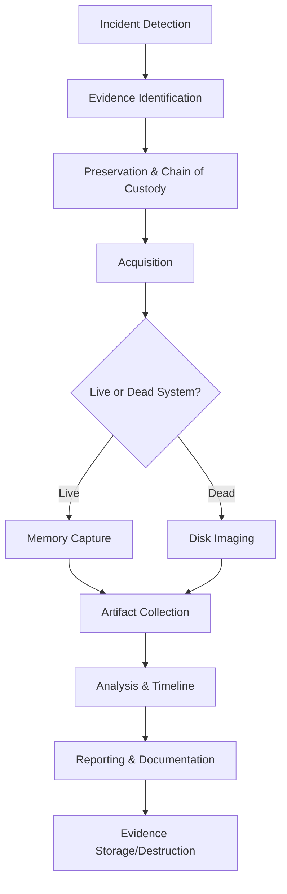

# Module 4: Digital Forensics

Digital forensics is the systematic process of collecting, preserving, analyzing, and presenting digital evidence in a legally admissible manner. This module covers the essential principles, methodologies, and tools required for conducting thorough digital investigations.

---

## 🎯 Learning Objectives

By completing this module, you will understand:
- Core forensic principles and legal requirements
- Evidence handling and chain of custody procedures
- Data acquisition and analysis techniques
- Windows and Linux artifact analysis
- Memory forensics and file system examination
- Proper evidence destruction methods

---

## 📚 Module Contents

### Foundation Concepts
- [**01: Introduction to Digital Forensics**](./01-introduction-to-digital-forensics.md)
  - Forensic process overview
  - Core principles and terminology
  - Chain of custody fundamentals
  - Essential tools (FTK Imager, KAPE)

- [**02: Data Representation and Encoding**](./02-data-representation-and-encoding.md)
  - Binary, hexadecimal, and octal systems
  - ASCII and Base64 encoding
  - CyberChef for data transformation
  - Obfuscation techniques

### Storage and File Systems
- [**03: Storage Media Fundamentals**](./03-storage-media-fundamentals.md)
  - Hard Disk Drives (HDD) mechanics
  - Solid-State Drives (SSD) challenges
  - Slack space and data recovery
  - TRIM and garbage collection

- [**04: File Systems**](./04-file-systems.md)
  - Windows file systems (FAT, NTFS)
  - Linux file systems (Ext3, Ext4)
  - File system identification with FTK Imager
  - Journaling and metadata

### Evidence Management
- [**05: Evidence Handling, Integrity, and Volatility**](./05-evidence-handling-and-integrity.md)
  - ACPO principles for evidence handling
  - Chain of custody documentation
  - Hash verification (MD5, SHA1, SHA256)
  - Order of volatility (RFC 3227)
  - Write-blocker usage

- [**06: Memory and System Files**](./06-memory-and-system-files.md)
  - Memory forensics fundamentals
  - Windows system files (Pagefile, Hibernation)
  - Linux swap space analysis
  - Volatile data collection

### Data Recovery and Analysis
- [**07: Metadata and File Carving**](./07-metadata-and-file-carving.md)
  - Metadata extraction with `exiftool`
  - File carving with `scalpel`
  - Permission management with `chown`
  - Hidden data discovery

- [**08: Evidence Collection and Acquisition**](./08-evidence-collection-and-acquisition.md)
  - Forensic equipment toolkit
  - Live vs. dead acquisition
  - FTK Imager disk imaging
  - KAPE for rapid triage

### Specialized Topics
- [**09: Evidence Destruction**](./09-evidence-destruction.md)
  - Physical destruction methods
  - Secure wiping standards (DoD 5220.22-M)
  - Degaussing and overwriting
  - Reusable vs. permanent destruction

- [**10: Windows Artifacts**](./10-windows-artifacts.md)
  - Program execution artifacts (LNK, Prefetch, Jump Lists)
  - Browser forensics (history, cache, downloads)
  - Windows Event Logs (4624, 4625, 4634, 4672)
  - Recycle Bin analysis

---

## 🔧 Key Tools and Technologies

| Tool Category | Tools | Purpose |
|---------------|-------|---------|
| **Imaging & Acquisition** | FTK Imager, KAPE | Creating forensic images and rapid artifact collection |
| **File Analysis** | `exiftool`, `scalpel`, Windows File Analyzer | Metadata extraction and file carving |
| **Memory Analysis** | Volatility, Memory dumps | RAM and volatile data analysis |
| **Timeline Analysis** | Log2timeline, Plaso | Event reconstruction and correlation |
| **Artifact Parsing** | Eric Zimmerman tools (PECmd, JLECmd, RBCmd) | Windows-specific artifact analysis |
| **Data Transformation** | CyberChef, `xxd`, Base64 tools | Encoding/decoding and data conversion |

---

## 📊 Investigation Workflow

---

## ⚖️ Legal and Ethical Considerations

### ACPO Principles Summary
1. **No alteration** of original evidence
2. **Competent personnel** must handle evidence
3. **Documented audit trail** of all processes
4. **Case officer responsibility** for adherence

### Chain of Custody Requirements
- Continuous documentation from collection to court
- Hash verification at each stage
- Secure storage and access controls
- Proper evidence labeling and sealing

---

## 🎯 Practical Scenarios

| Scenario Type | Key Artifacts | Primary Tools |
|---------------|---------------|---------------|
| **Malware Investigation** | Prefetch files, memory dumps, network logs | KAPE, Volatility, FTK Imager |
| **Data Theft** | Browser history, file access logs, USB artifacts | Windows File Analyzer, Event Viewer |
| **Insider Threat** | Email, document metadata, user activity logs | `exiftool`, Timeline analysis |
| **System Intrusion** | Event logs, memory analysis, network artifacts | SIEM logs, Memory forensics |

---

## 🔗 Quick Reference Links

- [NIST Digital Forensics Framework](https://www.nist.gov/cyberframework)
- [SANS Digital Forensics Resources](https://www.sans.org/cyber-security-courses/digital-forensics/)
- [Eric Zimmerman Tools](https://ericzimmerman.github.io/)
- [ACPO Digital Evidence Guidelines](https://www.college.police.uk/)

---

[⬆️ Back to Main Course](../README.md)
