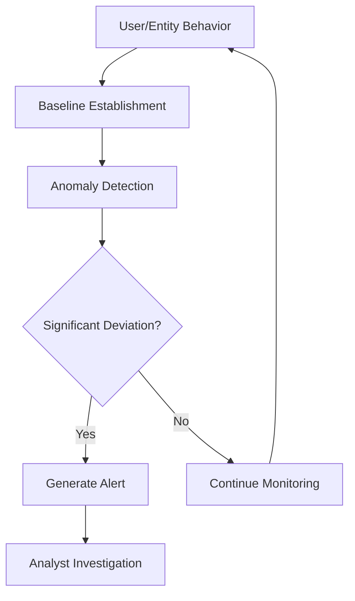
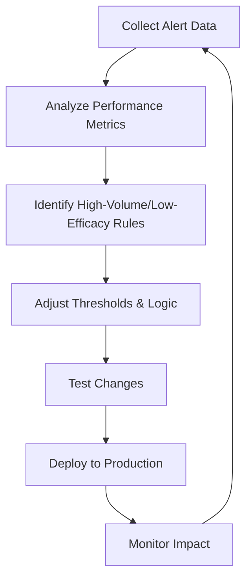

# 5.9: SIEM Rule Development

SIEM rule development is the process of creating, testing, and tuning detection logic to identify malicious activity while minimizing false positives. It's both an art and a science that requires understanding your environment, threat landscape, and the balance between security coverage and analyst workload.

---

## The Rule Development Lifecycle

Creating effective SIEM rules requires a systematic approach that balances threat detection with operational efficiency.

### 1. Requirements Analysis
- **Threat Assessment**: Identify specific threats your organization faces
- **Asset Evaluation**: Understand critical systems and data that need protection
- **Compliance Mapping**: Align rules with regulatory requirements (PCI-DSS, HIPAA, etc.)
- **Environment Understanding**: Know your network's normal behavior patterns

### 2. Rule Design
- **Logic Definition**: Establish the conditions that constitute suspicious activity
- **Threshold Setting**: Determine appropriate frequency and time windows
- **Context Consideration**: Account for business processes and user behaviors
- **MITRE ATT&CK Mapping**: Align detections with adversary tactics and techniques

### 3. Implementation & Testing
- **Test Environment Setup**: Create isolated environment with representative data
- **Validation Testing**: Use red team exercises or breach simulation tools
- **Performance Assessment**: Measure rule efficiency and resource consumption
- **False Positive Analysis**: Identify and address benign activities triggering alerts

---

## Types of SIEM Rules

### Rule-Based Detection
Traditional signature-based detection using predefined conditions.

| Rule Type | Description | Use Case | Example |
|-----------|-------------|----------|---------|
| **Simple** | Single event triggers | Direct IOC matching | Known malware hash detected |
| **Composite** | Multiple events correlation | Complex attack patterns | Failed logins + successful login from new location |
| **Threshold** | Frequency-based triggers | Brute force detection | 5+ failed logins in 10 minutes |

### Behavioral Detection
Advanced detection methods that identify deviations from normal behavior patterns.



### Risk-Based Detection
Quantifies "risky" actions to entities, allowing detection engineers to build rules based on a broader range of events.

---

## Detection Engineering Best Practices

### Follow the MITRE ATT&CK Framework
Aligning detections with the MITRE ATT&CK framework provides structured approach to threat coverage.

**Benefits:**
- **Comprehensive Coverage**: Ensures detection across the full attack lifecycle
- **Common Language**: Standardized terminology for threat discussion
- **Gap Analysis**: Identifies areas lacking detection coverage
- **Threat Modeling**: Maps specific APT behaviors to your environment

### Implement Detection as Code (DaC)
Detection as Code incorporates software engineering best practices to create scalable detection processes.

**Core Components:**
- **Version Control**: Track changes to detection logic
- **Testing Framework**: Automated validation of rule effectiveness
- **CI/CD Integration**: Streamlined deployment and rollback capabilities
- **Collaboration**: Team-based development with peer review processes

### Use Platform-Agnostic Formats
Sigma provides an open-source, rule-based format for writing detections that can be converted into queries for various SIEM platforms.

**Sigma Rule Example:**
```yaml
title: PowerShell Credential Dumping
id: 12345678-1234-1234-1234-123456789012
status: stable
description: Detects PowerShell commands attempting to dump credentials
references:
    - https://attack.mitre.org/techniques/T1555/
tags:
    - attack.credential_access
    - attack.t1555
logsource:
    product: windows
    service: powershell
detection:
    selection:
        EventID: 4104
        ScriptBlockText|contains:
            - 'Get-Credential'
            - 'ConvertFrom-SecureString'
    condition: selection
falsepositives:
    - Legitimate administrative scripts
level: medium
```

---

## Rule Tuning and Optimization

### The False Positive Problem
43% of organizations report that more than 20% of their security alerts are false positives, with 15% reporting over half are false.

**Impact of Poor Tuning:**
- **Alert Fatigue**: Analysts become desensitized to constant notifications
- **Missed Threats**: Real attacks lost in the noise of false positives
- **Resource Waste**: Time spent investigating benign activities
- **Reduced Confidence**: Teams lose trust in the detection system

### Tuning Methodology



### Key Tuning Strategies

| Strategy | Description | Implementation |
|----------|-------------|----------------|
| **Threshold Adjustment** | Modify frequency/time windows | Increase failed login threshold from 3 to 5 attempts |
| **Whitelisting** | Exclude known-good sources | Exempt service accounts from certain rules |
| **Contextual Filtering** | Add environmental context | Only alert on admin activities outside business hours |
| **Event Correlation** | Group related events | Combine multiple indicators into single incident |

### Performance Metrics for Rule Effectiveness

Use data-driven methods to systematically improve detection logic and minimize alert fatigue.

**Key Performance Indicators:**
- **True Positive Rate**: Percentage of alerts that are actual threats
- **False Positive Rate**: Percentage of alerts that are benign
- **Mean Time to Investigation**: Average time spent analyzing each alert
- **Coverage Ratio**: Percentage of MITRE ATT&CK techniques detected

---

## Advanced Rule Development Techniques

### Dynamic Thresholds
Replace static thresholds with dynamic ones that adjust based on contextual factors like time of day, geographic location, or historical user behavior.

**Implementation Example:**
```sql
-- Dynamic threshold based on user's historical behavior
SELECT user_id, failed_logins
FROM security_events
WHERE failed_logins > (
    SELECT AVG(failed_logins) + (2 * STDDEV(failed_logins))
    FROM historical_user_behavior
    WHERE user_id = security_events.user_id
)
```

### Machine Learning Integration
Implement ML algorithms to identify patterns in historical alert data and suppress repetitive false positives.

**Use Cases:**
- **Anomaly Detection**: Identify statistical outliers in user behavior
- **Pattern Recognition**: Detect subtle attack techniques
- **False Positive Prediction**: Automatically suppress known benign activities
- **Risk Scoring**: Prioritize alerts based on multiple factors

### Threat Intelligence Integration
Enrich alerts with real-time threat intelligence feeds, such as known malicious IP addresses or indicators of compromise (IOCs).

---

## Rule Management and Governance

### Documentation Requirements
Every rule should include:
- **Purpose**: What threat or behavior it detects
- **Logic**: Clear explanation of detection criteria
- **False Positives**: Known benign scenarios that may trigger
- **Response**: Recommended investigation steps
- **Maintenance**: Review schedule and responsible teams

### Change Management Process
The ability to enable security analysts to build bespoke detection rules that can be tuned to the organization's network configuration is a crucial feature.

**Workflow Components:**
1. **Peer Review**: Technical validation by other analysts
2. **Testing Requirements**: Mandatory validation in test environment
3. **Approval Process**: Management sign-off for production deployment
4. **Rollback Plan**: Procedures for reverting problematic changes
5. **Documentation Update**: Maintain current rule inventory

---

## Common Rule Development Pitfalls

### Over-Tuning vs. Under-Tuning
Following best practices for alert tuning creates a natural balance between over-tuning and under-tuning alert signals.

**Over-Tuning Risks:**
- Missing legitimate threats due to overly restrictive rules
- Creating detection blind spots
- Reducing security coverage

**Under-Tuning Risks:**
- Overwhelming analysts with false positives
- Alert fatigue leading to missed threats
- Inefficient resource utilization

### Environment-Specific Considerations
Different environments (production, staging, testing) may require tailored rules.

**Adaptation Requirements:**
- **Business Hours**: Adjust thresholds for after-hours activities
- **User Roles**: Different baselines for admins vs. regular users
- **Geographic Distribution**: Account for global operations
- **Technology Stack**: Rules specific to your security tools

---

## Continuous Improvement

### Regular Review Cycles
Anyone who thinks they can set up their SIEM and it will remain highly tuned is sorely mistaken.

**Review Triggers:**
- **Scheduled Reviews**: Monthly/quarterly rule effectiveness assessment
- **Threat Landscape Changes**: New attack techniques or threat actors
- **Infrastructure Changes**: New systems or applications
- **Performance Issues**: Rules causing system strain

### Feedback Loops
When you get a false positive, use it as a feedback loop to adjust the SIEM so that the same false positive doesn't show up again.

**Implementation:**
- Document all false positive investigations
- Track rule modification success rates
- Measure improvement in alert quality over time
- Share lessons learned across the team

[⬆️ Back to SIEM & Monitoring](./README.md)
