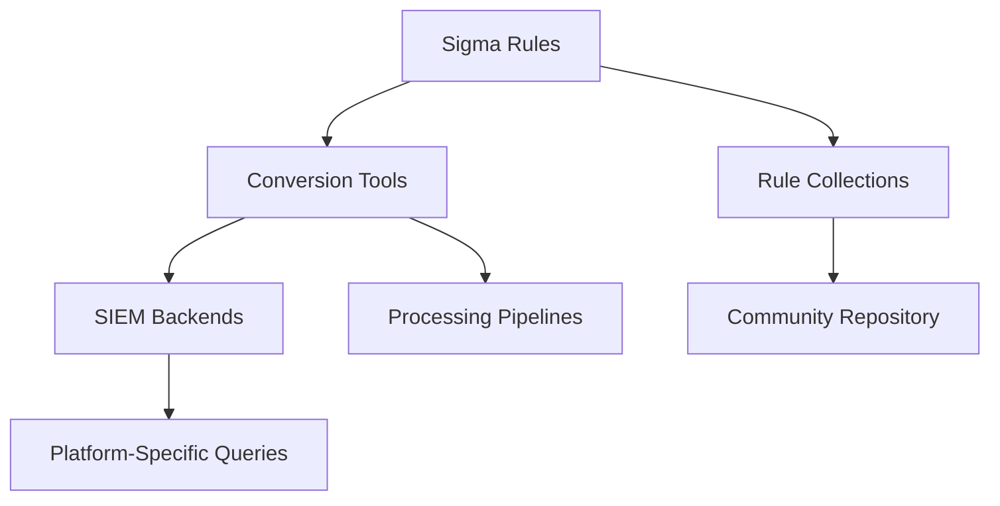
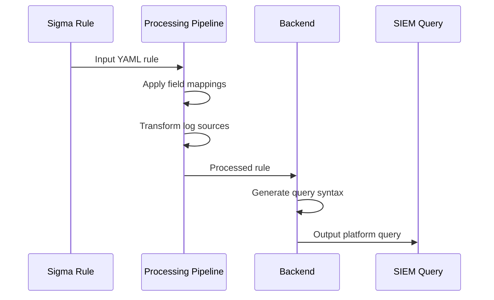

# 5.10: Sigma Universal Detection Framework

Sigma is a generic, open-source signature format that allows security teams to describe relevant log events in a straightforward manner and share detection methods across different SIEM platforms. Think of Sigma as "what Snort is to network traffic and YARA is to files, but for log files."

---

## Introduction to Sigma

### What is Sigma?
Sigma is a generic and open signature format that allows you to describe relevant log events in a straightforward manner. The rule format is very flexible, easy to write and applicable to any type of log file.

**Core Philosophy:**
- **Generic Format**: Platform-agnostic detection rules
- **Open Standard**: Community-driven development and sharing
- **Structured Language**: YAML-based syntax for consistency
- **Universal Compatibility**: Convertible to multiple SIEM platforms

### The Problem Sigma Solves
Before Sigma, security teams faced several challenges:
- **Vendor Lock-in**: Detection rules tied to specific SIEM platforms
- **Knowledge Silos**: Difficulty sharing detection methods between organizations
- **Duplication of Effort**: Each team rebuilding the same detections
- **Translation Overhead**: Manual conversion between different query languages

---

## Sigma Ecosystem Components

The Sigma ecosystem consists of three main components that work together to create a comprehensive detection framework.



### 1. Sigma Detection Format
The standardized YAML format for writing detection rules.

### 2. Conversion Tools
- **sigma-cli**: Modern command-line tool for rule conversion
- **sigmac**: Legacy converter (being deprecated)
- **Uncoder.io**: Web-based conversion interface

### 3. Rule Collections
- **SigmaHQ Repository**: Over 3,000 community-maintained rules
- **Vendor-Specific Collections**: Rules tailored for specific platforms
- **Custom Collections**: Organization-specific rule sets

---

## Sigma Rule Structure

Sigma rules are written in YAML and follow a specific structure with mandatory and optional fields.

### Basic Rule Anatomy

```yaml
title: Brief description of what the rule detects
id: unique-uuid-identifier
status: experimental | test | stable
description: Detailed explanation of the detection
author: Rule creator
date: Creation date (YYYY/MM/DD)
modified: Last modification date
references:
  - https://example.com/reference
tags:
  - attack.technique_id
  - attack.tactic
logsource:
  category: process_creation
  product: windows
detection:
  selection:
    field_name: value
  condition: selection
falsepositives:
  - Known legitimate scenarios
level: critical | high | medium | low | informational
```

### Metadata Fields

| Field | Required | Description | Example |
|-------|----------|-------------|---------|
| `title` | ✅ | Short summary of detection | "Suspicious PowerShell Execution" |
| `id` | ✅ | Unique UUIDv4 identifier | "12345678-1234-1234-1234-123456789012" |
| `status` | ✅ | Rule maturity level | "stable" |
| `description` | ✅ | Detailed explanation | "Detects suspicious PowerShell commands..." |
| `author` | ❌ | Rule creator | "John Smith" |
| `tags` | ❌ | MITRE ATT&CK mapping | "attack.t1059.001" |
| `level` | ❌ | Severity classification | "high" |

---

## Log Source Specification

The `logsource` section defines what type of log data the rule should search over.

### Logsource Components

```yaml
logsource:
  category: [optional]  # Type of logs (firewall, antivirus, etc.)
  product: [optional]   # Specific product (windows, linux, etc.)
  service: [optional]   # Subset of product logs (security, sysmon, etc.)
  definition: [optional] # Custom definition for non-standard sources
```

### Logsource Examples

#### Windows Security Events
```yaml
logsource:
  product: windows
  service: security
```

#### Sysmon Process Creation
```yaml
logsource:
  category: process_creation
  product: windows
```

#### Web Server Logs
```yaml
logsource:
  category: webserver
```

#### Cloud Service Logs
```yaml
logsource:
  product: aws
  service: cloudtrail
```

---

## Detection Logic

The `detection` section is the core of any Sigma rule, specifying exactly what the rule looks for.

### Detection Components

```yaml
detection:
  selection:          # Main detection criteria
    field: value
  filter:            # Exclusion criteria
    field: value
  condition: selection and not filter
```

### Selection Methods

#### 1. Keyword-Based Detection
```yaml
detection:
  keywords:
    - "suspicious_string"
    - "malicious_pattern"
  condition: keywords
```

#### 2. Field-Based Detection
```yaml
detection:
  selection:
    EventID: 4624
    LogonType: 3
  condition: selection
```

#### 3. List-Based Detection (OR Logic)
```yaml
detection:
  selection:
    ProcessName:
      - "cmd.exe"
      - "powershell.exe"
      - "wscript.exe"
  condition: selection
```

#### 4. Multiple Field Detection (AND Logic)
```yaml
detection:
  selection:
    Image: "*\\powershell.exe"
    CommandLine: "*-EncodedCommand*"
  condition: selection
```

---

## Advanced Detection Patterns

### Complex Conditions
Sigma supports sophisticated logical operations through condition statements.

```yaml
detection:
  selection1:
    Image: "*\\powershell.exe"
  selection2:
    CommandLine: "*-EncodedCommand*"
  filter:
    User: "SYSTEM"
  condition: (selection1 and selection2) and not filter
```

### Time-Based Aggregations
```yaml
detection:
  selection:
    EventID: 4625  # Failed logon
  timeframe: 5m
  condition: selection | count() > 10
```

### Grouping Operations
```yaml
detection:
  selection:
    EventID: 4624  # Successful logon
  timeframe: 1h
  condition: selection | count() by SourceIP > 50
```

---

## Field Modifiers

Sigma provides various modifiers to enhance field matching capabilities.

| Modifier | Description | Example |
|----------|-------------|---------|
| `contains` | Field contains substring | `field\|contains: "substring"` |
| `startswith` | Field starts with value | `field\|startswith: "prefix"` |
| `endswith` | Field ends with value | `field\|endswith: "suffix"` |
| `re` | Regular expression match | `field\|re: "regex_pattern"` |
| `base64` | Base64 encoded value | `field\|base64: "encoded_value"` |
| `base64offset` | Base64 with offset | `field\|base64offset: "value"` |

### Modifier Examples

```yaml
detection:
  selection:
    CommandLine|contains: "powershell"
    ProcessName|endswith: ".exe"
    EventData|re: '.*admin.*'
  condition: selection
```

---

## Rule Conversion Process

Converting Sigma rules to SIEM-specific queries involves several components working together.

### Conversion Architecture



### Using sigma-cli

#### Installation
```bash
# Install sigma-cli
pip install sigma-cli

# Install backend plugins
sigma plugin install splunk
sigma plugin install elastic
sigma plugin install microsoft365defender
```

#### Basic Conversion
```bash
# Convert single rule to Splunk
sigma convert -t splunk rule.yml

# Convert multiple rules
sigma convert -t splunk rules/*.yml

# Specify output format
sigma convert -t splunk -f savedsearches rules/*.yml
```

#### Advanced Options
```bash
# Use processing pipeline
sigma convert -p pipeline.yml -t splunk rule.yml

# Apply specific configuration
sigma convert -c config.yml -t splunk rule.yml

# Output to file
sigma convert -t splunk rule.yml -o output.txt
```

---

## Backend Support

Sigma supports conversion to numerous SIEM platforms and query languages.

### Major SIEM Backends

| Platform | Backend ID | Output Format |
|----------|------------|---------------|
| **Splunk** | `splunk` | SPL queries |
| **Elastic** | `elasticsearch` | Query DSL, KQL |
| **Microsoft Sentinel** | `sentinel` | KQL queries |
| **QRadar** | `qradar` | AQL queries |
| **ArcSight** | `arcsight` | CEF queries |
| **Chronicle** | `chronicle` | UDM queries |

### Example Conversions

#### Original Sigma Rule
```yaml
title: Suspicious PowerShell Execution
logsource:
  category: process_creation
  product: windows
detection:
  selection:
    Image: "*\\powershell.exe"
    CommandLine: "*-EncodedCommand*"
  condition: selection
```

#### Splunk Output
```spl
(Image="*\\powershell.exe" CommandLine="*-EncodedCommand*")
```

#### Elastic Query DSL Output
```json
{
  "query": {
    "bool": {
      "must": [
        {"wildcard": {"Image": "*\\powershell.exe"}},
        {"wildcard": {"CommandLine": "*-EncodedCommand*"}}
      ]
    }
  }
}
```

---

## Processing Pipelines

Processing pipelines define transformations applied during rule conversion to handle differences between Sigma rules and target data models.

### Pipeline Components

```yaml
name: Windows EventID Mapping
priority: 100
transformations:
  - id: field_mapping
    type: field_name_mapping
    mapping:
      EventID: event_id
      ProcessName: process.name
    rule_conditions:
      - type: logsource
        product: windows
```

### Common Pipeline Uses

| Use Case | Description | Example |
|----------|-------------|---------|
| **Field Mapping** | Map Sigma field names to SIEM-specific fields | `EventID` → `event.code` |
| **Log Source Mapping** | Transform generic sources to specific ones | `process_creation` → `sysmon` |
| **Value Transformation** | Modify field values during conversion | Add index specifications |
| **Condition Addition** | Inject additional conditions | Add time constraints |

---

## Rule Categories and Quality Levels

### Rule Categories

The Sigma repository contains different types of rules for various use cases:

| Category | Purpose | Characteristics |
|----------|---------|-----------------|
| **Generic Detection** | Threat-agnostic behavior detection | Broad applicability, technique-focused |
| **Threat Hunting** | Starting points for investigation | Broader scope, lower confidence |
| **Emerging Threats** | Specific, timely threats | High confidence, limited timeframe |

### Quality Levels

```yaml
status: experimental  # Initial development, may have issues
status: test         # Tested but may need refinement
status: stable       # Production-ready, well-tested
```

### Severity Levels

```yaml
level: critical      # Immediate attention required
level: high         # Important security event
level: medium       # Noteworthy activity
level: low          # Informational event
level: informational # Logging/audit purposes
```

---

## Writing Effective Sigma Rules

### Best Practices

#### 1. Start Simple
```yaml
# Good: Simple, focused detection
detection:
  selection:
    Image: "*\\powershell.exe"
    CommandLine: "*-EncodedCommand*"
  condition: selection
```

#### 2. Use Appropriate Modifiers
```yaml
# Better: More specific matching
detection:
  selection:
    Image|endswith: "\\powershell.exe"
    CommandLine|contains: "-EncodedCommand"
  condition: selection
```

#### 3. Include Filters for False Positives
```yaml
# Best: Includes exclusions
detection:
  selection:
    Image|endswith: "\\powershell.exe"
    CommandLine|contains: "-EncodedCommand"
  filter:
    User: "SYSTEM"
  condition: selection and not filter
```

### Common Pitfalls

| Issue | Problem | Solution |
|-------|---------|----------|
| **Overly Broad Rules** | Too many false positives | Add specific conditions and filters |
| **Field Name Errors** | Incorrect field references | Use standardized field names |
| **Logic Errors** | Incorrect condition syntax | Test with sample data |
| **Missing Context** | Insufficient metadata | Include proper tags and references |

---

## Integration Strategies

### CI/CD Integration

```yaml
# GitHub Actions example
name: Validate Sigma Rules
on: [push, pull_request]
jobs:
  validate:
    runs-on: ubuntu-latest
    steps:
      - uses: actions/checkout@v2
      - name: Validate Rules
        run: |
          sigma check rules/
          sigma convert -t splunk rules/ --output-format json
```

### SIEM Deployment Automation

```bash
#!/bin/bash
# Automated rule deployment script

# Convert rules to Splunk format
sigma convert -t splunk -f savedsearches rules/ -o splunk_rules.conf

# Deploy to Splunk via REST API
curl -X POST "https://splunk.example.com:8089/services/saved/searches" \
  -H "Authorization: Bearer $SPLUNK_TOKEN" \
  -d @splunk_rules.conf
```

### Version Control Management

```bash
# Rule management workflow
git clone https://github.com/your-org/sigma-rules.git
cd sigma-rules

# Create new rule
sigma new-rule --template process_creation
# Edit rule content
vim rules/windows/process_creation/suspicious_powershell.yml

# Validate before commit
sigma check rules/windows/process_creation/suspicious_powershell.yml
git add rules/windows/process_creation/suspicious_powershell.yml
git commit -m "Add suspicious PowerShell detection"
```

---

## Testing and Validation

### Rule Testing Framework

```yaml
# Test file example
tests:
  - title: "Test PowerShell Encoded Command"
    rule: rules/windows/process_creation/powershell_encoded.yml
    data:
      - Image: "C:\\Windows\\System32\\WindowsPowerShell\\v1.0\\powershell.exe"
        CommandLine: "powershell.exe -EncodedCommand dGVzdA=="
    expected: true
  
  - title: "Test PowerShell Normal Usage"
    rule: rules/windows/process_creation/powershell_encoded.yml
    data:
      - Image: "C:\\Windows\\System32\\WindowsPowerShell\\v1.0\\powershell.exe"
        CommandLine: "powershell.exe Get-Process"
    expected: false
```

### Validation Tools

```bash
# Validate rule syntax
sigma check rule.yml

# Test rule conversion
sigma convert -t splunk rule.yml --dry-run

# Generate test queries
sigma test rule.yml --backend splunk
```

---

## Community and Collaboration

### Contributing to Sigma

1. **Fork the Repository**: Create your own copy of SigmaHQ/sigma
2. **Create Rules**: Follow the contribution guidelines
3. **Test Thoroughly**: Ensure rules work across different environments
4. **Submit Pull Request**: Propose your rules for community review

### Rule Sharing Best Practices

```yaml
# Example community-ready rule
title: Suspicious Registry Run Key Modification
id: a1b2c3d4-e5f6-7890-1234-567890abcdef
status: stable
description: Detects modifications to Windows Run registry keys that could indicate persistence mechanisms
author: Security Team
date: 2024/01/15
references:
  - https://attack.mitre.org/techniques/T1547/001/
tags:
  - attack.persistence
  - attack.t1547.001
logsource:
  product: windows
  service: sysmon
detection:
  selection:
    EventID: 13  # Registry event
    TargetObject|contains:
      - "\\SOFTWARE\\Microsoft\\Windows\\CurrentVersion\\Run\\"
      - "\\SOFTWARE\\Microsoft\\Windows\\CurrentVersion\\RunOnce\\"
  filter:
    Image|endswith:
      - "\\msiexec.exe"
      - "\\setup.exe"
  condition: selection and not filter
falsepositives:
  - Software installations
  - System updates
  - Legitimate administrative tasks
level: medium
```

---

## Future of Sigma

### Emerging Trends

- **AI-Assisted Rule Generation**: Machine learning for automatic rule creation
- **Cloud-Native Integration**: Enhanced support for cloud security platforms
- **Real-Time Processing**: Stream processing capabilities for live detection
- **Extended Correlation**: Multi-event correlation and temporal analysis

### Ecosystem Growth

- **Backend Expansion**: Support for emerging SIEM platforms
- **Pipeline Enhancement**: More sophisticated transformation capabilities
- **Community Tools**: Third-party integrations and extensions
- **Enterprise Features**: Commercial offerings built on Sigma foundation

[⬆️ Back to SIEM & Monitoring](./README.md)
