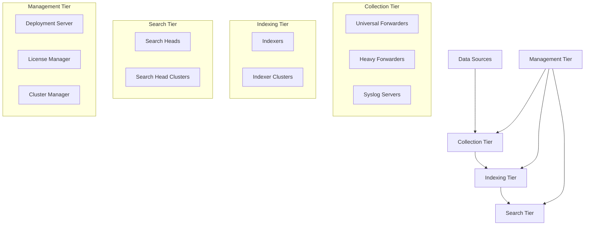
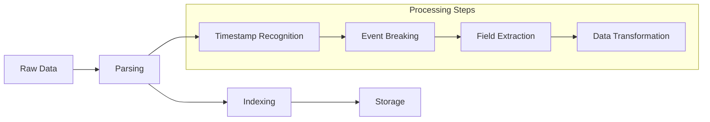
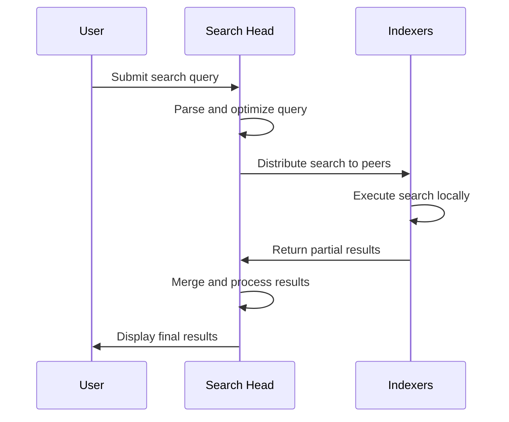
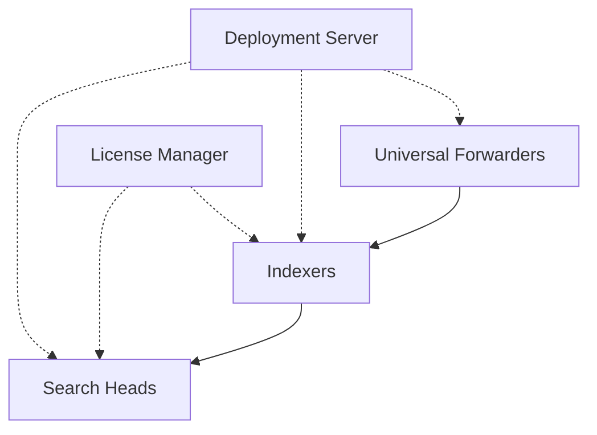

# 5.11: Splunk Platform Fundamentals

Splunk is a powerful data platform designed to search, monitor, and analyze machine-generated big data. Understanding its core architecture, components, and data pipeline is essential for effectively implementing and managing a Splunk deployment for security monitoring and analysis.

---

## Splunk Platform Overview

### What is Splunk?
Splunk is a distributed system that aggregates, parses, and analyzes log data from various sources across an organization's IT infrastructure. It transforms machine data into searchable events and provides powerful analytics capabilities.

**Core Capabilities:**
- **Universal Data Ingestion**: Supports any data format from any source
- **Real-time Processing**: Indexes and searches data as it arrives
- **Scalable Architecture**: Horizontal scaling through distributed components
- **Rich Search Language**: Powerful SPL (Search Processing Language)
- **Visualization & Reporting**: Dashboards, alerts, and custom applications

### Platform Editions

| Edition | Description | Use Case |
|---------|-------------|----------|
| **Splunk Enterprise** | On-premises deployment | Full control, custom environments |
| **Splunk Cloud Platform** | SaaS offering | Managed service, reduced operational overhead |
| **Splunk Free** | Limited free version | Small deployments, testing |

---

## Core Architecture Components

Splunk's architecture is built around three primary tiers plus a management layer, each serving specific functions in the data processing workflow.



---

## Collection Tier: Forwarders

Forwarders are lightweight agents that collect data from various sources and send it to indexers for processing.

### Universal Forwarder (UF)
The most common data collection method, installed on source systems.

**Characteristics:**
- **Minimal Processing**: Forwards raw data without parsing
- **Low Resource Usage**: Consumes ~1-2% CPU
- **High Scalability**: Can deploy to thousands of endpoints
- **Real-time Forwarding**: Sends data as it's generated

**Use Cases:**
- Log file monitoring
- Windows event collection
- System metrics gathering
- Application data forwarding

### Heavy Forwarder (HF)
Full Splunk instance that performs processing before forwarding data.

**Characteristics:**
- **Local Processing**: Parsing and indexing at source
- **Intelligent Routing**: Data filtering and transformation
- **Bandwidth Optimization**: Reduces network traffic
- **Enhanced Security**: Local data masking and filtering

**Use Cases:**
- API data collection
- Remote site aggregation
- Data preprocessing requirements
- Bandwidth-constrained environments

### Forwarder Comparison

| Feature | Universal Forwarder | Heavy Forwarder |
|---------|-------------------|-----------------|
| **Processing** | None (raw data only) | Full parsing & indexing |
| **Resource Usage** | Very low (~1-2% CPU) | Moderate (full Splunk instance) |
| **Bandwidth** | High (sends all data) | Low (processes locally) |
| **Capabilities** | Data forwarding only | Full Splunk functionality |
| **Deployment** | Lightweight agent | Full Splunk installation |

---

## Indexing Tier: Data Processing and Storage

The indexing tier transforms raw data into searchable events and stores them efficiently for fast retrieval.

### Indexer Functions

#### Data Processing Pipeline


#### Key Processing Activities
- **Event Breaking**: Splitting data streams into individual events
- **Timestamp Extraction**: Identifying and parsing time information
- **Field Recognition**: Extracting key-value pairs from events
- **Data Enhancement**: Adding metadata (host, source, sourcetype)
- **Index Writing**: Storing processed events in searchable format

### Bucket Architecture

Splunk stores indexed data in **buckets** - file system directories containing portions of an index.

#### Bucket Lifecycle

| Bucket Type | Description | Location | Characteristics |
|-------------|-------------|----------|-----------------|
| **Hot** | Actively receiving data | Fast storage | Writable, immediate search |
| **Warm** | Recently indexed data | Fast storage | Read-only, fast search |
| **Cold** | Older archived data | Slower storage | Read-only, slower search |
| **Frozen** | Archived/deleted data | Archive/deletion | Removed from index |

#### Bucket Management
```yaml
# indexes.conf example
[security_logs]
homePath = $SPLUNK_DB/security_logs/db
coldPath = $SPLUNK_DB/security_logs/colddb
thawedPath = $SPLUNK_DB/security_logs/thaweddb
maxDataSize = auto_high_volume
maxHotBuckets = 10
maxWarmDBCount = 300
```

### Indexer Clustering

Indexer clusters provide data replication and high availability.

#### Cluster Components
- **Manager Node**: Coordinates cluster operations
- **Peer Nodes**: Handle indexing and replication
- **Search Heads**: Coordinate searches across peers

#### Replication Concepts
- **Replication Factor**: Number of data copies (default: 3)
- **Search Factor**: Number of searchable copies (default: 2)
- **Failure Tolerance**: RF - 1 peer failures tolerated

---

## Search Tier: User Interface and Search Management

The search tier provides the interface for users to interact with Splunk data and coordinates search operations across indexers.

### Search Head Functions

#### Primary Responsibilities
- **User Interface**: Web-based GUI for search and analysis
- **Search Coordination**: Distributes queries to indexers
- **Result Aggregation**: Combines results from multiple indexers
- **Knowledge Management**: Stores reports, dashboards, alerts
- **Job Management**: Handles scheduled and real-time searches

#### Search Head Clustering
Multiple search heads working together for scalability and redundancy.

**Benefits:**
- **Load Distribution**: Spreads search workload
- **High Availability**: Automatic failover capability
- **Shared Configuration**: Consistent user experience
- **Horizontal Scaling**: Add capacity by adding nodes

### Search Process Flow



---

## Management Tier: Central Administration

The management tier provides centralized control and monitoring for the entire Splunk deployment.

### Key Management Components

#### Deployment Server
Centralized configuration management for Splunk components.

**Functions:**
- Configuration distribution
- App deployment
- Update management
- Client grouping and targeting

#### License Manager
Controls and monitors Splunk license usage.

**Responsibilities:**
- License allocation
- Usage tracking
- Compliance monitoring
- Violation alerting

#### Cluster Manager
Manages indexer cluster operations (formerly called Cluster Master).

**Duties:**
- Peer coordination
- Replication management
- Bucket distribution
- Cluster health monitoring

---

## Data Pipeline Deep Dive

Understanding Splunk's data pipeline is crucial for optimizing performance and troubleshooting issues.

### Four-Phase Pipeline

#### Phase 1: Input
Raw data collection from various sources.

**Configuration Files:**
- `inputs.conf`: Data input definitions
- `props.conf`: Source type properties
- `transforms.conf`: Data transformations

#### Phase 2: Parsing
Breaking data into individual events and extracting fields.

**Key Activities:**
- Line breaking and event boundary detection
- Timestamp recognition and extraction
- Character set handling and encoding
- Initial field extraction

#### Phase 3: Indexing
Processing events and writing to disk storage.

**Core Functions:**
- Final field extraction and enhancement
- Index file creation (TSIDX files)
- Bucket management and rotation
- Compression and optimization

#### Phase 4: Search
Retrieving and processing data for user queries.

**Search Operations:**
- Query parsing and optimization
- Index file reading and filtering
- Field extraction and calculation
- Result formatting and presentation

---

## Deployment Topologies

### Single Instance
All Splunk functions on one server.

**Use Cases:**
- Development/testing
- Small environments
- Proof of concept

**Limitations:**
- No scalability
- Single point of failure
- Resource constraints

### Distributed Deployment
Functions separated across multiple servers.



**Benefits:**
- Horizontal scalability
- Performance optimization
- Fault tolerance
- Role specialization

### Clustered Architecture
High availability through clustering.

**Components:**
- **Indexer Cluster**: Data replication and failover
- **Search Head Cluster**: Search head redundancy
- **Forwarder Load Balancing**: Automatic failover

---

## Performance Optimization

### Indexing Performance

#### Parallel Ingestion
Multiple pipeline sets for concurrent data processing.

```yaml
# server.conf
[general]
parallelIngestionPipelines = 2
```

**Considerations:**
- Increases CPU usage
- Requires adequate I/O capacity
- Diminishing returns beyond 2 pipelines

#### Batch Mode Search
Processes data by bucket rather than time.

**Benefits:**
- Faster transforming searches
- Improved reliability for long-running searches
- Better resource utilization

### Search Performance

#### Search Optimization Techniques
- **Time Range Limitation**: Narrow search windows
- **Index Specification**: Target specific indexes
- **Field Limitations**: Use `fields` command early
- **Summary Indexing**: Pre-calculate common searches

#### Hardware Considerations
- **Storage**: SSD for hot/warm buckets
- **Memory**: Adequate RAM for search operations
- **CPU**: Multiple cores for parallel processing
- **Network**: Low latency between components

---

## Security and Access Control

### Authentication Methods
- **Local Accounts**: Built-in user management
- **LDAP/Active Directory**: Enterprise integration
- **SAML**: Single sign-on support
- **Multi-factor Authentication**: Enhanced security

### Authorization Model
- **Roles**: Define user capabilities
- **Indexes**: Control data access
- **Apps**: Functional compartmentalization
- **Search Filters**: Row-level security

### Best Practices
- **Principle of Least Privilege**: Minimal necessary access
- **Role-Based Access Control**: Standardized permissions
- **Regular Access Review**: Periodic permission audits
- **Audit Logging**: Track administrative actions

---

## Monitoring and Maintenance

### Monitoring Console
Built-in monitoring dashboard for Splunk health.

**Key Metrics:**
- Indexing throughput and latency
- Search performance and concurrency
- Resource utilization (CPU, memory, disk)
- License usage and compliance

### Health Checks
Regular monitoring of critical indicators.

#### Indexer Health
- Bucket count and size distribution
- Queue utilization and blocking
- Disk space and I/O performance
- Replication lag and errors

#### Search Head Health
- Search concurrency and queuing
- User activity and resource usage
- Knowledge object performance
- Cluster synchronization status

### Maintenance Tasks
- **Index Maintenance**: Bucket optimization and cleanup
- **Configuration Backup**: Regular backup procedures
- **Update Management**: Software patches and upgrades
- **Capacity Planning**: Growth projection and scaling

---

## Integration and Extensibility

### Apps and Add-ons
Splunk's modular architecture supports extensive customization.

#### Splunk Apps
Complete applications with dashboards, searches, and reports.

**Examples:**
- Splunk Enterprise Security (ES)
- IT Service Intelligence (ITSI)
- User Behavior Analytics (UBA)

#### Add-ons
Data input and parsing components.

**Categories:**
- Technology add-ons (data parsing)
- Supporting add-ons (utilities)
- Domain-specific add-ons (industry solutions)

### APIs and Development
- **REST API**: Programmatic access to Splunk functions
- **SDK Support**: Multiple programming languages
- **Custom Commands**: Extend SPL functionality
- **Custom Visualizations**: Unique data representations

[⬆️ Back to SIEM & Monitoring](./README.md)
