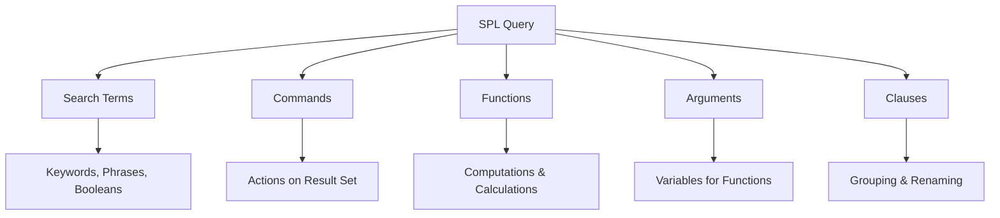

# 5.12: Splunk Search Processing Language (SPL)

The Search Processing Language (SPL) is Splunk's powerful domain-specific language designed for searching, filtering, manipulating, and analyzing machine data. SPL enables users to ask complex questions of their data through a pipeline-based approach that transforms raw events into meaningful insights.

---

## SPL Fundamentals

### What is SPL?
SPL (Search Processing Language) is Splunk's query language that encompasses all search commands, functions, arguments, and clauses used to retrieve and analyze data. The syntax was originally based on UNIX pipeline concepts and SQL, making it familiar to many users.

**Core Capabilities:**
- **Data Searching**: Retrieve events from indexes based on criteria
- **Filtering**: Narrow down results using specific conditions  
- **Modification**: Transform and manipulate data fields
- **Statistical Analysis**: Calculate metrics and generate reports
- **Visualization**: Create charts, graphs, and dashboards

### SPL Components



| Component | Description | Example |
|-----------|-------------|---------|
| **Search Terms** | Keywords, phrases, or boolean expressions | `error`, `"fatal error"`, `status=404` |
| **Commands** | Actions to perform on results | `stats`, `chart`, `eval`, `where` |
| **Functions** | Computations applied to fields | `avg()`, `count()`, `max()`, `sum()` |
| **Arguments** | Variables that functions operate on | Field names, values, parameters |
| **Clauses** | Grouping and renaming operations | `by`, `as`, `over`, `split-by` |

---

## SPL Syntax and Structure

### Pipeline Architecture
SPL uses a pipeline approach where commands are chained together with the pipe (`|`) character.

```spl
search_criteria | command1 arguments | command2 arguments | command3 arguments
```

**Example:**
```spl
index=security_logs error | stats count by host | sort -count | head 10
```

### Implied Search Command
Every SPL query begins with an implied `search` command, so these are equivalent:

```spl
# Explicit search command
search index=web_logs status=404

# Implicit search command (preferred)
index=web_logs status=404
```

---

## Search Terms and Basic Syntax

### Keyword Searches
Simple text searches look for terms anywhere in the event data.

```spl
# Single keyword
error

# Multiple keywords (implicit AND)
error failed authentication

# Quoted phrases
"connection timeout"
```

### Field-Value Pair Matching
Target specific fields for more precise searches.

```spl
# Exact match
status=404

# Field existence
status=*

# Multiple values for same field (traditional approach)
status=404 OR status=500 OR status=502

# Using IN operator (modern approach)
status IN (404, 500, 502)
```

### Boolean Operators

| Operator | Symbol | Description | Example |
|----------|--------|-------------|---------|
| **AND** | `AND` or space | Both conditions must be true | `error AND failed` |
| **OR** | `OR` | Either condition can be true | `status=404 OR status=500` |
| **NOT** | `NOT` | Condition must not be true | `NOT status=200` |

**Operator Precedence:**
1. `NOT` (highest)
2. `AND` 
3. `OR` (lowest)

### Comparison Operators

```spl
# Equality and inequality
status=200
status!=404
response_time>5000

# Greater than/less than
bytes>1000000
response_time<=2.5

# Range searches
bytes>1000 bytes<50000
```

---

## Wildcards and Pattern Matching

### Wildcard Characters

| Wildcard | Description | Example | Matches |
|----------|-------------|---------|---------|
| `*` | Zero or more characters | `error*` | error, errors, error_code |
| `?` | Single character | `test?` | test1, testa, testX |

### Wildcard Usage Examples

```spl
# Prefix matching
host=web*

# Suffix matching  
source=*access.log

# Contains matching
uri_path=*/admin/*

# Field-value wildcards
status=4*  # Matches 400, 404, 403, etc.

# Using wildcards with IN operator
error_code IN (40*, 50*)
```

### Best Practices for Wildcards

**Do:**
- Use specific field-value pairs: `status=4*` instead of `4*`
- Place wildcards at the end when possible: `host=web*`
- Use exact matches when you know the complete value

**Avoid:**
- Leading wildcards: `*error` (performance impact)
- Wildcards in the middle of punctuated strings: `product_id=S*G01`
- Wildcards without any other criteria: `*` (matches everything)

---

## Essential SPL Commands

### Data Retrieval Commands

#### `search`
The fundamental command for retrieving events (usually implicit).

```spl
# Basic search
index=security_logs

# With field filtering
index=security_logs source="/var/log/auth.log"

# Boolean expressions
index=web_logs (status=404 OR status=500) host=web01
```

#### `where`
Filters results using expressions, useful for field comparisons.

```spl
# Compare two fields
... | where response_time > average_response_time

# Complex conditions
... | where status >= 400 AND status < 500

# String functions
... | where len(user_agent) > 100
```

### Statistical Commands

#### `stats`
Calculates statistics and aggregations.

```spl
# Basic counting
... | stats count

# Count by field
... | stats count by status

# Multiple statistics
... | stats count, avg(response_time), max(bytes) by host

# Rename output fields
... | stats count as total_events, avg(response_time) as avg_resp by status
```

#### `chart`
Creates statistical tables optimized for visualization.

```spl
# Simple chart
... | chart count by status

# Chart over time
... | chart count by status over _time

# Multiple series
... | chart avg(response_time) by host, status
```

#### `timechart`
Creates time-series visualizations.

```spl
# Events over time
... | timechart count

# Multiple metrics
... | timechart avg(response_time), max(response_time)

# Grouped by field
... | timechart count by status

# Custom time spans
... | timechart span=1h count
```

### Data Manipulation Commands

#### `eval`
Creates or modifies fields using expressions.

```spl
# Create new field
... | eval response_category=if(response_time>5, "slow", "fast")

# Mathematical operations
... | eval bytes_mb=bytes/1024/1024

# String operations
... | eval full_name=first_name + " " + last_name

# Conditional logic
... | eval threat_level=case(
    status>=500, "high",
    status>=400, "medium", 
    1=1, "low"
)
```

#### `rex`
Extracts fields using regular expressions.

```spl
# Extract IP addresses
... | rex "(?<client_ip>\d+\.\d+\.\d+\.\d+)"

# Named capture groups
... | rex "User (?<username>\w+) from (?<source_ip>\d+\.\d+\.\d+\.\d+)"

# Extract multiple fields
... | rex "(?<method>\w+) (?<uri>\S+) HTTP/(?<version>[\d\.]+)"
```

### Filtering and Sorting Commands

#### `fields`
Includes or excludes specific fields from results.

```spl
# Include only specific fields
... | fields _time, host, status, response_time

# Exclude fields
... | fields - _raw, _bkt, _cd

# Use wildcards in field names
... | fields response_* user_*
```

#### `sort`
Orders results by specified fields.

```spl
# Ascending sort
... | sort response_time

# Descending sort
... | sort -response_time

# Multiple field sort
... | sort host, -response_time

# Limit results
... | sort -count | head 10
```

#### `head` and `tail`
Limits results to first or last N events.

```spl
# First 10 results
... | head 10

# Last 5 results
... | tail 5

# Default is 10 if no number specified
... | head
```

---

## Advanced SPL Concepts

### Field Extraction Techniques

#### Automatic Field Extraction
Splunk automatically extracts fields based on source type definitions.

```spl
# Common auto-extracted fields
index=web_logs | fields method, status, uri_path, clientip
```

#### Manual Field Extraction

```spl
# Using rex for custom extraction
... | rex "duration=(?<duration_ms>\d+)"

# Using split for delimited data
... | eval temp=split(user_data, ",") | eval username=mvindex(temp, 0)

# Using spath for JSON/XML
... | spath input=json_field output=extracted_value path="response.data.id"
```

### Working with Time

#### Time Range Specifications
```spl
# Absolute time
earliest=07/01/2024:00:00:00 latest=07/31/2024:23:59:59

# Relative time
earliest=-24h latest=now

# Snap to time boundaries
earliest=-1d@d latest=@d
```

#### Time Manipulation Functions
```spl
# Convert timestamp formats
... | eval readable_time=strftime(_time, "%Y-%m-%d %H:%M:%S")

# Extract time components
... | eval hour=strftime(_time, "%H"), day=strftime(_time, "%A")

# Time arithmetic
... | eval one_hour_ago=_time-3600
```

### Lookup Operations

#### Static Lookups
```spl
# Basic lookup
... | lookup ip_to_country clientip OUTPUT country

# Multiple field lookup
... | lookup user_info userid OUTPUT department, manager, location
```

#### Dynamic Lookups
```spl
# Create lookup from search results
| inputlookup existing_lookup 
| append [search index=updates | stats latest(_time) as last_update by userid]
| outputlookup updated_lookup
```

---

## SPL Command Categories

### Generating Commands
Commands that generate events or create new data streams.

| Command | Purpose | Example |
|---------|---------|---------|
| `search` | Retrieve events from indexes | `search index=security_logs` |
| `inputlookup` | Read data from lookup tables | `inputlookup users.csv` |
| `makeresults` | Generate synthetic events | `makeresults count=10` |
| `rest` | Query Splunk REST API | `rest /services/server/info` |

### Transforming Commands
Commands that transform search results into statistical data tables.

| Command | Purpose | Example |
|---------|---------|---------|
| `stats` | Calculate statistics | `stats count by host` |
| `chart` | Create charts and tables | `chart count over _time by status` |
| `timechart` | Time-based charts | `timechart count` |
| `top` | Most common values | `top limit=5 clientip` |
| `rare` | Least common values | `rare limit=3 user_agent` |

### Streaming Commands
Commands that process events individually without requiring all events in memory.

| Command | Purpose | Example |
|---------|---------|---------|
| `eval` | Create/modify fields | `eval response_time_sec=response_time/1000` |
| `rex` | Extract fields with regex | `rex "User: (?<username>\w+)"` |
| `where` | Filter based on expressions | `where response_time > 5000` |
| `fields` | Select/remove fields | `fields _time, host, status` |

---

## Search Optimization Techniques

### Performance Best Practices

#### 1. Be Specific with Time Ranges
```spl
# Good: Specific time range
earliest=-4h latest=-1h index=security_logs

# Bad: Overly broad time range
earliest=-30d index=security_logs
```

#### 2. Use Index and Source Type Filtering
```spl
# Good: Specific index and source type
index=web_logs sourcetype=access_combined

# Bad: Search all indexes
* sourcetype=access_combined
```

#### 3. Filter Early in the Pipeline
```spl
# Good: Filter first, then process
index=web_logs status>=400 | stats count by host

# Bad: Process all data, then filter
index=web_logs | stats count by host, status | where status>=400
```

#### 4. Use Fields Command to Limit Data
```spl
# Good: Limit fields early
index=web_logs | fields _time, host, status, response_time | stats avg(response_time) by host

# Bad: Carry all fields through pipeline
index=web_logs | stats avg(response_time) by host
```

### Advanced Search Patterns

#### Subsearches
```spl
# Find events where user appears in both logs
index=auth_logs [search index=app_logs error | return userid]

# Use subsearch for dynamic filtering
index=web_logs clientip=[search index=threat_intel | return ip]
```

#### Transaction Searches
```spl
# Group related events
index=web_logs | transaction sessionid startswith="login" endswith="logout"
```

#### Join Operations (Use Sparingly)
```spl
# Join two data sets
index=orders | join userid [search index=customers | fields userid, name, email]
```

---

## Common SPL Patterns and Examples

### Security Use Cases

#### Failed Authentication Detection
```spl
index=security_logs action=failure 
| stats count as failed_attempts by user, src_ip 
| where failed_attempts > 5 
| sort -failed_attempts
```

#### Network Traffic Analysis
```spl
index=firewall_logs action=blocked 
| eval threat_score=case(
    dest_port IN (22, 23, 3389), 3,
    dest_port IN (80, 443), 1,
    1=1, 2
)
| stats sum(threat_score) as total_threat, count by src_ip 
| sort -total_threat
```

#### User Behavior Analytics
```spl
index=access_logs 
| bucket _time span=1h 
| stats dc(src_ip) as unique_ips, count as total_requests by user, _time 
| where unique_ips > 10 OR total_requests > 1000
```

### Operational Monitoring

#### Error Rate Tracking
```spl
index=application_logs 
| eval status_category=if(match(log_level, "ERROR|FATAL"), "error", "normal")
| timechart span=5m count by status_category
```

#### Performance Monitoring
```spl
index=web_logs 
| stats avg(response_time) as avg_resp, max(response_time) as max_resp, count by uri_path 
| eval avg_resp_sec=round(avg_resp/1000, 2) 
| where avg_resp_sec > 2 
| sort -avg_resp_sec
```

#### Capacity Planning
```spl
index=system_metrics metric_name=cpu_usage 
| timechart span=1h avg(value) as avg_cpu by host 
| where avg_cpu > 80
```

---

## Error Handling and Debugging

### Common SPL Errors

#### Syntax Errors
```spl
# Error: Missing quotes around phrase
index=web_logs failed login attempt

# Correct: Quoted phrase
index=web_logs "failed login attempt"
```

#### Field Reference Errors
```spl
# Error: Field doesn't exist
... | where nonexistent_field > 100

# Debug: Check available fields
... | fieldsummary | where count > 0
```

### Debugging Techniques

#### Job Inspector
Use Job Inspector to analyze search performance:
- Search execution time
- Events scanned vs. returned
- Command execution costs
- Memory usage

#### Search Optimization
```spl
# Add format command to see actual search
... | format

# Use map command for troubleshooting
... | map search="search index=debug $field$"
```

---

## SPL Functions Reference

### Mathematical Functions

| Function | Description | Example |
|----------|-------------|---------|
| `abs(X)` | Absolute value | `eval pos_value=abs(negative_num)` |
| `round(X,Y)` | Round to Y decimal places | `eval rounded=round(3.14159, 2)` |
| `sqrt(X)` | Square root | `eval root=sqrt(value)` |
| `pow(X,Y)` | X raised to power Y | `eval squared=pow(value, 2)` |

### String Functions

| Function | Description | Example |
|----------|-------------|---------|
| `len(X)` | String length | `eval name_length=len(username)` |
| `upper(X)` | Convert to uppercase | `eval caps=upper(text)` |
| `lower(X)` | Convert to lowercase | `eval lower_text=lower(text)` |
| `substr(X,Y,Z)` | Extract substring | `eval first_three=substr(text, 1, 3)` |

### Date/Time Functions

| Function | Description | Example |
|----------|-------------|---------|
| `now()` | Current timestamp | `eval current_time=now()` |
| `strftime(X,Y)` | Format timestamp | `eval readable=strftime(_time, "%Y-%m-%d")` |
| `strptime(X,Y)` | Parse time string | `eval epoch=strptime(time_str, "%Y-%m-%d")` |
| `relative_time(X,Y)` | Add/subtract time | `eval yesterday=relative_time(now(), "-1d")` |

[⬆️ Back to SIEM & Monitoring](./README.md)
