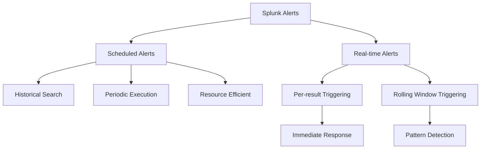

# 5.13: Splunk Alert Development

Splunk alerts are automated monitoring capabilities that trigger when specific conditions are met in your data. They transform saved searches into proactive security monitoring tools that can notify teams, take automated actions, and help maintain situational awareness of critical events.

---

## Alert Fundamentals

### What are Splunk Alerts?
Alerts are saved searches that run automatically and trigger actions when predefined conditions are met. They bridge the gap between passive data collection and active threat response by continuously monitoring for specific patterns, anomalies, or thresholds.

**Core Components:**
- **Base Search**: The SPL query that defines what data to examine
- **Trigger Conditions**: Criteria that determine when the alert fires
- **Actions**: What happens when the alert triggers
- **Schedule**: When and how often the alert runs

### Alert vs. Reports vs. Dashboards

| Component | Purpose | Execution | Output |
|-----------|---------|-----------|---------|
| **Alert** | Proactive monitoring | Scheduled/Real-time | Actions triggered on conditions |
| **Report** | Regular analysis | Scheduled/On-demand | Formatted results for consumption |
| **Dashboard** | Visual monitoring | Real-time/Refreshed | Interactive visualizations |

---

## Alert Types and Triggering Methods

Understanding the different alert types is crucial for selecting the right monitoring approach for specific use cases.



### Scheduled Alerts
Run at predefined intervals using historical searches.

**Characteristics:**
- **Resource Efficient**: Lower system overhead
- **Batch Processing**: Examines data in time blocks
- **Delayed Detection**: Trade-off between resources and response time
- **Reliable**: Less prone to performance issues

**Use Cases:**
- Daily/weekly compliance reports
- Trending analysis over time periods
- Capacity planning and forecasting
- Batch security assessments

**Example - Daily Error Monitoring:**
```spl
index=application_logs level=ERROR earliest=-24h latest=now
| stats count by application, host
| where count > 100
```

### Real-time Alerts
Continuously monitor data as it arrives using real-time searches.

**Characteristics:**
- **Immediate Detection**: Near-instant response to events
- **High Resource Usage**: Continuous processing overhead
- **Live Monitoring**: Processes events as they stream in
- **Complex Management**: More difficult to scale and maintain

#### Per-result Triggering
Triggers an action for each individual event that matches criteria.

**Use Cases:**
- Critical security events (failed root logins)
- System failures requiring immediate attention
- High-value transaction monitoring
- Real-time fraud detection

**Example - Failed Login Detection:**
```spl
index=security_logs action=failure
| where user!="service_account"
```

#### Rolling Window Triggering
Triggers when conditions are met within a specified time window.

**Use Cases:**
- Brute force attack detection
- Rate limiting violations
- Burst activity monitoring
- Pattern-based anomalies

**Example - Brute Force Detection:**
```spl
index=auth_logs action=failure
| stats count by src_ip
| where count >= 5
```

---

## Alert Development Workflow

### Step-by-Step Alert Creation

#### 1. Search Development
Create and refine the base search that identifies the condition you want to monitor.

```spl
# Start with basic search
index=web_logs status>=400

# Add statistical analysis
index=web_logs status>=400
| stats count by host, status
| where count > 50

# Refine with time-based grouping
index=web_logs status>=400
| bucket _time span=1h
| stats count by _time, host, status
| where count > 50
```

#### 2. Alert Configuration
Transform the search into an alert with proper settings.

**Configuration Elements:**
- **Title**: Descriptive name for the alert
- **Description**: Detailed explanation of purpose and expected actions
- **Permissions**: Who can view, edit, and receive the alert
- **Alert Type**: Scheduled vs. Real-time
- **Schedule**: Frequency and timing for scheduled alerts

#### 3. Trigger Condition Setup
Define when the alert should fire based on search results.

**Common Trigger Patterns:**
- **Result Count**: Number of events returned
- **Field Values**: Specific thresholds in data fields
- **Statistical Conditions**: Aggregated metrics exceed limits
- **Custom Logic**: Complex conditional expressions

#### 4. Action Configuration
Specify what happens when the alert triggers.

---

## Trigger Conditions

### Built-in Trigger Types

#### Number-based Triggers
```yaml
# Number of Results
Condition: Greater than 10 results
Use Case: Monitor for excessive error events

# Number of Hosts  
Condition: More than 5 hosts affected
Use Case: Identify widespread system issues

# Number of Sources
Condition: Fewer than expected data sources
Use Case: Detect data collection failures
```

#### Custom Trigger Conditions
Advanced conditions using SPL expressions for more sophisticated logic.

```spl
# Custom condition example
search index=performance_logs
| stats avg(response_time) as avg_resp, max(response_time) as max_resp by host
| where avg_resp > 5000 OR max_resp > 30000
```

### Trigger Condition Best Practices

#### 1. Use Appropriate Granularity
```spl
# Good: Specific field-based trigger
| stats count by error_type, severity
| where severity="critical" AND count > 5

# Avoid: Overly broad triggers
| where count > 100
```

#### 2. Include Context in Results
```spl
# Good: Provides actionable context
index=security_logs action=failure
| stats count, earliest(_time) as first_attempt, latest(_time) as last_attempt by user, src_ip
| where count >= 5

# Poor: Limited context for response
index=security_logs action=failure
| stats count by user
| where count >= 5
```

#### 3. Consider Time Windows
```spl
# Time-aware alerting
index=application_logs error
| bucket _time span=15m
| stats count by _time, application
| where count > 50
```

---

## Alert Actions

### Standard Alert Actions

#### Email Notifications
Most common alert action for team communication.

**Configuration Options:**
- **Recipients**: To, CC, BCC fields
- **Subject**: Dynamic subject with search results
- **Message**: Custom message with token substitution
- **Format**: Plain text, HTML, or table format
- **Attachments**: Include search results as CSV/PDF

**Email Configuration Example:**
```yaml
To: security-team@company.com, ops-team@company.com
Subject: SECURITY ALERT: $name$ triggered with $job.resultCount$ events
Message: |
  Alert: $name$
  Trigger Time: $trigger_time$
  Result Count: $job.resultCount$
  
  Search Query: $search$
  
  Please investigate immediately.
```

#### Webhook Actions
Send alert data to external systems for integration.

**Use Cases:**
- SOAR platform integration
- Ticket creation in ITSM systems
- Notification to Slack/Teams channels
- Custom application APIs

#### Lookup Table Output
Write alert results to lookup tables for enrichment or tracking.

```spl
# Alert search that outputs to lookup
index=threat_intelligence new_iocs
| outputlookup append=true threat_iocs.csv
```

#### Script Execution (Deprecated)
**Note**: Script actions are officially deprecated in favor of custom alert actions.

### Custom Alert Actions

#### Development Framework
Create custom actions using Splunk's alert action framework.

**Components:**
- **Configuration File**: Define action parameters
- **Python Script**: Implement action logic
- **HTML Template**: User interface for configuration
- **Icon**: Visual representation in UI

#### Integration Examples
- **SIEM Integration**: Send events to external SIEM
- **Automation Platforms**: Trigger orchestration workflows
- **Notification Services**: Custom messaging systems
- **Database Updates**: Write to external databases

---

## Alert Management and Monitoring

### Alert Performance Monitoring

#### Using Internal Logs
Monitor alert execution and performance.

```spl
# Check alert execution status
index=_internal source=*scheduler.log*
| search savedsearch_name="Your Alert Name"
| stats count by status
| sort -count

# Monitor alert runtime performance
index=_internal source=*scheduler.log*
| eval runtime=run_time/1000
| stats avg(runtime) as avg_runtime, max(runtime) as max_runtime by savedsearch_name
| sort -avg_runtime
```

#### Alert Health Dashboard
Create dashboards to monitor alert ecosystem health.

```spl
# Failed alerts in last 24 hours
index=_internal source=*scheduler.log* status!=success earliest=-24h
| stats count by savedsearch_name, status
| sort -count

# Alert execution frequency
index=_internal source=*scheduler.log* earliest=-7d
| stats count by savedsearch_name
| sort -count
```

### Triggered Alerts Management

#### Reviewing Triggered Alerts
Access triggered alert history through the interface:
- **Activity Menu**: View recent triggers
- **Triggered Alerts Page**: Comprehensive trigger history
- **Alert Details**: Drill down into specific triggers

#### Alert Suppression and Throttling
Prevent alert fatigue through intelligent suppression.

**Throttling Options:**
- **Suppress for Time Period**: Prevent duplicate alerts
- **Suppress by Field**: Group related events
- **Custom Suppression Logic**: Advanced deduplication

```yaml
# Throttling configuration
Throttle: 1 hour
Suppress Fields: host, error_type
Suppress Condition: | stats count by host, error_type | where count > 1
```

---

## Security-Focused Alert Patterns

### Authentication and Access Monitoring

#### Failed Login Detection
```spl
# Brute force detection
index=auth_logs action=failure
| bucket _time span=5m
| stats dc(user) as unique_users, count by src_ip, _time
| where count >= 10 OR unique_users >= 5
```

#### Privilege Escalation Detection
```spl
# Administrative access outside business hours
index=security_logs action=success privilege_level=admin
| eval hour=strftime(_time, "%H")
| where hour < 8 OR hour > 18
| stats count by user, host, action_detail
```

#### Anomalous Login Patterns
```spl
# Geographic impossibility detection
index=auth_logs action=success
| eval country=case(
    match(src_ip, "^192\.168\."), "Internal",
    match(src_ip, "^10\."), "Internal",
    1=1, "External"
)
| stats earliest(_time) as first_login, latest(_time) as last_login by user, country
| where last_login - first_login < 3600 AND country="External"
```

### Network Security Monitoring

#### Data Exfiltration Detection
```spl
# Large data transfers
index=proxy_logs
| eval bytes_mb=bytes/1024/1024
| stats sum(bytes_mb) as total_mb by user, dest_ip
| where total_mb > 1000
```

#### Command and Control Detection
```spl
# Beaconing behavior detection
index=firewall_logs action=allow
| bucket _time span=1m
| stats count by src_ip, dest_ip, dest_port, _time
| eventstats avg(count) as avg_connections, stdev(count) as stdev_connections by src_ip, dest_ip, dest_port
| where abs(count - avg_connections) < stdev_connections AND avg_connections > 1
```

### System Security Monitoring

#### Malware Detection
```spl
# Suspicious process execution
index=endpoint_logs process_name=*
| rex field=process_name "(?<filename>[^\\\/]+)$"
| lookup malware_indicators filename OUTPUT threat_score
| where threat_score > 7
```

#### Configuration Changes
```spl
# Critical system changes
index=system_logs (event_type=config_change OR event_type=user_add OR event_type=permission_change)
| stats count by host, user, event_type, object_name
| where user!="system" AND user!="administrator"
```

---

## Alert Optimization and Best Practices

### Performance Optimization

#### Search Efficiency
```spl
# Efficient: Use specific indexes and time ranges
index=security_logs earliest=-1h latest=now action=failure
| stats count by user, src_ip
| where count >= 5

# Inefficient: Broad search across all data
* action=failure
| stats count by user, src_ip
| where count >= 5
```

#### Resource Management
- **Schedule Distribution**: Spread alert execution across time
- **Search Head Load**: Monitor concurrent alert execution
- **Memory Usage**: Optimize searches for memory efficiency
- **Index Selection**: Target specific indexes when possible

### Alert Design Principles

#### 1. Actionable Alerts
Every alert should lead to a clear response action.

```spl
# Good: Provides actionable context
index=application_logs error
| stats count, values(error_message) as errors by application, host
| where count > 10
| eval alert_priority=case(count > 100, "Critical", count > 50, "High", 1=1, "Medium")
```

#### 2. Appropriate Sensitivity
Balance between catching threats and avoiding false positives.

#### 3. Clear Documentation
Include comprehensive descriptions and response procedures.

#### 4. Regular Review
Periodically assess alert effectiveness and tune as needed.

### Common Pitfalls and Solutions

| Problem | Impact | Solution |
|---------|--------|----------|
| **Alert Fatigue** | Teams ignore alerts | Implement throttling and prioritization |
| **False Positives** | Reduced trust in alerts | Refine trigger conditions and add context |
| **Missing Context** | Delayed response | Include relevant fields in alert results |
| **Poor Performance** | System slowdown | Optimize searches and distribute load |
| **Outdated Logic** | Missed threats | Regular review and updates |

---

## Alert Integration Patterns

### SOAR Integration
```python
# Example webhook payload for SOAR
{
  "alert_name": "$name$",
  "trigger_time": "$trigger_time$",
  "result_count": "$job.resultCount$",
  "search_results": "$results$",
  "priority": "high",
  "category": "security"
}
```

### Ticketing System Integration
```spl
# Alert that creates structured data for ticket creation
index=security_logs severity=critical
| eval ticket_priority=case(
    severity="critical", "P1",
    severity="high", "P2",
    1=1, "P3"
)
| table _time, host, event_type, description, ticket_priority
```

### Metrics and KPI Tracking
```spl
# Alert that tracks security metrics
index=security_events
| stats count by event_type, severity
| eval metric_name="security_events_" + event_type
| eval metric_value=count
| outputlookup security_metrics.csv
```

---

## Advanced Alert Techniques

### Multi-stage Alert Logic
```spl
# Stage 1: Identify potential threats
index=network_logs
| stats count by src_ip, dest_port
| where count > 1000

# Stage 2: Enrich with threat intelligence
| lookup threat_intel src_ip OUTPUT threat_score, threat_type
| where threat_score > 5

# Stage 3: Calculate risk score
| eval risk_score=count * threat_score / 1000
| where risk_score > 10
```

### Correlation Across Data Sources
```spl
# Cross-source correlation
index=auth_logs action=failure
| join user [search index=hr_logs status=terminated]
| stats count by user, src_ip
| where count > 0
```

### Machine Learning Integration
```spl
# Anomaly detection using MLTK
index=performance_logs
| apply anomaly_detector
| where anomaly_score > 0.8
```

[⬆️ Back to SIEM & Monitoring](./README.md)
