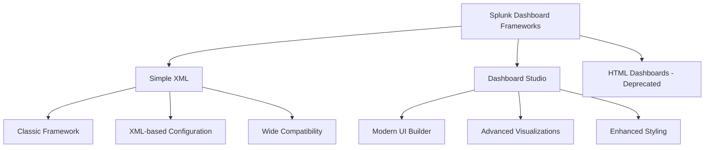

# 5.14: Splunk Dashboard and Reporting

Dashboards and reports are essential tools for transforming raw Splunk data into actionable insights and meaningful visualizations. They enable teams to monitor key metrics, track trends, and make data-driven decisions through interactive interfaces and automated reporting capabilities.

---

## Dashboard Fundamentals

### What are Splunk Dashboards?
Dashboards are collections of panels that display visualizations, tables, and other content powered by saved searches or inline queries. They provide real-time or near-real-time views of your data through interactive interfaces.

**Core Components:**
- **Panels**: Individual visualization containers
- **Searches**: SPL queries that power the visualizations
- **Inputs**: Interactive controls for filtering and customization
- **Layout**: Organization and arrangement of dashboard elements

### Dashboard vs. Reports

| Aspect | Dashboard | Report |
|--------|-----------|--------|
| **Purpose** | Interactive monitoring and analysis | Scheduled data delivery and documentation |
| **Interaction** | Real-time user interaction | Static or scheduled generation |
| **Content** | Multiple panels and visualizations | Single search result with formatting |
| **Refresh** | Manual or automatic refresh | Run on-demand or scheduled |
| **Audience** | Operations teams, analysts | Management, stakeholders, compliance |

---

## Dashboard Frameworks

Splunk offers multiple frameworks for dashboard creation, each with distinct capabilities and use cases.

### Framework Comparison



#### Simple XML Dashboards
The traditional and most widely-used dashboard framework.

**Characteristics:**
- **XML-based Configuration**: Declarative dashboard definitions
- **Broad Compatibility**: Works across all Splunk versions
- **Extensive Documentation**: Well-documented with many examples
- **Community Support**: Large ecosystem of shared dashboards

**Use Cases:**
- Standard operational dashboards
- Simple data visualization needs
- Legacy dashboard migration
- Team collaboration and sharing

#### Dashboard Studio
Modern, UI-driven dashboard creation framework.

**Characteristics:**
- **Visual Editor**: Drag-and-drop interface
- **Advanced Styling**: Enhanced visual customization
- **Modern Visualizations**: Contemporary chart types and layouts
- **JSON Configuration**: Generated automatically from UI

**Use Cases:**
- Executive dashboards and presentations
- Custom branding requirements
- Advanced visualization needs
- Modern user experience expectations

### Framework Feature Support

| Feature | Simple XML | Dashboard Studio |
|---------|------------|------------------|
| **Chart Types** | Standard set | Extended with modern options |
| **Custom CSS** | Limited | Enhanced styling options |
| **Drilldown** | Supported | Advanced drilldown options |
| **Inputs** | Basic controls | Enhanced input types |
| **Mobile Support** | Basic | Responsive design |
| **PDF Export** | Supported | Limited support |

---

## Dashboard Creation Process

### Planning and Design

#### 1. Define Purpose and Audience
```yaml
Dashboard Planning Checklist:
- Primary Use Case: Monitoring, Analysis, Reporting
- Target Audience: Operations, Management, Analysts
- Update Frequency: Real-time, Hourly, Daily
- Key Metrics: KPIs, Trends, Comparisons
- Interaction Level: Static, Basic, Advanced
```

#### 2. Data Source Identification
```spl
# Identify relevant indexes and sourcetypes
| metadata type=sourcetypes index=security_logs
| eval usage_percentage=totalCount/sumTotalCount*100
| sort -usage_percentage

# Understand data volume and patterns
index=security_logs earliest=-7d
| stats count by sourcetype, date_hour
| eval date_hour=strftime(_time, "%Y-%m-%d %H")
```

#### 3. Visualization Selection
Choose appropriate visualizations based on data characteristics and analytical goals.

| Data Type | Recommended Visualization | Use Case |
|-----------|--------------------------|----------|
| **Time Series** | Line chart, Area chart | Trends over time |
| **Categories** | Bar chart, Pie chart | Comparisons between groups |
| **Geographic** | Maps, Choropleth | Location-based analysis |
| **Relationships** | Scatter plot, Bubble chart | Correlations and patterns |
| **Tables** | Data tables | Detailed data inspection |

### Dashboard Creation Workflow

#### Step 1: Create Base Searches
Develop and optimize the searches that will power your dashboard panels.

```spl
# Security events over time
index=security_logs 
| bucket _time span=1h 
| stats count by _time, severity 
| fillnull value=0

# Top threat sources
index=security_logs severity=high OR severity=critical
| stats count by src_ip, threat_type
| sort -count
| head 10

# Authentication success rate
index=auth_logs 
| stats count(eval(result="success")) as successful, 
        count(eval(result="failure")) as failed by app
| eval success_rate=round(successful/(successful+failed)*100, 2)
```

#### Step 2: Build Individual Panels
Create panels using the dashboard editor or XML configuration.

**Simple XML Panel Example:**
```xml
<panel>
  <title>Security Events by Severity</title>
  <chart>
    <search>
      <query>
        index=security_logs 
        | stats count by severity 
        | sort -count
      </query>
      <earliest>-24h@h</earliest>
      <latest>now</latest>
    </search>
    <option name="charting.chart">pie</option>
    <option name="charting.legend.placement">right</option>
  </chart>
</panel>
```

#### Step 3: Add Interactivity
Implement inputs and drilldown functionality.

```xml
<!-- Time range picker input -->
<input type="time" token="time_token">
  <label>Time Range</label>
  <default>
    <earliest>-24h@h</earliest>
    <latest>now</latest>
  </default>
</input>

<!-- Search using token -->
<search>
  <query>
    index=security_logs 
    | stats count by severity
  </query>
  <earliest>$time_token.earliest$</earliest>
  <latest>$time_token.latest$</latest>
</search>
```

---

## Visualization Types and Best Practices

### Chart Selection Guidelines

#### Time-Based Visualizations
```spl
# Line charts for trends
index=performance_logs 
| timechart avg(response_time) by application

# Area charts for cumulative data
index=sales_data 
| timechart sum(revenue) as total_revenue

# Column charts for periodic comparisons
index=system_logs 
| bucket _time span=1d 
| stats count by _time, log_level
```

#### Categorical Visualizations
```spl
# Bar charts for comparisons
index=web_logs 
| stats count by status 
| sort -count

# Pie charts for proportions (use sparingly)
index=traffic_logs 
| stats count by country 
| sort -count 
| head 5
```

#### Geographic Visualizations
```spl
# Map visualization
index=access_logs 
| iplocation clientip 
| geostats count by Country

# Choropleth maps for regional data
index=sales_data 
| stats sum(revenue) by state 
| geom geo_us_states featureIdField=state
```

### Data Preparation for Visualizations

#### Single Series Data
```spl
# Simple count by category
index=security_logs 
| stats count by threat_type 
| sort -count
```

#### Multi-Series Data
```spl
# Multiple metrics by category
index=performance_logs 
| stats avg(response_time) as avg_resp, 
        max(response_time) as max_resp, 
        count as requests by application
```

#### Time Series with Multiple Dimensions
```spl
# Multiple series over time
index=security_logs 
| timechart count by severity
```

---

## Advanced Dashboard Features

### Interactive Controls

#### Input Types and Configuration

**Time Range Picker:**
```xml
<input type="time" token="time_range">
  <label>Select Time Range</label>
  <default>
    <earliest>-7d@d</earliest>
    <latest>now</latest>
  </default>
</input>
```

**Dropdown Selection:**
```xml
<input type="dropdown" token="severity_filter">
  <label>Severity Level</label>
  <choice value="*">All</choice>
  <choice value="critical">Critical</choice>
  <choice value="high">High</choice>
  <choice value="medium">Medium</choice>
  <default>*</default>
</input>
```

**Multi-select Input:**
```xml
<input type="multiselect" token="application_filter">
  <label>Applications</label>
  <search>
    <query>
      index=app_logs | stats count by application | sort application
    </query>
  </search>
  <valuePrefix>"</valuePrefix>
  <valueSuffix>"</valueSuffix>
  <delimiter> OR application=</delimiter>
</input>
```

### Drilldown Functionality

#### Simple Drilldown
```xml
<chart>
  <title>Events by Source</title>
  <search>
    <query>index=security_logs | stats count by source</query>
  </search>
  <drilldown>
    <link target="_blank">
      /app/search/search?q=index=security_logs source="$click.value$"
    </link>
  </drilldown>
</chart>
```

#### Conditional Drilldown
```xml
<drilldown>
  <condition field="severity">
    <link target="_blank">
      /app/search/search?q=index=security_logs severity="$click.value$"
    </link>
  </condition>
  <condition field="source">
    <link target="_blank">
      /app/search/search?q=index=security_logs source="$click.value$"
    </link>
  </condition>
</drilldown>
```

### Token Usage and Dynamic Content

#### Token-based Search Filtering
```xml
<search>
  <query>
    index=security_logs 
    | search $severity_filter$ 
    | search application=$application_filter$ 
    | stats count by threat_type
  </query>
  <earliest>$time_range.earliest$</earliest>
  <latest>$time_range.latest$</latest>
</search>
```

#### Dynamic Panel Visibility
```xml
<panel depends="$show_details$">
  <title>Detailed Analysis</title>
  <!-- Panel content -->
</panel>

<!-- Button to toggle panel visibility -->
<input type="link" token="show_details">
  <label>Show Details</label>
  <choice value="true">Show</choice>
  <choice value="false">Hide</choice>
</input>
```

---

## Reporting Capabilities

### Report Types and Scheduling

#### Saved Reports
Transform searches into reusable reports with consistent formatting.

```spl
# Security incident summary report
index=security_logs severity=high OR severity=critical
| stats count as incidents, 
        dc(src_ip) as unique_sources,
        values(threat_type) as threat_types by date_mday
| eval date=strftime(_time, "%Y-%m-%d")
| table date, incidents, unique_sources, threat_types
| sort -date
```

#### Scheduled Reports
Automate report generation and distribution.

**Report Configuration:**
```yaml
Schedule: Daily at 9:00 AM
Time Range: Previous 24 hours
Actions:
  - Email to security team
  - Save to shared folder
  - Update lookup table
Format: PDF attachment + inline table
```

### Report Acceleration
Improve performance for frequently-accessed reports.

#### Summary Indexing
```spl
# Create summary for daily security metrics
index=security_logs 
| bucket _time span=1d 
| stats count as total_events,
        count(eval(severity="critical")) as critical_events,
        count(eval(severity="high")) as high_events,
        dc(src_ip) as unique_sources by _time
| collect index=security_summary
```

#### Data Model Acceleration
```xml
<!-- Configure data model for acceleration -->
<datamodel>
  <objects>
    <object name="Security_Events">
      <fields>
        <field name="severity"/>
        <field name="src_ip"/>
        <field name="threat_type"/>
      </fields>
    </object>
  </objects>
</datamodel>
```

---

## Security-Focused Dashboard Patterns

### Security Operations Center (SOC) Dashboard

#### Key Panels and Metrics
```spl
# Real-time threat count
index=security_logs 
| stats count as total_threats,
        count(eval(severity="critical")) as critical,
        count(eval(severity="high")) as high by _time
| timechart span=5m sum(total_threats) as "Total Threats"

# Top attacking countries
index=firewall_logs action=blocked
| iplocation src_ip
| stats count by Country
| sort -count
| head 10

# Attack timeline
index=security_logs 
| timechart span=1h count by attack_type

# Failed authentication attempts
index=auth_logs result=failure
| stats count by user, src_ip
| where count > 5
| sort -count
```

### Incident Response Dashboard

#### Incident Tracking Panels
```spl
# Open incidents by severity
| inputlookup incident_tracker.csv
| where status="open"
| stats count by severity
| sort severity

# Incident resolution time
| inputlookup incident_tracker.csv
| where status="closed"
| eval resolution_time=closed_time-created_time
| stats avg(resolution_time) as avg_resolution by severity

# Incident trends
| inputlookup incident_tracker.csv
| timechart count by incident_type
```

### Compliance Monitoring Dashboard

#### Audit and Compliance Panels
```spl
# Access control violations
index=audit_logs event_type="unauthorized_access"
| stats count by user, resource, action
| where count > 1

# Data access patterns
index=database_logs 
| stats count by user, database, action
| eventstats avg(count) as avg_access by user
| where count > avg_access * 2

# Configuration changes
index=system_logs event_type="config_change"
| stats count by user, system, change_type
| where user!="system"
```

---

## Performance Optimization

### Dashboard Performance Best Practices

#### Search Optimization
```spl
# Efficient: Specific time range and index
index=security_logs earliest=-24h@h latest=now
| stats count by severity

# Inefficient: Broad search
* severity earliest=-7d
| stats count by severity
```

#### Panel Dependencies and Cascading
```xml
<!-- Base search -->
<search id="base_security_search">
  <query>
    index=security_logs $time_token$ 
    | eval hour=strftime(_time, "%H")
  </query>
</search>

<!-- Dependent panel 1 -->
<chart>
  <search base="base_security_search">
    <query>
      | stats count by severity
    </query>
  </search>
</chart>

<!-- Dependent panel 2 -->
<chart>
  <search base="base_security_search">
    <query>
      | stats count by hour
    </query>
  </search>
</chart>
```

#### Caching and Refresh Strategies
```xml
<!-- Cache search results -->
<search refresh="300" cache="true">
  <query>expensive_search_query</query>
</search>

<!-- Real-time panel with controlled refresh -->
<search refreshType="interval" refresh="30">
  <query>realtime_monitoring_query</query>
</search>
```

### Resource Management

#### Memory and CPU Considerations
- **Limit Concurrent Searches**: Use search job limits
- **Optimize Visualizations**: Reduce data points in charts
- **Use Summary Indexes**: Pre-calculate common metrics
- **Schedule Heavy Searches**: Run during off-peak hours

#### Network and Storage
- **Minimize Data Transfer**: Use fields command early
- **Compress Large Results**: Configure dashboard caching
- **Optimize Images**: Use appropriate file formats and sizes

---

## Dashboard Administration

### Permissions and Sharing

#### Permission Levels
```yaml
Permission Types:
  Private: Creator only
  App-level: All app users
  Global: All Splunk users

Access Controls:
  Read: View dashboard
  Write: Edit dashboard
  Own: Full control including deletion
```

#### Role-based Access
```xml
<!-- Configure permissions in metadata -->
<meta type="views">
  <app>security_app</app>
  <owner>admin</owner>
  <sharing>app</sharing>
  <acl>
    <read>security_analyst</read>
    <write>security_admin</write>
  </acl>
</meta>
```

### Dashboard Maintenance

#### Version Control
```bash
# Export dashboard for version control
splunk cmd exportdashboard -name="security_overview" -app="security_app"

# Import dashboard from file
splunk cmd importdashboard -file="security_overview.xml" -app="security_app"
```

#### Monitoring Dashboard Usage
```spl
# Dashboard access analytics
index=_audit action="view" object_category="dashboard"
| stats count by user, dashboard_name, app
| sort -count

# Dashboard performance monitoring
index=_internal source=*web_access.log* dashboard
| stats avg(time_taken) as avg_load_time by dashboard
| sort -avg_load_time
```

---

## Export and Distribution

### PDF Generation

#### Automated PDF Reports
```xml
<!-- Schedule PDF delivery -->
<dashboard>
  <label>Weekly Security Report</label>
  <schedule>
    <cron_schedule>0 9 * * 1</cron_schedule>
    <action name="email">
      <param name="to">security-team@company.com</param>
      <param name="subject">Weekly Security Dashboard</param>
      <param name="format">pdf</param>
    </action>
  </schedule>
</dashboard>
```

#### PDF Formatting Options
```xml
<!-- PDF-specific formatting -->
<option name="pdf.paperSize">a4</option>
<option name="pdf.orientation">landscape</option>
<option name="pdf.logo">company_logo.png</option>
<option name="pdf.header">Security Operations Report</option>
<option name="pdf.footer">Confidential - Internal Use Only</option>
```

### Integration with External Systems

#### API Access
```python
# Python script to export dashboard data
import splunklib.client as client

service = client.connect(host="localhost", port=8089, 
                        username="admin", password="password")

# Run dashboard search
job = service.jobs.create("search index=security_logs | stats count by severity")
while not job.is_done():
    time.sleep(1)

# Export results
results = job.results()
for result in results:
    print(result)
```

#### Webhook Integration
```spl
# Send dashboard data to external system
index=security_logs severity=critical
| stats count by threat_type
| map search="| rest /services/data/lookup-table-files/threat_notifications.csv"
| outputlookup threat_notifications.csv
```

[⬆️ Back to SIEM & Monitoring](./README.md)
