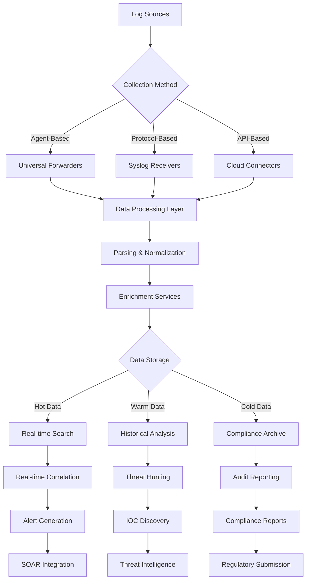
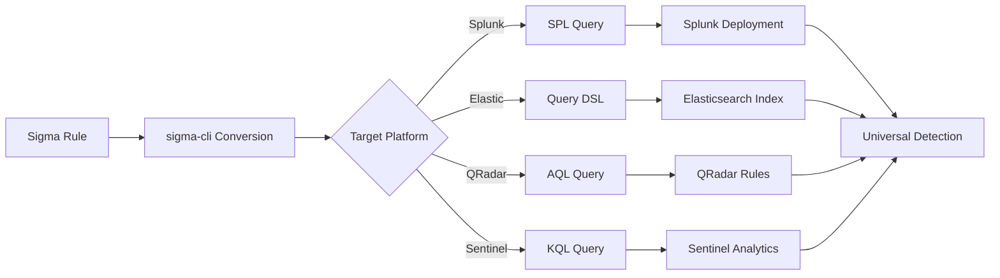

# Module 5: SIEM & Monitoring

Security Information and Event Management (SIEM) represents the operational backbone of modern cybersecurity programs. This module covers the complete SIEM ecosystem from foundational architecture and log management to advanced threat hunting and compliance automation.

---

## 🎯 Learning Objectives

By completing this module, you will understand:
- SIEM architecture evolution and platform selection criteria
- Comprehensive log collection, normalization, and enrichment strategies  
- Detection engineering with platform-agnostic rule development
- Advanced threat hunting methodologies and SIEM optimization
- Compliance automation and regulatory audit support
- Enterprise-scale SIEM deployment and performance tuning

---

## 📚 Module Contents

### Foundation and Architecture
- [**01: SIEM Architecture and Components**](./01-siem-architecture-and-components.md)
  - SIM vs SEM evolution and unified platform benefits
  - Multi-layer architecture (Collection, Processing, Storage, Presentation)
  - Threat intelligence integration and comprehensive security coverage

- [**02: SIEM Platform Landscape**](./02-siem-platform-landscape.md)
  - Enterprise solutions (Splunk, QRadar, ArcSight, LogRhythm)
  - Open source alternatives (Graylog, ELK Stack, OSSIM)
  - Cloud-native platforms (Azure Sentinel, Chronicle)
  - Selection criteria and Total Cost of Ownership (TCO) analysis

### Data Collection and Processing
- [**03: Logging Fundamentals**](./03-logging-fundamentals.md)
  - Security event categories and log quality principles
  - Risk-based log source prioritization (Tier 1/2/3 sources)
  - Data volume management and intelligent filtering strategies

- [**04: Syslog Protocol and Implementation**](./04-syslog-protocol-and-implementation.md)
  - RFC 3164 vs RFC 5424 standards and message structure
  - Priority calculation (Facility × 8 + Severity)
  - Transport security (UDP/TCP/TLS) and enterprise deployment

- [**05: Windows Event Logging**](./05-windows-event-logging.md)
  - Event log architecture (.evt vs .evtx evolution)
  - Critical security events (4624, 4625, 4672, 4688)
  - Advanced monitoring with Sysmon configuration
  - Windows Event Forwarding (WEF) and SIEM integration

- [**06: Advanced Logging Technologies**](./06-advanced-logging-technologies.md)
  - Enhanced Windows monitoring (Sysmon deep dive)
  - Cloud platform logging (Azure Monitor, AWS CloudTrail)
  - Endpoint visibility with OSQuery framework
  - Network traffic analysis with Arkime (full packet capture)

### Data Intelligence and Processing
- [**07: Log Aggregation Strategies**](./07-log-aggregation-strategies.md)
  - Centralized vs distributed vs hierarchical models
  - Collection methods (Syslog, Agent-based, API, Direct access)
  - Performance optimization and storage lifecycle management

- [**08: Data Normalization and Enrichment**](./08-data-normalization-and-enrichment.md)
  - Field mapping and semantic normalization techniques
  - Contextual enrichment (GeoIP, threat intelligence, asset context)
  - Quality assurance and processing pipeline optimization

### Detection Engineering
- [**09: SIEM Rule Development**](./09-siem-rule-development.md)
  - Rule development lifecycle and methodology frameworks
  - Detection types (Rule-based, Behavioral, Risk-based scoring)
  - Tuning strategies and false positive optimization
  - Detection as Code (DaC) and MITRE ATT&CK integration

- [**10: Sigma Universal Detection Framework**](./10-sigma-universal-detection-framework.md)
  - Platform-agnostic detection rule format (YAML-based)
  - Rule structure, field modifiers, and condition logic
  - Conversion tools (sigma-cli) and backend support
  - Community collaboration and rule sharing ecosystem

### Splunk Platform Deep Dive
- [**11: Splunk Platform Fundamentals**](./11-splunk-platform-fundamentals.md)
  - Three-tier architecture (Forwarders, Indexers, Search Heads)
  - Data pipeline phases and bucket lifecycle management
  - Deployment topologies and clustering strategies

- [**12: Splunk Search Processing Language (SPL)**](./12-splunk-search-processing-language.md)
  - SPL syntax, pipeline architecture, and command categories
  - Statistical analysis, field extraction, and data manipulation
  - Advanced patterns and performance optimization techniques

- [**13: Splunk Alert Development**](./13-splunk-alert-development.md)
  - Alert types (Scheduled vs Real-time triggering)
  - Trigger conditions and action configuration
  - Alert management, throttling, and performance monitoring

- [**14: Splunk Dashboard and Reporting**](./14-splunk-dashboard-and-reporting.md)
  - Dashboard frameworks (Simple XML vs Dashboard Studio)
  - Visualization best practices and interactive controls
  - Automated reporting and PDF generation workflows

### Advanced Operations
- [**15: Threat Hunting with SIEM**](./15-threat-hunting-with-siem.md)
  - Hypothesis-driven vs intelligence-based hunting methodologies
  - Advanced techniques (Frequency analysis, Stacking, Temporal correlation)
  - Hunt team organization and maturity assessment
  - Integration with threat intelligence and IOC management

- [**16: SIEM Performance and Scaling**](./16-siem-performance-and-scaling.md)
  - Performance bottlenecks and Events Per Second (EPS) limitations
  - Horizontal vs vertical scaling strategies
  - Cloud and hybrid architecture patterns
  - Capacity planning and automated health monitoring

- [**17: Compliance and Audit Support**](./17-compliance-and-audit-support.md)
  - Regulatory frameworks (GDPR, PCI DSS, HIPAA, SOX, CMMC)
  - Automated compliance reporting and audit trail management
  - Evidence collection and auditor collaboration workflows

---

## 🔧 Essential Tools and Technologies

| Tool Category | Tools | Purpose | Key Features |
|---------------|-------|---------|---------------|
| **Enterprise SIEM** | Splunk, QRadar, ArcSight, LogRhythm | Comprehensive security monitoring | Real-time correlation, enterprise scalability |
| **Open Source** | ELK Stack, Graylog, OSSIM | Cost-effective monitoring | Community support, customization flexibility |
| **Cloud-Native** | Azure Sentinel, Chronicle, Sumo Logic | Scalable cloud monitoring | Auto-scaling, managed services, global reach |
| **Detection Development** | Sigma, sigma-cli, Uncoder.io | Platform-agnostic rules | Universal rule format, cross-platform deployment |
| **Log Collection** | Beats, Universal Forwarders, Syslog-ng | Data ingestion and forwarding | Agent-based, protocol-based, API integration |
| **Enrichment** | Threat Intel Platforms, GeoIP, MISP | Context enhancement | IOC matching, attribution, risk scoring |

---

## 📊 SIEM Operational Workflow



---

## 🏗️ SIEM Architecture Comparison

| Architecture | Advantages | Disadvantages | Best For |
|-------------|------------|---------------|----------|
| **Single Instance** | Simple deployment, low cost | Limited scalability, single point of failure | Small environments, testing |
| **Distributed** | Horizontal scaling, fault tolerance | Complex management, higher cost | Medium enterprises |
| **Clustered** | High availability, load distribution | Operational complexity, resource overhead | Large enterprises |
| **Cloud-Native** | Auto-scaling, managed services | Vendor dependency, data sovereignty | Global organizations |

---

## 🔍 Detection Engineering Evolution

### Rule Development Maturity

| Level | Approach | Characteristics | Example Techniques |
|-------|----------|----------------|-------------------|
| **Level 1** | IOC-Based | Known bad signatures | Hash matching, IP blacklists |
| **Level 2** | Behavioral | Pattern recognition | Failed login thresholds, data volume spikes |
| **Level 3** | Statistical | Baseline deviation | User behavior analytics, time-series anomalies |
| **Level 4** | AI/ML Enhanced | Adaptive learning | Ensemble models, deep learning correlations |

### Sigma Framework Integration



---

## 📈 Threat Hunting Methodology Comparison

| Approach | Trigger | Process | Outcome | Skill Level |
|----------|---------|---------|---------|-------------|
| **IOC-Based** | Threat intelligence | Search for known indicators | Confirmed threats, attribution | Beginner |
| **Hypothesis-Driven** | Analyst intuition | Scientific method investigation | New TTPs, detection gaps | Intermediate |
| **Situational** | Environmental factors | Context-aware analysis | Custom threats, insider activity | Advanced |
| **Behavioral** | Statistical anomalies | Machine learning assisted | Unknown threats, zero-days | Expert |

### Hunt Techniques Arsenal
- **Frequency Analysis** - Identify rare or unusual events indicating compromise
- **Stacking and Clustering** - Group similar activities to spot outliers
- **Temporal Analysis** - Detect activities outside normal business patterns
- **Volume Analysis** - Identify data exfiltration through transfer patterns
- **Correlation Hunting** - Link events across multiple data sources

---

## 🏢 Enterprise SIEM Scaling

### Performance Scaling Metrics

| EPS Range | Infrastructure | Typical Use Case | Architecture Pattern |
|-----------|---------------|------------------|---------------------|
| **< 5,000** | Single node, 64GB RAM | Small business, branch office | Standalone deployment |
| **5K - 20K** | Small cluster, 256GB RAM | Medium enterprise, regional | Distributed indexers |
| **20K - 100K** | Multi-tier cluster, 1TB+ RAM | Large enterprise, global | Full clustering with HA |
| **> 100K** | Cloud-scale, auto-scaling | Service provider, mega-corp | Hybrid cloud architecture |

### Data Lifecycle Management
```
Hot Tier (0-30 days): SSD storage, real-time correlation, active investigations
    ↓
Warm Tier (30 days - 1 year): High-performance HDD, historical analysis, compliance queries  
    ↓
Cold Tier (1+ years): Archive storage, long-term retention, legal hold requirements
```

---

## ⚖️ Compliance Framework Integration

### Regulatory Requirements Mapping

| Framework | Log Retention | Key Requirements | SIEM Capabilities |
|-----------|---------------|------------------|-------------------|
| **GDPR** | Processing duration + statute | Data processing monitoring, breach detection | Real-time alerts, automated reporting |
| **PCI DSS** | 1 year online + archive | Cardholder data access logging | Specialized dashboards, compliance reports |
| **HIPAA** | 6 years minimum | ePHI access monitoring | Audit trails, access control verification |
| **SOX** | 7 years financial data | Financial system change tracking | Configuration monitoring, executive reporting |

### Automated Compliance Reporting
- **Real-time Dashboards** - Executive compliance status visibility
- **Scheduled Reports** - Automated regulatory submission preparation  
- **Exception Management** - Policy violation tracking and remediation
- **Audit Trail Maintenance** - Tamper-evident log preservation

---

## 🧠 Platform-Specific Expertise

### Splunk Mastery Path

| Component | Core Skills | Advanced Techniques | Expert Capabilities |
|-----------|-------------|-------------------|-------------------|
| **SPL Development** | Basic search syntax, statistical commands | Complex correlation, subsearches | Custom commands, advanced analytics |
| **Architecture** | Single instance setup | Distributed deployment | Enterprise clustering, performance tuning |
| **Apps & Add-ons** | Installation and configuration | Custom app development | Marketplace contribution |
| **Integration** | Basic API usage | Custom alert actions | Advanced automation, SOAR integration |

### Multi-Platform Competency
- **Cross-Platform Rule Development** - Sigma framework mastery for vendor independence
- **Data Source Expertise** - Universal log source knowledge across platforms
- **Architecture Patterns** - Platform-agnostic design principles
- **Performance Optimization** - Universal tuning techniques and best practices

---

## 🔗 Essential Resources

### Official Documentation
- [Splunk Documentation](https://docs.splunk.com/) - Comprehensive platform guides
- [Sigma HQ Repository](https://github.com/SigmaHQ/sigma) - Community detection rules
- [Elastic Security](https://www.elastic.co/guide/en/security/current/) - ELK Stack security

### Detection Resources
- [MITRE ATT&CK](https://attack.mitre.org/) - Adversary tactics and techniques framework
- [Detection Engineering](https://detectionengineering.io/) - Community best practices
- [Uncoder.io](https://uncoder.io/) - Online Sigma rule converter

### Training and Certification
- [Splunk Education](https://www.splunk.com/en_us/training.html) - Official Splunk training
- [SANS SEC555](https://www.sans.org/cyber-security-courses/siem-with-tactical-analytics/) - SIEM with Tactical Analytics
- [Elastic Training](https://www.elastic.co/training/) - ELK Stack certification programs

### Threat Hunting Resources
- [ThreatHunter-Playbook](https://github.com/OTRF/ThreatHunter-Playbook) - Community hunting techniques
- [Hunting ELK](https://github.com/Cyb3rWard0g/HELK) - Open source hunting platform
- [MITRE Cyber Analytics Repository](https://car.mitre.org/) - Analytics and detection methods

### Performance and Scaling
- [Splunk Validated Architectures](https://www.splunk.com/en_us/pdfs/technical-briefs/) - Enterprise deployment guides
- [High Volume SIEM](https://www.elastic.co/guide/en/elasticsearch/reference/current/scalability.html) - Elasticsearch scaling
- [Cloud SIEM Best Practices](https://docs.microsoft.com/en-us/azure/sentinel/) - Cloud-native optimization

---

[⬆️ Back to Main Course](../README.md)
