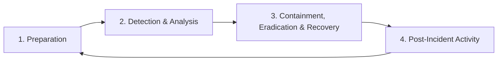

# 6.2: IR Frameworks and Methodologies

Incident response frameworks provide structured methodologies for handling security incidents consistently and effectively. These frameworks establish common terminology, processes, and best practices across the cybersecurity industry.

---

## NIST SP 800-61 Framework

The **NIST Special Publication 800-61** is the gold standard for incident response, providing a comprehensive framework adopted by organizations worldwide.

### The Four-Phase NIST Model



#### Phase 1: Preparation
**Objective**: Establish capability to respond effectively to incidents.

**Key Activities**:
- Develop IR policy and procedures
- Create and train incident response team
- Implement security controls and monitoring
- Establish communication procedures
- Prepare incident handling resources

**Deliverables**:
- IR plan and playbooks
- Team contact lists
- Tool inventories
- Communication templates

#### Phase 2: Detection and Analysis
**Objective**: Identify and analyze potential security incidents.

**Key Activities**:
- Monitor security events across the environment
- Analyze alerts and indicators to determine if an incident occurred
- Collect and preserve evidence
- Notify appropriate stakeholders
- Prioritize incidents based on business impact

**Common Detection Methods**:

| Method | Description | Examples |
|--------|-------------|----------|
| **Automated Monitoring** | SIEM, IDS/IPS, EDR alerts | Malware detections, anomalous network traffic |
| **User Reports** | Internal users reporting suspicious activity | Phishing emails, slow system performance |
| **External Notifications** | Third parties reporting issues | Law enforcement, security vendors, customers |
| **Proactive Discovery** | Threat hunting and audits | Vulnerability assessments, penetration tests |

#### Phase 3: Containment, Eradication, and Recovery
**Objective**: Stop the incident from spreading, eliminate the threat, and restore normal operations.

**Containment Strategies**:

| Strategy | When to Use | Pros | Cons |
|----------|-------------|------|------|
| **Short-term** | Immediate threat mitigation | Quick implementation | May not eliminate root cause |
| **Long-term** | Permanent solution development | Comprehensive fix | Time-intensive |
| **Acceptable Loss** | Cost of containment exceeds impact | Resource conservation | Some systems remain compromised |

**Recovery Process**:
1. **System Hardening**: Apply patches, update configurations
2. **Restoration**: Rebuild systems from clean backups
3. **Monitoring**: Enhanced surveillance for recurring activity
4. **Validation**: Confirm systems are functioning normally

#### Phase 4: Post-Incident Activity
**Objective**: Learn from the incident and improve future response capabilities.

**Key Activities**:
- Conduct lessons learned meeting
- Document incident details and response actions
- Update IR plans and procedures
- Implement additional security controls
- Share information with relevant communities

---

## SANS Incident Response Process

The **SANS Institute** provides a complementary six-step methodology that expands on the NIST framework with additional granularity.

### The SANS Six-Step Process

```
1. Preparation
2. Identification  
3. Containment
4. Eradication
5. Recovery
6. Lessons Learned
```

### Detailed SANS Steps

| Step | Focus | Key Questions |
|------|-------|---------------|
| **Preparation** | Readiness | Are we prepared to handle an incident? |
| **Identification** | Detection | Has an incident occurred? What is the scope? |
| **Containment** | Damage Control | How do we stop the spread? |
| **Eradication** | Threat Removal | How do we eliminate the threat? |
| **Recovery** | Restoration | How do we safely restore operations? |
| **Lessons Learned** | Improvement | What can we learn and improve? |

---

## Incident Classifications and Severity Levels

Proper classification ensures appropriate resource allocation and response urgency.

### Incident Categories by Impact

#### **Category 1: Data Breach**
- **Definition**: Unauthorized access or disclosure of sensitive data
- **Regulatory Implications**: GDPR, HIPAA, PCI-DSS notification requirements
- **Response Priority**: High - Legal and regulatory deadlines

#### **Category 2: Service Disruption**
- **Definition**: Significant impact on business operations or customer services
- **Business Impact**: Revenue loss, customer dissatisfaction, SLA violations
- **Response Priority**: High - Business continuity focused

#### **Category 3: Malware Infection**
- **Definition**: Confirmed presence of malicious software
- **Technical Impact**: System compromise, potential data theft, lateral movement
- **Response Priority**: Medium to High - Based on malware type and spread

#### **Category 4: Unauthorized Access**
- **Definition**: Improper use of systems or accounts
- **Security Impact**: Privilege escalation, insider threats, external intrusion
- **Response Priority**: Medium - Investigation and access control focused

### Severity Level Matrix

| Severity | Business Impact | Technical Impact | Response Time | Escalation |
|----------|----------------|------------------|---------------|------------|
| **Critical** | Severe business disruption, significant data loss | Complete system compromise, active data exfiltration | < 1 hour | Executive leadership, external experts |
| **High** | Major business impact, sensitive data exposure | Multiple systems affected, confirmed malicious activity | < 4 hours | Senior management, specialized teams |
| **Medium** | Moderate business impact, limited data exposure | Single system affected, suspicious activity confirmed | < 24 hours | Department management, standard team |
| **Low** | Minimal business impact, no data exposure | Isolated incident, policy violation | < 72 hours | Supervisor notification, standard process |

### Priority Calculation Formula

```
Priority = (Business Impact × Urgency × Scope) / Available Resources

Where:
- Business Impact: 1-5 scale (revenue, reputation, compliance)
- Urgency: 1-5 scale (time sensitivity, escalation potential)  
- Scope: 1-5 scale (number of systems, users, data affected)
- Available Resources: Current team capacity and expertise
```

---

## Incident Declaration Criteria

Clear criteria help determine when an event becomes an incident requiring formal response.

### Technical Indicators
- **Confirmed malware detection** by multiple security tools
- **Unauthorized network connections** to known malicious IPs
- **Abnormal data transfer volumes** outside normal patterns
- **Privilege escalation attempts** or successful unauthorized access
- **System performance degradation** without clear cause

### Business Indicators
- **Customer complaints** about service availability or data concerns
- **Regulatory notification triggers** met or exceeded
- **Media attention** or public disclosure of potential issues
- **Partner/vendor notifications** of compromise or suspicious activity
- **Financial impact thresholds** exceeded

### Legal and Compliance Indicators
- **Personal data potentially exposed** to unauthorized parties
- **Intellectual property theft** suspected or confirmed
- **Compliance violations** detected or reported
- **Criminal activity suspected** requiring law enforcement notification

---

## Documentation Standards

Consistent documentation is critical for legal, regulatory, and improvement purposes.

### Incident Record Template

```markdown
## Incident ID: INC-YYYY-NNNN

### Executive Summary
- Incident Type: [Category]
- Severity: [Critical/High/Medium/Low] 
- Status: [Open/Contained/Resolved/Closed]
- Business Impact: [Description]
- Root Cause: [Summary]

### Timeline
- Detection: [Date/Time]
- Declaration: [Date/Time] 
- Containment: [Date/Time]
- Resolution: [Date/Time]

### Systems Affected
- [System 1]: [Impact Description]
- [System 2]: [Impact Description]

### Response Actions
1. [Action Taken] - [Date/Time] - [Person]
2. [Action Taken] - [Date/Time] - [Person]

### Evidence Collected
- [Evidence Type] - [Location] - [Chain of Custody]

### Lessons Learned
- [Improvement Area]
- [Recommendation]
```

### Metrics to Track

| Metric | Purpose | Calculation |
|--------|---------|-------------|
| **Mean Time to Detection (MTTD)** | Measure detection effectiveness | Time from incident start to detection |
| **Mean Time to Response (MTTR)** | Measure response speed | Time from detection to initial response |
| **Mean Time to Containment (MTTC)** | Measure containment effectiveness | Time from response to containment |
| **Mean Time to Recovery (MTR)** | Measure recovery efficiency | Time from containment to full recovery |

[⬆️ Back to Incident Response](./README.md)
