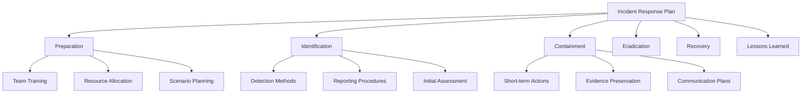

# 6.3: Preparation Phase

Preparation is the foundation of effective incident response. This phase involves creating comprehensive plans, building skilled teams, and establishing the infrastructure needed to respond effectively when incidents occur.

---

## Incident Response Plans (IRP)

**A well-documented IRP** prevents confusion during high-stress incidents and ensures consistent, effective responses.

### IRP Structure Framework



### 1. Preparation Section

#### Team Readiness
- **Response plan development** for different incident types
- **Simulated scenario exercises** to test team effectiveness  
- **Resource provisioning** (laptops, software, forensic equipment)
- **Training programs** tailored to specific roles and responsibilities
- **Budget approval** for abandoning normal duties during incidents

#### Continuous Training Requirements
- **Security analysts**: Alert triage and incident classification
- **Forensic analysts**: Evidence acquisition and preservation
- **PR/Communications**: Media response and stakeholder notification
- **Management**: Decision-making under pressure
- **Legal**: Compliance and evidence handling procedures

### 2. Identification Section

#### Detection and Reporting Framework
- **When**: Timestamp requirements and timezone considerations
- **Who**: Discovery source (security team, employee, external notification)
- **How**: Detection method (automated alert, user report, external tip)
- **What**: Affected systems and business units
- **Impact**: Operational disruption assessment
- **Scope**: Extent of compromise and damage evaluation

#### Incident Prioritization Matrix

| Criticality Level | Response Time | Examples |
|------------------|---------------|----------|
| **Critical** | < 15 minutes | Active data exfiltration, ransomware |
| **High** | < 1 hour | Confirmed malware, privilege escalation |
| **Medium** | < 4 hours | Suspicious activity, failed attacks |
| **Low** | < 24 hours | Policy violations, minor anomalies |

| Impact Level | Business Effect | Examples |
|-------------|----------------|----------|
| **Severe** | Operations halted | Payment systems down, manufacturing stopped |
| **Major** | Significant disruption | Email systems compromised, databases locked |
| **Moderate** | Limited impact | Individual workstations affected |
| **Minor** | Minimal disruption | Non-critical systems impacted |

### 3. Containment Section

#### Evidence Preservation Guidelines
- **Memory analysis priority** - volatile data collection before shutdown
- **Write-blocker usage** for disk imaging and analysis
- **Chain of custody** documentation requirements
- **Photography** of physical evidence and system states

#### Containment Strategy Selection

| Containment Type | Use Case | Considerations |
|-----------------|----------|----------------|
| **Network Isolation** | Malware spread prevention | May lose remote access |
| **Account Disabling** | Credential compromise | User productivity impact |
| **Service Shutdown** | Critical system protection | Business continuity needs |
| **Backup Activation** | System replacement | Recovery time objectives |

### 4. Eradication & Recovery Sections

#### Analysis Requirements
- **MITRE ATT&CK mapping** for technique identification
- **Root cause analysis** using forensic examination
- **IOC generation** for threat hunting and sharing
- **Timeline reconstruction** for complete understanding

#### Defensive Hardening
- **Patch management** for exploited vulnerabilities
- **Configuration changes** to prevent reoccurrence  
- **NIPS/HIPS rule updates** using discovered IOCs
- **Run-book creation** for similar future incidents

---

## Incident Response Teams

### Team Structure and Roles

#### Core Leadership
**Incident Commander**
- **Primary responsibility**: Coordinate all response efforts
- **Communication hub**: Single point of contact for stakeholders
- **Decision authority**: Resource allocation and strategy decisions
- **Reporting**: Regular updates to management and C-suite

#### Technical Specialists

**Security Analysts**
- **Alert triage**: Initial incident classification and prioritization
- **Investigation**: Technical analysis of security events
- **Tool expertise**: SIEM, IDS/IPS, and monitoring platform proficiency
- **Documentation**: Detailed technical findings and evidence

**Forensic Analysts** 
- **Evidence acquisition**: Forensically sound data collection
- **Deep analysis**: Advanced investigation techniques
- **Legal preparation**: Court-admissible evidence preparation
- **Tool mastery**: Specialized forensic software and hardware

**Threat Intelligence Analysts**
- **Context provision**: Actor attribution and campaign analysis
- **IOC validation**: Threat hunting and exposure assessment
- **Intelligence sharing**: External community collaboration
- **MITRE ATT&CK mapping**: Technique and tactic identification

#### Business Stakeholders

**Management/C-Suite**
- **Resource authorization**: Budget and personnel allocation
- **Strategic decisions**: Business impact and response priorities
- **External relations**: Media and regulatory communication
- **Risk acceptance**: Tolerance levels and escalation triggers

**Human Resources**
- **Personnel issues**: Insider threat response
- **Disciplinary actions**: Policy violation consequences
- **Communication**: Employee notification and training
- **Legal coordination**: Employment law compliance

**Public Relations**
- **Media relations**: Press statement preparation and delivery
- **Stakeholder communication**: Customer and partner notification
- **Reputation management**: Brand protection during incidents
- **Regulatory coordination**: Required disclosure management

**Legal Team**
- **Compliance assurance**: Regulatory requirement adherence
- **Evidence oversight**: Legal admissibility standards
- **Liability assessment**: Risk and exposure evaluation
- **External coordination**: Law enforcement and regulatory interaction

### Team Activation Thresholds

#### Automatic Activation Triggers
- **Data breach confirmed** with customer information exposure
- **Ransomware deployment** across multiple systems
- **Critical infrastructure** compromise or disruption
- **Executive system** compromise or targeting

#### Escalation Criteria
- **Financial impact** exceeding predetermined thresholds
- **Media attention** or public exposure
- **Regulatory requirements** triggering mandatory disclosure
- **Customer impact** affecting service delivery

---

## Asset Inventory and Risk Assessment

### Asset Inventory Management

#### Comprehensive Asset Database (CMDB)
**Asset Categories**:
- **Endpoints**: Desktops, laptops, mobile devices
- **Servers**: Physical and virtual infrastructure  
- **Network devices**: Firewalls, switches, routers, load balancers
- **IoT devices**: Connected sensors, appliances, and systems
- **Applications**: Business-critical software and services

#### Critical Asset Information
- **System owner** and primary contact information
- **Operating system** version and patch level
- **Installed software** inventory and versions
- **Network configuration** including IP addresses and VLANs
- **Data classification** and sensitivity levels
- **Business criticality** rating and dependencies

### Risk Assessment Framework

#### Risk Calculation Matrix
```
Risk = Threat × Vulnerability × Impact
```

#### Asset Prioritization Criteria

| Priority Level | Characteristics | Response Requirements |
|---------------|----------------|----------------------|
| **Critical** | Mission-essential, customer-facing | 24/7 monitoring, immediate response |
| **High** | Important business functions | Business hours monitoring, <4hr response |
| **Medium** | Supporting systems | Standard monitoring, <24hr response |
| **Low** | Non-essential systems | Basic monitoring, best-effort response |

#### Risk Treatment Strategies

| Strategy | Application | Examples |
|----------|------------|----------|
| **Mitigate** | Cost-effective controls available | Patch management, access controls |
| **Transfer** | Insurance or outsourcing viable | Cyber insurance, cloud services |
| **Accept** | Low impact, high cost to mitigate | Legacy systems near retirement |
| **Avoid** | Unacceptable risk levels | Discontinue risky services |

### Business Impact Analysis Integration

#### Critical System Dependencies
- **Business Continuity Plan** integration for priority identification
- **Recovery Time Objectives (RTO)** for each system classification
- **Recovery Point Objectives (RPO)** for data loss tolerance
- **Maximum Tolerable Downtime (MTD)** calculations

#### Incident Prioritization Matrix
When multiple incidents occur simultaneously:

1. **Customer-facing systems** take priority over internal tools
2. **Revenue-generating** systems prioritized over support systems  
3. **Regulated data** systems require immediate attention
4. **Safety-critical** systems override all other priorities

---

## Preparation Success Metrics

### Readiness Indicators
- **Team activation time**: < 30 minutes for critical incidents
- **Plan currency**: Updated within last 6 months
- **Training completion**: 100% of team members current
- **Exercise frequency**: Quarterly tabletop and annual full-scale

### Resource Availability
- **Equipment readiness**: 100% functional and accessible
- **Documentation accuracy**: < 5% outdated information
- **Contact currency**: Monthly validation of all stakeholder contacts
- **Budget allocation**: Sufficient for 72-hour sustained response

Effective preparation dramatically improves incident response outcomes and reduces overall business impact.

[⬆️ Back to Incident Response](./README.md)
