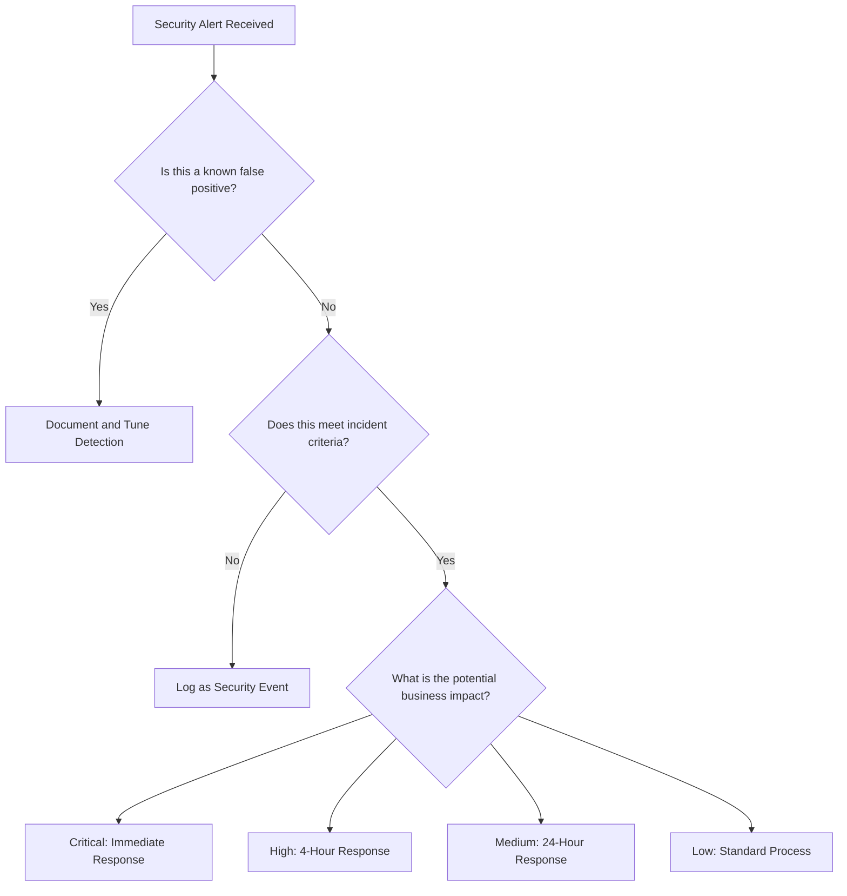

# 6.4: Detection and Analysis

Detection and analysis form the critical bridge between a security event occurring and an effective response being initiated. This phase determines whether an incident has actually occurred and, if so, its scope, severity, and required response.

---

## Incident Detection Methods

Organizations must implement multiple detection layers to identify incidents across various attack vectors and stages.

### Detection Source Categories

#### **Automated Security Tools**
Modern security infrastructure provides the first line of automated detection:

| Tool Type | Detection Capability | Typical Alerts |
|-----------|---------------------|----------------|
| **SIEM** | Cross-platform correlation and analysis | Correlation rules, anomaly detection, threat hunting |
| **IDS/IPS** | Network-based attack detection | Signature matches, protocol anomalies, behavioral analysis |
| **EDR/XDR** | Endpoint behavior monitoring | Malware execution, suspicious processes, file modifications |
| **DLP** | Data exfiltration attempts | Unauthorized data transfers, policy violations |
| **Email Security** | Malicious email detection | Phishing attempts, malware attachments, suspicious domains |

#### **Human Detection Sources**
Despite automation advances, human observers remain crucial detection sources:

| Source | Detection Type | Common Scenarios |
|--------|----------------|------------------|
| **End Users** | Suspicious activity reports | Phishing emails, slow systems, unusual behavior |
| **System Administrators** | Infrastructure anomalies | Performance issues, configuration changes, access anomalies |
| **Security Analysts** | Proactive threat hunting | IOC searches, behavioral analysis, trend investigation |
| **Business Users** | Process/data anomalies | Missing data, unauthorized changes, process failures |

#### **External Detection Sources**
Third parties often detect incidents before internal systems:

| Source | Information Type | Response Requirements |
|--------|------------------|----------------------|
| **Law Enforcement** | Criminal activity notifications | Immediate legal coordination, evidence preservation |
| **Customers/Partners** | Service impact reports | Business impact assessment, communication planning |
| **Security Vendors** | Threat intelligence alerts | IOC validation, threat hunting, preventive measures |
| **Cyber Threat Sharing** | Industry-wide threats | Proactive defense, community response |

---

## Initial Triage and Analysis

Effective triage separates true incidents from false positives and prioritizes response efforts.

### Triage Decision Framework



### Initial Analysis Checklist

#### **Indicator Validation** (15-30 minutes)
- [ ] **Confirm Detection Accuracy**: Verify the alert is not a false positive
- [ ] **Cross-Reference Multiple Sources**: Check if other tools detected similar activity
- [ ] **Validate Timing**: Confirm timestamps align with business operations
- [ ] **Check Known Issues**: Review recent changes, maintenance, or known problems

#### **Scope Assessment** (30-60 minutes)
- [ ] **System Identification**: Determine all affected systems and networks
- [ ] **User Impact**: Identify affected user accounts and access patterns  
- [ ] **Data Involvement**: Assess what data may be compromised or at risk
- [ ] **Geographic Distribution**: Map incident across locations and time zones

#### **Business Impact Evaluation** (15-30 minutes)
- [ ] **Service Availability**: Assess impact on customer-facing services
- [ ] **Operational Disruption**: Evaluate effect on business processes
- [ ] **Regulatory Implications**: Consider compliance and notification requirements
- [ ] **Financial Exposure**: Estimate potential costs and losses

### Severity Assessment Matrix

| Factor | Weight | Critical (5) | High (4) | Medium (3) | Low (2) | Minimal (1) |
|--------|--------|-------------|----------|------------|---------|-------------|
| **Business Impact** | 30% | Complete service outage | Major service degradation | Moderate service impact | Minor impact | No service impact |
| **Data Sensitivity** | 25% | PII/PHI/Financial exposed | Internal sensitive data | Business confidential | Public information | No data involved |
| **System Criticality** | 20% | Core production systems | Important production systems | Development/test systems | Isolated systems | Non-production |
| **Threat Sophistication** | 15% | APT/Nation-state | Organized crime | Skilled individual | Script kiddie | Accidental |
| **Urgency** | 10% | Active ongoing attack | Recent compromise | Historical evidence | Suspicious activity | Policy violation |

**Calculation**: `Severity Score = Σ(Factor Score × Weight)`
- **Critical**: 4.0-5.0
- **High**: 3.0-3.9  
- **Medium**: 2.0-2.9
- **Low**: 1.0-1.9

---

## Evidence Collection and Preservation

Proper evidence handling ensures investigation integrity and supports potential legal proceedings.

### Evidence Types and Sources

#### **Volatile Evidence** (Collect First)
**Priority**: Highest - Lost when system powers down

| Evidence Type | Collection Method | Tools | Retention |
|---------------|-------------------|-------|-----------|
| **Memory Contents** | RAM acquisition | FTK Imager, Volatility, KAPE | Full investigation + 7 years |
| **Network Connections** | Live network state | netstat, ss, tcpdump | Document immediately |
| **Running Processes** | Process listing | ps, tasklist, Process Monitor | Document immediately |
| **Logged-in Users** | Active session data | who, w, PsLoggedOn | Document immediately |

#### **Semi-Volatile Evidence**
**Priority**: High - May change during normal operations

| Evidence Type | Collection Method | Considerations |
|---------------|-------------------|----------------|
| **Temporary Files** | File system imaging | May be overwritten during normal operations |
| **Swap/Pagefile** | Physical acquisition | Contains memory remnants from previous operations |
| **Network Routing** | Configuration dump | Changes with network topology updates |
| **Registry Data** | Registry hive export | Windows-specific, frequent updates |

#### **Non-Volatile Evidence**  
**Priority**: Medium - Persistent storage data

| Evidence Type | Collection Method | Chain of Custody |
|---------------|-------------------|------------------|
| **Hard Drive Images** | Bit-for-bit forensic copy | Hash verification, write-blocking |
| **Log Files** | Secure file copy | Timestamp preservation, integrity validation |
| **Configuration Files** | Version-controlled backup | Change tracking, approval workflows |
| **Database Contents** | Logical/physical backup | Transaction log preservation |

### Collection Procedures

#### **Live System Evidence Collection**

**Step 1: Preparation** (5 minutes)
```bash
# Create working directory
mkdir /tmp/ir_evidence_$(date +%Y%m%d_%H%M)
cd /tmp/ir_evidence_$(date +%Y%m%d_%H%M)

# Document system state
date > collection_start.txt
whoami >> collection_start.txt  
hostname >> collection_start.txt
```

**Step 2: Network State** (2 minutes)
```bash
# Active connections
netstat -anp > network_connections.txt
ss -tuln > socket_statistics.txt

# ARP table and routing
arp -a > arp_table.txt
route -n > routing_table.txt
```

**Step 3: Process Information** (3 minutes)
```bash
# Process listing
ps aux > running_processes.txt
pstree > process_tree.txt

# Open files
lsof > open_files.txt
```

**Step 4: User Activity** (2 minutes)
```bash
# Logged in users
w > logged_users.txt
who > who_output.txt
last > login_history.txt
```

**Step 5: System Information** (3 minutes)
```bash
# System configuration
uname -a > system_info.txt
df -h > disk_usage.txt
mount > mounted_filesystems.txt
cat /etc/passwd > user_accounts.txt
```

#### **Network Evidence Collection**

**Packet Capture Setup**:
```bash
# Immediate capture for ongoing incidents
tcpdump -i any -w incident_traffic_$(date +%Y%m%d_%H%M).pcap

# Filtered capture for specific hosts
tcpdump -i any host [suspicious_ip] -w targeted_capture.pcap

# Full packet capture with rotation
tcpdump -i any -C 100 -W 10 -w full_capture.pcap
```

### Chain of Custody Documentation

#### **Evidence Tracking Form**

```markdown
## Evidence Item: [Unique Identifier]

**Collection Information:**
- Date/Time: [ISO 8601 format]
- Collector: [Name and role]
- Location: [Physical/network location]
- Method: [Collection technique used]

**Item Description:**
- Type: [Hard drive, memory dump, log files, etc.]
- Size: [Physical or logical size]
- Hash Values:
  - MD5: [hash value]
  - SHA256: [hash value]

**Storage Information:**
- Location: [Secure storage location]
- Access Controls: [Who can access]
- Retention Period: [Legal/policy requirements]

**Chain of Custody:**
| Date/Time | Transferred From | Transferred To | Purpose | Signature |
|-----------|------------------|----------------|---------|-----------|
| [DateTime] | [Person] | [Person] | [Analysis/Storage] | [Signature] |

**Integrity Verification:**
- [ ] Hash verification performed
- [ ] Write-blocker used during acquisition  
- [ ] Duplicate created for analysis
- [ ] Original secured in evidence storage
```

---

## Attack Vector Identification

Understanding how an attack occurred helps guide response priorities and prevention measures.

### Common Attack Vectors and Indicators

#### **Email-Based Attacks**

**Indicators to Investigate:**
- Suspicious email attachments or links clicked
- Unusual email forwarding rules created
- Unexpected email account activity
- Credential harvesting attempts

**Investigation Steps:**
1. **Email Flow Analysis**: Trace message routing and delivery
2. **Attachment Analysis**: Sandbox suspicious files
3. **Link Analysis**: Check URLs for malicious content  
4. **Account Review**: Examine mailbox rules and forwarding

#### **Web-Based Attacks**

**Common Patterns:**
- SQL injection attempts in web logs
- Unusual user-agent strings
- Excessive 404 errors (directory scanning)
- Large POST requests (data exfiltration)

**Investigation Approach:**
```
Web Log Analysis Pipeline:
┌─────────────────┐    ┌─────────────────┐    ┌─────────────────┐
│ Collect Web     │ → │ Parse and       │ → │ Correlate with  │
│ Server Logs     │   │ Normalize Data  │   │ Other Evidence  │
└─────────────────┘    └─────────────────┘    └─────────────────┘
```

#### **Network-Based Attacks**

**Detection Indicators:**
- Unusual network traffic patterns
- Connections to known malicious IPs
- DNS queries to suspicious domains  
- Large data transfers outside business hours

**Analysis Tools and Techniques:**
- **Flow Analysis**: NetFlow, sFlow data examination
- **Packet Analysis**: Deep packet inspection with Wireshark
- **DNS Analysis**: Passive DNS data and query patterns
- **Bandwidth Analysis**: Traffic volume and timing patterns

### Timeline Development

Creating an accurate timeline helps understand attack progression and impact.

#### **Timeline Construction Process**

**Phase 1: Data Collection** (Multiple Sources)
- System logs (Windows Event Logs, Syslog)
- Security tool alerts (SIEM, IDS/IPS, EDR)
- Network data (Firewall logs, proxy logs, DNS)
- Application logs (Web servers, databases, email)

**Phase 2: Normalization** (Common Format)
```
Standard Timeline Entry Format:
[YYYY-MM-DD HH:MM:SS UTC] [Source] [Event Type] [Description]

Example:
2024-01-15 14:23:42 UTC [Exchange] [Login] User account compromised-user@company.com successful login from 203.0.113.5
2024-01-15 14:24:15 UTC [EDR] [Process] powershell.exe launched with suspicious parameters
2024-01-15 14:25:33 UTC [Firewall] [Network] Outbound connection to 198.51.100.10:443 allowed
```

**Phase 3: Analysis and Correlation**
- Identify patterns and relationships between events
- Map events to MITRE ATT&CK techniques
- Highlight gaps in visibility or logging
- Create visual timeline for stakeholder communication

#### **Timeline Analysis Questions**

| Phase | Key Questions | Investigation Focus |
|-------|---------------|-------------------|
| **Initial Access** | How did the attacker first gain access? | Email analysis, vulnerability exploitation, credential theft |
| **Persistence** | How did they maintain access? | Registry changes, scheduled tasks, service installations |
| **Privilege Escalation** | How did they gain higher privileges? | Vulnerability exploitation, credential harvesting |
| **Lateral Movement** | What other systems were compromised? | Network connections, authentication logs, process execution |
| **Data Access** | What information was accessed or stolen? | File access logs, database queries, email access |
| **Exfiltration** | How was data removed from the environment? | Network traffic analysis, cloud uploads, external devices |

[⬆️ Back to Incident Response](./README.md)
