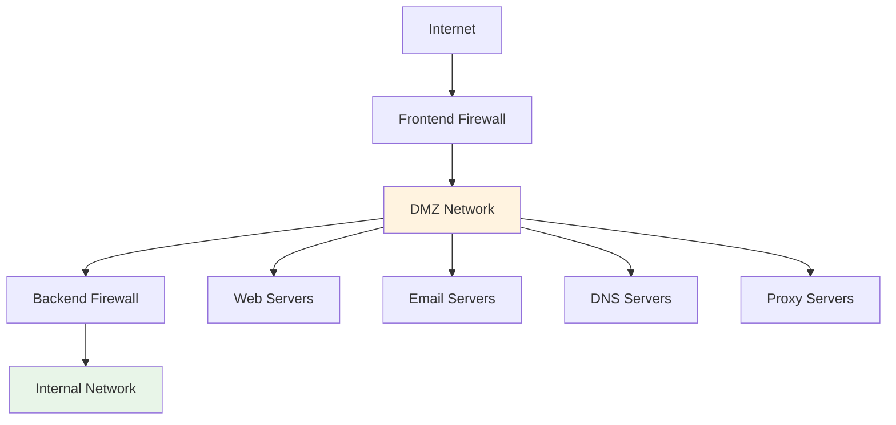
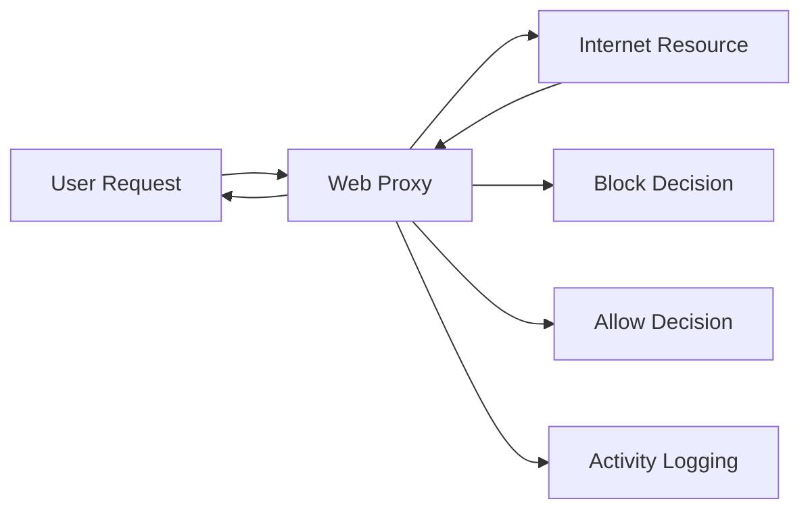

# 6.4: Prevention Controls

Prevention controls implement the "defense-in-depth" strategy, creating multiple security layers to slow attackers and provide detection opportunities. This comprehensive approach spans network architecture, host systems, email security, and human factors.

---

## Network Architecture Defense

### DMZ (Demilitarized Zone) Implementation



#### DMZ Architecture Options

**Single Firewall (Three-Legged Model)**
- **Cost-effective** solution for smaller organizations
- **Minimum 3 interfaces**: External, DMZ, Internal
- **Shared security policies** across all zones
- **Single point of failure** risk

**Dual Firewall (Enhanced Security)**
- **Frontend firewall**: Filters traffic to DMZ only
- **Backend firewall**: Controls DMZ to internal access
- **Vendor diversity** reduces common vulnerability exposure
- **Higher cost** but significantly improved security

#### DMZ Service Placement

| Service Type | Security Justification | Access Requirements |
|-------------|----------------------|-------------------|
| **Web Servers** | Public access required | HTTP/HTTPS from internet |
| **Email Servers** | External communication needed | SMTP/POP3/IMAP protocols |
| **DNS Servers** | Name resolution for public services | UDP/TCP port 53 |
| **FTP Servers** | File transfer capabilities | FTP/SFTP protocols |
| **VoIP Servers** | External communication support | SIP/RTP protocols |

#### Security Benefits Matrix

| Benefit | Implementation | Impact |
|---------|----------------|--------|
| **Access Control** | Segmented network zones | Limits blast radius of compromise |
| **Reconnaissance Prevention** | Limited internal visibility | Reduces attack surface mapping |
| **IP Spoofing Protection** | Address validation controls | Prevents source address manipulation |

---

## Host Defense Systems

### Intrusion Detection and Prevention

#### HIDS vs HIPS Comparison

| Aspect | HIDS (Detection) | HIPS (Prevention) |
|--------|------------------|-------------------|
| **Function** | Monitor and alert on suspicious activity | Block malicious activity automatically |
| **Response** | Generate alerts for human analysis | Take autonomous defensive actions |
| **Deployment** | Passive monitoring mode | Active inline protection |
| **Impact** | No performance degradation | Potential false positive blocking |

#### Anti-Virus Implementation Strategy

**Signature-Based Detection**
- **Known malware** identification using pattern matching
- **Rapid updates** from vendor threat intelligence
- **Low false positives** but limited zero-day protection
- **Baseline protection** for common threats

**Behavior-Based Detection** 
- **Anomaly identification** through baseline deviation
- **Zero-day protection** through suspicious activity analysis
- **Higher false positives** requiring tuning
- **Advanced threat** detection capabilities

### Endpoint Detection and Response (EDR)

#### EDR Capabilities Framework
- **Real-time monitoring** of endpoint activities
- **Historical search** capabilities for threat hunting
- **Automated response** actions for confirmed threats
- **Forensic analysis** tools for detailed investigation
- **Insider threat** monitoring and detection

#### Centralized Logging Integration
- **SIEM connectivity** for correlation and analysis
- **Syslog standardization** for multi-vendor environments
- **Event normalization** for consistent analysis
- **Alert prioritization** based on threat severity

### Windows Group Policy Objects (GPOs)

#### GPO Application Hierarchy
```
1. Local Computer Policy
2. Site Policies  
3. Domain Policies
4. Organizational Unit (OU) Policies
```

#### Security-Focused GPO Examples

| Policy Category | Implementation | Security Benefit |
|----------------|----------------|------------------|
| **Privilege Management** | Disable local admin rights globally | Reduces privilege escalation risk |
| **Password Policy** | Enforce complexity and rotation | Prevents credential-based attacks |
| **Software Restriction** | Block execution from temp directories | Limits malware execution |
| **Folder Redirection** | Centralize user data storage | Improves backup and monitoring |

#### GPO Limitations
- **Update timing**: 90-120 minute refresh cycles
- **Emergency changes**: Require manual system reboots
- **Network impact**: Frequent updates can overwhelm bandwidth

---

## Network Security Controls

### Intrusion Detection and Prevention Systems

#### NIDS Deployment Options

| Deployment | Description | Advantages | Disadvantages |
|------------|-------------|------------|---------------|
| **Inline** | Direct traffic path | Can block threats | Single point of failure |
| **Network Tap** | Physical connection tap | No network impact | Limited to monitoring |
| **SPAN Port** | Switch mirror port | Easy deployment | May miss traffic |

#### Open Source Solutions

**Snort**
- **Industry standard** for signature-based detection
- **Community rules** with frequent updates
- **Flexible configuration** for custom environments
- **Free licensing** with commercial support available

**Suricata**
- **Application layer** analysis capabilities
- **Multi-threading** for high-performance environments
- **JSON logging** for SIEM integration
- **Advanced protocol detection** and analysis

**Zeek (formerly Bro)**
- **Network monitoring** framework
- **Protocol analysis** and logging
- **Scripting capabilities** for custom detection
- **Comprehensive logging** for forensic analysis

### Firewall Technologies

#### Traditional Firewalls
**Rule-Based Filtering**:
- Source/destination IP addresses
- Source/destination ports
- Protocol specifications (TCP/UDP/ICMP)
- Simple allow/deny decisions

#### Next-Generation Firewalls (NGFWs)
**Advanced Capabilities**:
- **Deep Packet Inspection** across all OSI layers
- **Application-aware** filtering and control
- **User identity** integration and policies
- **Threat intelligence** integration
- **SSL/TLS inspection** capabilities

#### Web Application Firewalls (WAFs)
**Proxy-Based Protection**:
- **Application shielding** from direct exposure
- **Attack pattern** detection and blocking
- **Performance optimization** through caching
- **Compliance support** for regulatory requirements

### Network Access Control (NAC)

#### Pre-Admission Controls
- **Device compliance** verification (patches, antivirus)
- **Identity authentication** through 802.1X or certificates
- **Policy enforcement** before network access
- **BYOD integration** for personal devices

#### Post-Admission Controls
- **Role-Based Access Control (RBAC)** implementation
- **Network segmentation** based on device type
- **Continuous monitoring** of device behavior
- **Dynamic policy** adjustment based on risk

---

## Email Security Defense

### Anti-Spoofing DNS Records

#### SPF (Sender Policy Framework)
```dns
v=spf1 ip4:192.168.1.0/24 include:_spf.google.com ~all
```
- **Authorized senders** IP address specification
- **Policy enforcement** levels (soft fail, hard fail)
- **Multiple mechanisms** for complex environments

#### DKIM (DomainKeys Identified Mail)
```dns
selector._domainkey.example.com IN TXT "v=DKIM1; k=rsa; p=<public_key>"
```
- **Cryptographic signatures** for message integrity
- **Header protection** against tampering
- **Key rotation** for enhanced security

#### DMARC (Domain-based Message Authentication)
```dns
v=DMARC1; p=reject; rua=mailto:dmarc@example.com; ruf=mailto:forensic@example.com
```
- **Policy enforcement**: none/quarantine/reject
- **Aggregate reporting** for monitoring
- **Forensic reports** for detailed analysis

### Content Filtering and Analysis

#### Spam Filter Categories

| Filter Type | Deployment | Best Use Case |
|------------|------------|---------------|
| **Gateway** | On-premises behind firewall | Enterprise environments |
| **Hosted** | Cloud-based service | Rapid updates, scalability |
| **Desktop** | User-installed software | Small office/home office |

#### Attachment Security Controls

**Restricted File Types**:
- `.exe` (Executable files)
- `.vbs` (Visual Basic scripts)
- `.js` (JavaScript files)
- `.iso` (Disk image files)
- `.bat` (Batch files)
- `.ps1` (PowerShell scripts)
- `.htm/.html` (Web pages)

#### Sandboxing Technology
- **Dynamic analysis** of attachments in isolated environment
- **Behavior monitoring** for malicious indicators
- **Zero-day protection** through behavioral analysis
- **Automatic blocking** of confirmed threats

### Data Loss Prevention (DLP)

#### Detection Methods
- **Pattern matching** for structured data (SSN, credit cards)
- **Keyword detection** for sensitive terms
- **Content classification** based on data types
- **Policy enforcement** actions (block, quarantine, alert)

---

## Physical Security Controls

### Deterrent Controls

#### Visual Deterrents
| Control | Purpose | Effectiveness |
|---------|---------|---------------|
| **Warning Signs** | Legal notification and deterrence | Moderate - depends on visibility |
| **Security Lighting** | Eliminate concealment opportunities | High - 24/7 operation |
| **Visible Cameras** | Psychological deterrent effect | High - perceived surveillance |
| **Security Guards** | Human presence demonstration | Very High - active response capability |

#### Physical Barriers
- **Perimeter fencing** with razor/barbed wire
- **Vehicle barriers** (bollards, gates)
- **Landscaping** for natural access control
- **Guard dogs** for patrol and deterrence

### Access Control Systems

#### Authentication Methods
**Single-Factor Authentication**:
- ID cards with magnetic strips
- Proximity cards (RFID/NFC)
- Keypads with PIN codes
- Biometric scanners

**Multi-Factor Authentication**:
- Card + PIN combination
- Biometric + card systems
- Escort requirements for visitors
- Time-based access restrictions

#### Advanced Access Controls
**Mantraps**:
- Dual-door systems with verification
- Prevents tailgating and piggybacking
- Controlled environment for screening
- Integration with video monitoring

**Electronic Locks**:
- Role-based access permissions
- Audit trails for access events
- Remote monitoring and control
- Emergency override capabilities

### Monitoring and Detection

#### Surveillance Systems
- **CCTV networks** with recording capabilities
- **Motion detectors** for perimeter monitoring
- **Thermal sensors** for heat signature detection
- **Sound detection** for break-in attempts

---

## Human Security Controls

### Security Awareness Training

#### Training Components
- **Phishing recognition** and reporting procedures
- **Social engineering** awareness and response
- **Policy education** for acceptable use
- **Incident reporting** procedures and contacts

#### Training Schedule
- **New employee onboarding** (mandatory)
- **Annual refresher** training (compliance requirement)
- **Role-specific training** (targeted content)
- **Post-incident training** (remedial education)

### Policy Framework

#### Acceptable Use Policy (AUP) Examples
- **Website restrictions**: Adult content, gambling, illegal activities
- **Software installation**: Prohibition of unauthorized applications
- **Device usage**: Home use restrictions and approval requirements
- **Credential sharing**: Prohibition with disciplinary consequences

### Behavioral Controls

#### Incentive Programs
- **Security champions** recognition for exemplary behavior
- **Reward systems** for threat reporting and good practices
- **Positive reinforcement** for security-conscious actions
- **Cost-effective recognition** (gift cards, public acknowledgment)

#### Phishing Simulation Programs
**Implementation Schedule**:
- **Quarterly campaigns** (every 3-4 months)
- **Department-specific** targeting
- **Executive-level** inclusion
- **Progressive difficulty** increases

**Metrics Tracking**:
- **Click rates** by department and individual
- **Reporting rates** for suspicious emails
- **Repeat offenders** requiring additional training
- **Improvement trends** over time

#### Whistleblowing Systems
- **Anonymous reporting** mechanisms
- **Insider threat** early detection
- **No-retaliation policies** clearly communicated
- **Prompt investigation** procedures established

---

## Web Proxy Implementation

### Proxy Architecture


#### Security Functions
- **Content filtering** based on categories and reputation
- **Malware protection** through real-time scanning
- **Data loss prevention** monitoring outbound traffic
- **Bandwidth management** and performance optimization

#### Implementation Benefits
- **Centralized control** over internet access
- **Detailed logging** for forensic analysis
- **Policy enforcement** across all users
- **Threat intelligence** integration for dynamic blocking

---

## Defense-in-Depth Summary

### Layered Security Model
1. **Perimeter Defense**: Firewalls, IDS/IPS, DMZ architecture
2. **Network Segmentation**: VLANs, NAC, access controls
3. **Endpoint Protection**: Antivirus, EDR, host firewalls
4. **Application Security**: WAF, input validation, secure coding
5. **Data Protection**: Encryption, DLP, access controls
6. **Identity Management**: Authentication, authorization, auditing
7. **Security Monitoring**: SIEM, logging, threat hunting
8. **Human Factors**: Training, policies, awareness programs

### Success Metrics
- **Detection time**: Average time to identify threats
- **Response time**: Speed of containment and mitigation
- **False positive rate**: Accuracy of security controls
- **User compliance**: Adherence to security policies
- **System availability**: Uptime despite security measures

Effective prevention controls create multiple opportunities to detect, slow, and stop attackers before they can cause significant damage.

[⬆️ Back to Incident Response](./README.md)
