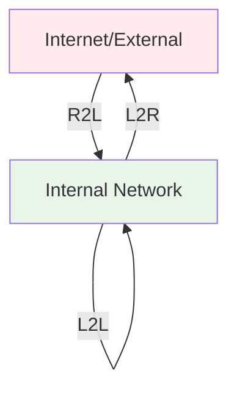
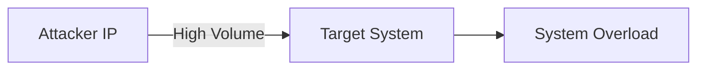
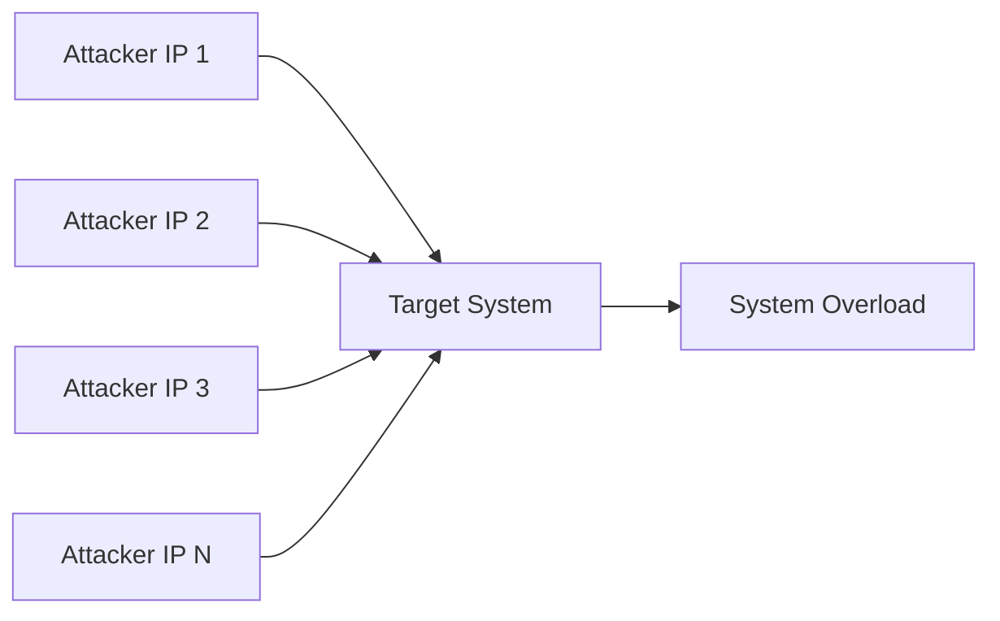

# 6.5: Detection and Analysis

The Detection and Analysis phase bridges the gap between prevention and response. This phase focuses on identifying security events, analyzing their potential impact, and determining appropriate response actions using both automated tools and manual investigation techniques.

---

## Common Security Events and Incidents

Understanding typical security events helps analysts prioritize responses and recognize escalation triggers.

### Network Activity Terminology

#### Traffic Direction Classification
- **Remote to Local (R2L)**: External → Internal network traffic
- **Local to Remote (L2R)**: Internal → External network traffic  
- **Local to Local (L2L)**: Internal → Internal network traffic



### Remote to Local (R2L) Events

#### Port Scanning Activity
**Event Characteristics**:
- External IP scanning organization's public IP ranges
- Multiple port connections within short timeframes
- Non-standard port access attempts (beyond 80/443)

**Detection Methods**:
- **Perimeter firewall logs** analysis
- **Connection pattern recognition** (rapid sequential ports)
- **Threshold-based alerting** for connection volume

**Potential Impact**:
- Usually minimal immediate damage
- Information gathering for future attacks
- Possible DoS on legacy systems with poor scalability

#### Denial of Service (DoS/DDoS) Attacks

**Single Source DoS**:


**Distributed DoS (DDoS)**:


**Detection Strategy**:
- **Traffic volume baselines** establishment
- **Threshold monitoring** for abnormal request rates
- **Geographic analysis** of source IPs
- **Protocol analysis** for attack patterns

**Business Impact Examples**:
- **E-commerce sites**: Lost sales during downtime
- **Service providers**: Customer trust erosion
- **Critical infrastructure**: Safety and operational concerns

> **Case Study**: The 2016 Dyn DDoS attack affected major services including Amazon, BBC, PayPal, Reddit, and Twitter by targeting their DNS provider.

### Local to Local (L2L) Events

#### Internal Network Scanning
**Event Characteristics**:
- Internal IP scanning other internal systems
- Unusual lateral communication patterns
- ARP, UDP, TCP, or ICMP reconnaissance

**Detection Methods**:
- **SIEM correlation rules** for rapid internal connections
- **Baseline deviation** from normal communication patterns
- **Whitelist exclusions** for legitimate vulnerability scanners

**Critical Implications**:
- **Compromise indicator**: System may already be breached
- **Lateral movement**: Attacker expanding access
- **Privilege escalation**: Seeking additional targets

### Authentication Events

#### Login Failure Analysis

**Windows Event ID 4625 Status Codes**:

| Status Code | Meaning | Security Implication |
|-------------|---------|---------------------|
| `0xC0000064` | User name not found | **High Risk**: Username enumeration attempt |
| `0xC0000071` | Password expired | **Low Risk**: Normal password policy |
| `0xC000006E` | Account locked | **Medium Risk**: Possible brute force |
| `0xC0000234` | Account locked (too many attempts) | **High Risk**: Active attack |
| `0xC000006F` | Logon outside allowed time | **Medium Risk**: Policy violation |

#### Attack Pattern Recognition

**Password Spraying Detection**:
- **Low failure count** (2-3 attempts) across **many users**
- **Short time window** for attack execution
- **Common password** patterns in attempts

**Brute Force Detection**:
- **High failure count** against **single user**
- **Sustained attack** over extended period
- **Dictionary or incremental** password attempts

---

## Behavioral Baselines and Anomaly Detection

### Baseline Establishment

#### Baseline Components
- **Network utilization** patterns and peak times
- **Protocol distribution** percentages
- **Port usage** frequency and timing
- **User activity** patterns and work hours
- **System performance** metrics and thresholds

#### Baseline Example Analysis
**Normal Network Profile**:
- 85% HTTP/HTTPS traffic (ports 80/443)
- 10% Email traffic (ports 25/993/995)
- 3% SSH/RDP traffic (ports 22/3389)
- 2% Other protocols

**Anomaly Detection**:
- Sudden spike in Telnet traffic (port 23) = **Investigation trigger**
- Unusual FTP activity during off-hours = **Potential data exfiltration**
- New protocol usage without change requests = **Unauthorized activity**

### Anomaly Detection Advantages and Limitations

#### Advantages
- **Zero-day protection**: Detects unknown threats through behavior
- **Flexibility**: Adapts to new attack methods
- **Encrypted traffic**: Effective against encrypted C2 channels
- **DDoS detection**: Excellent for volume-based attacks

#### Limitations
- **High false positives**: Especially in complex environments
- **Baseline complexity**: Large networks require extensive profiling
- **Implementation time**: Significant setup and tuning required
- **Analysis overhead**: Resource-intensive investigation process

### Enhanced Detection Integration

#### SIEM Integration Benefits
- **Multi-source correlation** combining network, host, and application logs
- **Centralized alerting** with priority-based escalation
- **Historical analysis** for trend identification
- **Automated response** capabilities for confirmed threats

#### Commercial Solutions
- **Cisco Stealthwatch**: Network behavior analysis
- **IBM QRadar**: Security intelligence platform
- **Flowmon ADS**: Network anomaly detection system

---

## Network Traffic Analysis with Wireshark

### Wireshark Fundamentals

#### Interface Overview

**Startup Window Components**:
1. **Start Capture**: Begin live packet capture
2. **Open Files**: Load saved capture files (.pcap, .pcapng)
3. **Capture Filters**: Limit captured packet types
4. **Interface Selection**: Choose network interfaces

**Main Window Panes**:
1. **Packet List**: Summary view of captured packets
2. **Packet Details**: Layer-by-layer packet headers
3. **Hex Dump**: Raw packet bytes in hexadecimal and ASCII

#### Display Filter Examples

| Filter Purpose | Filter Expression | Description |
|---------------|------------------|-------------|
| **Protocol Filtering** | `tcp`, `udp`, `http` | Show only specific protocols |
| **IP Filtering** | `ip.src == 192.168.1.1` | Filter by source IP |
| **Port Filtering** | `tcp.port == 443` | Show traffic on specific port |
| **Combined Filters** | `ip.dst == 10.0.0.1 && tcp.port == 80` | Multiple conditions |
| **Exclusion Filters** | `not arp` | Exclude specific traffic |

### Advanced Analysis Techniques

#### Stream Following
- **TCP Streams**: Complete conversation reconstruction
- **HTTP Streams**: Web request/response analysis
- **SSL Streams**: Encrypted session examination
- **Application Data**: Payload content analysis

#### Statistical Analysis

**Protocol Hierarchy**:
- **Traffic distribution** by protocol percentage
- **Unusual protocol** identification for investigation
- **Data volume** analysis by protocol type
- **Filter application** for focused analysis

**Conversations Analysis**:
- **Host communication** patterns and volumes
- **Data flow** direction analysis (upload vs download)
- **Suspicious relationships** identification
- **Exfiltration detection** through volume analysis

**Endpoints Analysis**:
- **Traffic volume** ranking by host
- **Communication patterns** identification
- **Anomalous behavior** detection
- **Network role** determination (client vs server)

### Practical Investigation Workflow

#### Initial Assessment
1. **Load capture file** and assess overall traffic volume
2. **Protocol hierarchy** review for unusual protocols
3. **Endpoint analysis** to identify high-traffic hosts
4. **Time range** analysis for activity patterns

#### Focused Analysis
1. **Apply filters** to isolate suspicious traffic
2. **Follow streams** for complete conversation context
3. **Extract IOCs** (IPs, domains, file hashes)
4. **Document findings** with screenshots and evidence

---

## Command Line Investigation Tools

### CMD Commands for Incident Response

#### Network Configuration Analysis
```cmd
ipconfig /all
```
**Information Gathered**:
- System hostname identification
- MAC address for device tracking
- IP address and network configuration
- DNS server settings and domain information

#### Process and Service Analysis
```cmd
tasklist
wmic process get description,executablepath
net user
net localgroup administrators
sc query | more
netstat -ab
```

**Investigation Applications**:
- **Malware detection**: Unusual processes and locations
- **Backdoor identification**: Unexpected listening ports
- **Privilege escalation**: Unauthorized admin accounts
- **Persistence mechanisms**: Suspicious services

### PowerShell for Advanced Analysis

#### Enhanced User Analysis
```powershell
Get-LocalUser -Name USERNAME | select *
```
**Critical Security Properties**:
- **PasswordExpires**: Account security configuration
- **LastLogon**: Recent activity verification
- **Enabled**: Account status confirmation
- **PasswordRequired**: Security policy compliance

#### Service and Process Investigation
```powershell
Get-Service | Where Status -eq "Running" | Out-GridView
Get-Process | Format-Table -View priority
Get-ScheduledTask | Where State -eq "Ready"
```

**Security Focus Areas**:
- **Persistence detection**: Scheduled tasks and services
- **Resource consumption**: High-priority processes
- **Service relationships**: Dependencies and interactions
- **Startup programs**: Auto-execution mechanisms

---

## Event Log Analysis with DeepBlueCLI

### Tool Capabilities

#### Detection Signatures
- **User account creation** and group modifications
- **Password attack patterns** (spraying, brute force)
- **Offensive tool usage** (Bloodhound, Mimikatz)
- **PowerShell abuse** (obfuscation, remote downloads)
- **Service manipulation** for persistence
- **LSASS dumping** for credential theft

### Implementation Workflow

#### Setup Process
```powershell
Set-ExecutionPolicy Bypass -Scope CurrentUser
./DeepBlue.ps1 ../LogFile.evtx
./DeepBlue.ps1 -log security
./DeepBlue.ps1 -log system
```

#### Analysis Output Examples

**Password Spray Detection**:
- **Target accounts**: Complete list of attempted usernames
- **Attack timeline**: Precise timing of attack phases
- **Source identification**: Attacker system and username
- **Event correlation**: Related Event IDs for investigation

**Suspicious Command Detection**:
- **Encoded commands**: Base64 and other obfuscation
- **Download attempts**: Remote file retrieval commands
- **Execution context**: User and system information
- **Technique mapping**: MITRE ATT&CK correlation

---

## Analysis Integration and Workflow

### Multi-Tool Investigation Strategy

#### Evidence Correlation Framework
1. **Network analysis** (Wireshark) for communication patterns
2. **Host analysis** (CMD/PowerShell) for system state
3. **Log analysis** (DeepBlueCLI) for historical activity
4. **IOC extraction** for threat hunting and sharing

#### Investigation Priority Matrix

| Evidence Source | Immediacy | Persistence | Scope |
|----------------|-----------|-------------|-------|
| **Memory/Processes** | High | Low | System |
| **Network Traffic** | High | Medium | Network |
| **Event Logs** | Medium | High | System/Domain |
| **File System** | Low | High | System |

### Documentation Requirements

#### Investigation Report Components
- **Timeline reconstruction** with supporting evidence
- **IOC compilation** for threat intelligence sharing
- **Attack technique** mapping to MITRE ATT&CK
- **Scope assessment** of affected systems and data
- **Recommended actions** for containment and remediation

The Detection and Analysis phase provides the critical intelligence needed for effective incident response decision-making.

[⬆️ Back to Incident Response](./README.md)
