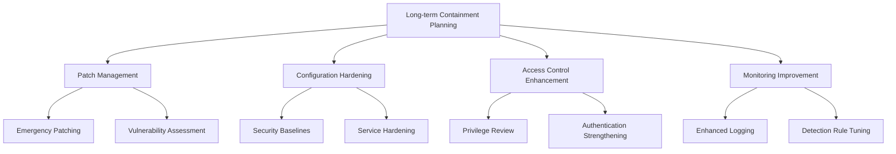
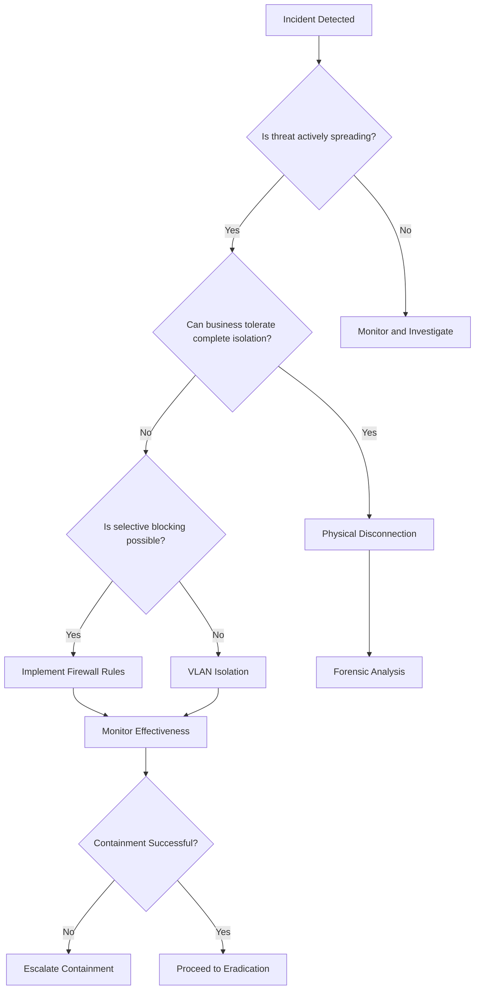
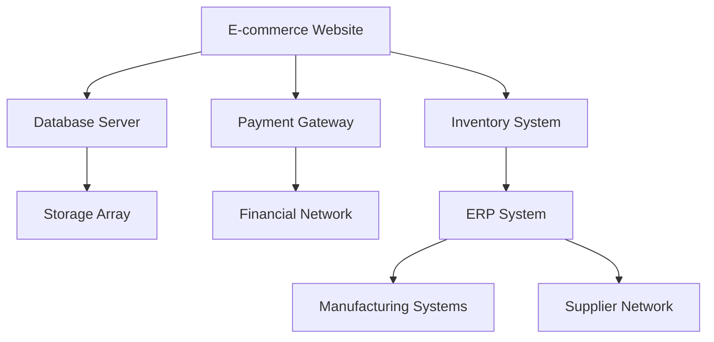

# 6.5: Containment Strategies

Containment is the critical phase where responders stop the spread of an incident while preserving evidence and maintaining business operations. The goal is to limit damage while buying time to develop a comprehensive eradication and recovery plan.

---

## Containment Strategy Selection

The choice of containment strategy depends on multiple factors and requires balancing competing priorities.

### Strategy Decision Matrix

| Factor | Short-term Containment | Long-term Containment | Accept Loss |
|--------|----------------------|---------------------|-------------|
| **Implementation Time** | Minutes to hours | Hours to days | Immediate |
| **Evidence Preservation** | Moderate | High | Low |
| **Business Continuity** | May impact operations | Minimal business impact | Operations continue |
| **Effectiveness** | Temporary fix | Comprehensive solution | No mitigation |
| **Resource Requirements** | Low | High | None |
| **When to Use** | Active ongoing attack | Persistent threat, time available | Cost exceeds impact |

### Containment Decision Factors

#### **Technical Factors**
- **Attack Vector**: How the threat spreads (network, email, removable media)
- **System Criticality**: Business importance of affected systems
- **Evidence Value**: Potential legal or investigative importance
- **Threat Sophistication**: Adversary's likely response to containment efforts

#### **Business Factors**
- **Operational Impact**: Effect on business processes and customer service
- **Financial Cost**: Direct costs of containment vs. continued compromise
- **Regulatory Requirements**: Compliance obligations and notification timelines
- **Stakeholder Expectations**: Management, customer, and partner requirements

#### **Risk Factors**
- **Spread Potential**: Likelihood and speed of lateral movement
- **Data Sensitivity**: Classification and value of data at risk
- **Adversary Motivation**: Criminal, nation-state, or insider threat characteristics
- **Detection Confidence**: Certainty about the scope and nature of compromise

---

## Short-term vs. Long-term Containment

Different situations require different containment approaches, often implemented in sequence.

### Short-term Containment

**Objective**: Immediately stop or slow the incident's progression
**Timeline**: Minutes to hours
**Characteristics**: Quick implementation, may impact business operations

#### **Network-Based Short-term Containment**

| Technique | Implementation | Use Case | Business Impact |
|-----------|---------------|----------|-----------------|
| **Network Isolation** | Disconnect affected systems from network | Malware spreading via network | Complete service outage |
| **VLAN Segmentation** | Move systems to isolated network segment | Lateral movement prevention | Limited functionality |
| **Access Control Lists** | Block specific IPs, ports, or protocols | C2 communication blocking | Minimal if targeted well |
| **DNS Sinkholing** | Redirect malicious domains to safe IPs | Malware communication disruption | None if properly configured |

#### **System-Based Short-term Containment**

| Technique | Implementation | Use Case | Considerations |
|-----------|---------------|----------|----------------|
| **Process Termination** | Kill malicious processes | Active malware execution | May alert adversary, lose evidence |
| **Account Disabling** | Deactivate compromised accounts | Unauthorized access prevention | User productivity impact |
| **Service Stopping** | Halt affected services | Prevent further exploitation | Service availability impact |
| **File Quarantine** | Move/isolate malicious files | Prevent execution/spread | System functionality may degrade |

### Long-term Containment

**Objective**: Implement comprehensive, sustainable security measures
**Timeline**: Hours to days  
**Characteristics**: Thorough solution, minimal business disruption

#### **Infrastructure Hardening**



#### **Systematic Containment Approach**

**Phase 1: Environmental Assessment** (2-4 hours)
- [ ] **Complete Network Mapping**: Document all affected systems and connections
- [ ] **Privilege Analysis**: Identify all accounts with elevated access
- [ ] **Data Flow Analysis**: Map sensitive data locations and access paths
- [ ] **Business Process Review**: Understand critical operations and dependencies

**Phase 2: Selective Containment** (4-8 hours)
- [ ] **Graduated Network Restrictions**: Implement progressively restrictive controls
- [ ] **Account Security Enhancement**: Force password resets, implement MFA
- [ ] **System Hardening**: Apply security configurations and patches
- [ ] **Monitoring Enhancement**: Deploy additional detection capabilities

**Phase 3: Validation and Testing** (2-4 hours)
- [ ] **Containment Effectiveness**: Verify threat cannot spread or communicate
- [ ] **Business Function Testing**: Confirm critical operations remain functional
- [ ] **Security Control Validation**: Test new security measures work as intended
- [ ] **Communication Verification**: Ensure incident response communications work

---

## Network Segmentation and Isolation

Network-based containment is often the most effective method for limiting incident spread.

### Network Isolation Techniques

#### **Physical Disconnection**
**Method**: Physically unplug network cables
**Advantages**: 
- Immediate and complete isolation
- Cannot be bypassed remotely
- Preserves system state for forensics

**Disadvantages**:
- Complete service outage
- May lose volatile evidence if system powers down
- Requires physical access to equipment

**Best Used For**: Critical systems with active data exfiltration

#### **VLAN Isolation**
**Method**: Move systems to isolated network segment
**Implementation**:
```bash
# Switch configuration example
interface ethernet 1/1/1
 switchport access vlan 999  # Quarantine VLAN
 description "Quarantined - Security Incident"
```

**Advantages**:
- Maintains system functionality for analysis
- Allows controlled communication for investigation
- Can be implemented remotely

**Disadvantages**:
- Requires network infrastructure support
- May not prevent all communication methods
- Complex to implement in virtualized environments

#### **Firewall Micro-Segmentation**
**Method**: Implement granular firewall rules
**Example Policy**:
```
# Allow only essential management traffic
allow tcp from 192.168.100.0/24 to any port 22    # SSH management
allow tcp from 192.168.100.0/24 to any port 3389  # RDP management  
allow udp from any to 192.168.1.10 port 53        # Internal DNS
deny all from any to any                          # Default deny
```

### Isolation Decision Tree



---

## System Quarantine Procedures

Individual system containment requires careful balance between security and functionality.

### Quarantine Implementation Levels

#### **Level 1: Monitoring Enhancement**
**Scope**: Increased observation without functional restriction
**Implementation**:
- Enhanced logging enabled
- Additional monitoring agents deployed
- Network traffic inspection increased
- User activity tracking implemented

**Use Case**: Suspicious but unconfirmed activity

#### **Level 2: Network Restriction**
**Scope**: Limited network access with business function preservation
**Implementation**:
```bash
# Example: Block external internet access
iptables -I OUTPUT -d 192.168.0.0/16 -j ACCEPT   # Allow internal
iptables -I OUTPUT -d 10.0.0.0/8 -j ACCEPT       # Allow internal  
iptables -I OUTPUT -d 172.16.0.0/12 -j ACCEPT    # Allow internal
iptables -I OUTPUT -j DROP                       # Block external
```

**Use Case**: Confirmed compromise with business continuity needs

#### **Level 3: Service Isolation**
**Scope**: Essential services only, external communication blocked
**Implementation**:
- Disable non-essential services
- Block all external communication
- Maintain only critical business functions
- Implement strict access controls

**Use Case**: Serious compromise requiring investigation access

#### **Level 4: Complete Quarantine**
**Scope**: No network access, local functions only
**Implementation**:
- Disconnect all network interfaces
- Disable wireless capabilities
- Maintain power for forensic analysis
- Physical access controls implemented

**Use Case**: Active data exfiltration or sophisticated adversary

### Automated Quarantine Systems

Many organizations implement automated quarantine capabilities:

#### **EDR-Based Quarantine**
```python
# Pseudo-code for EDR quarantine
def quarantine_endpoint(endpoint_id, reason):
    # Network isolation
    edr_client.isolate_network(endpoint_id)
    
    # Process containment  
    edr_client.suspend_processes(endpoint_id, malicious_processes)
    
    # File quarantine
    edr_client.quarantine_files(endpoint_id, suspicious_files)
    
    # Notification
    notify_ir_team(endpoint_id, reason, quarantine_status)
    
    return quarantine_confirmation
```

#### **Network Access Control (NAC) Integration**
- **Automatic Policy Enforcement**: Apply restrictive network policies
- **Device Profiling**: Identify and classify quarantined devices
- **Compliance Checking**: Verify security posture before network access
- **Remediation Orchestration**: Guide users through security updates

---

## Business Continuity Considerations

Effective containment must balance security with operational requirements.

### Business Impact Assessment

#### **Critical Business Function Analysis**

| Function | Systems Required | Acceptable Downtime | Alternative Options |
|----------|-----------------|-------------------|-------------------|
| **Customer Service** | CRM, Phone system, Email | 2 hours | Manual processes, backup site |
| **Order Processing** | E-commerce, Payment processing | 30 minutes | Phone orders, manual processing |
| **Manufacturing** | SCADA, ERP, Quality systems | 1 hour | Manual controls, reduced capacity |
| **Financial Operations** | Banking systems, Payroll | 4 hours | Delayed processing, manual approvals |

#### **Dependency Mapping**


### Containment with Business Continuity

#### **Graceful Degradation Strategy**
1. **Identify Core Functions**: Determine absolutely essential operations
2. **Implement Minimum Viable Security**: Apply containment without stopping core functions
3. **Establish Monitoring**: Enhanced oversight of limited operations
4. **Plan Progressive Restriction**: Increase containment as alternatives are established

#### **Alternative Operation Procedures**

| Scenario | Primary System | Alternative Process | Implementation Time |
|----------|----------------|-------------------|-------------------|
| **Email Compromise** | Exchange Server | Web-based email, phone communication | 30 minutes |
| **Network Isolation** | Internal applications | VPN access, remote systems | 1 hour |
| **Database Quarantine** | Production DB | Read-only replica, manual processes | 2 hours |
| **Workstation Imaging** | User computers | Loaner devices, mobile access | 4 hours |

### Communication During Containment

#### **Stakeholder Notification Template**
```
Subject: System Containment - [System Name] - [Incident ID]

SITUATION:
Security containment measures have been implemented on [system name] 
due to confirmed security incident [incident ID].

IMPACT:
- [Specific service impacts]
- [Affected user groups]  
- [Alternative procedures available]

DURATION:
- Estimated containment period: [timeframe]
- Next status update: [scheduled time]

ALTERNATIVES:
- [Alternative service 1]: [access method]
- [Alternative service 2]: [access method]

CONTACT:
For questions: [IR team contact]
For business continuity: [BCP team contact]
```

#### **User Guidance Scripts**
Prepare standard language for help desk and management communications:

**For Help Desk Staff**:
> "We're currently implementing security measures that may affect [service name]. This is a precautionary measure to protect our systems and data. Please direct users to [alternative process] and advise them that normal service will be restored as soon as security measures are complete."

**For Managers**:
> "We've identified a security issue that requires temporary containment of [systems]. Our security team is actively working to resolve the issue while maintaining business operations through [alternative processes]. We'll provide updates every [frequency] until normal operations resume."

[⬆️ Back to Incident Response](./README.md)
