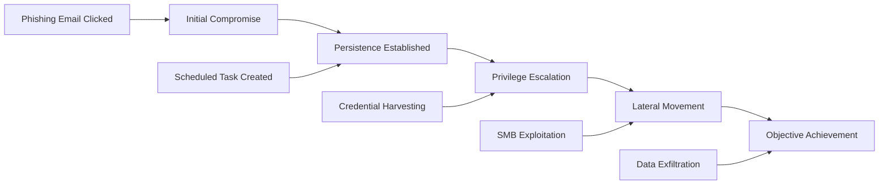
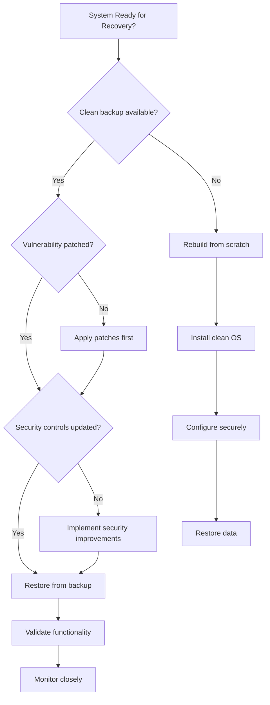

# 6.6: Eradication and Recovery

Eradication eliminates the threat from the environment while recovery restores normal operations. These phases require careful coordination to ensure threats are completely removed while minimizing business disruption and preventing reinfection.

---

## Root Cause Analysis

Effective eradication requires understanding how the incident occurred to prevent recurrence and ensure complete threat removal.

### Root Cause Investigation Framework

#### **The "5 Whys" Methodology**
Systematically drill down to identify the fundamental cause:

```
Example: Ransomware Incident
Why did ransomware encrypt our servers?
→ Because malware executed with administrative privileges

Why did malware get administrative privileges?  
→ Because it exploited a service account with excessive permissions

Why did the service account have excessive permissions?
→ Because it was granted Domain Admin rights for ease of deployment

Why was Domain Admin used instead of limited permissions?
→ Because our deployment process wasn't designed for least privilege

Why wasn't least privilege implemented?
→ Because we lacked documented standards and technical controls

ROOT CAUSE: Inadequate identity and access management governance
```

#### **Contributing Factor Analysis**

| Category | Investigation Questions | Common Contributing Factors |
|----------|------------------------|----------------------------|
| **Technical** | What vulnerabilities were exploited? | Unpatched systems, misconfigurations, weak authentication |
| **Process** | What procedures failed or were missing? | Inadequate change management, insufficient monitoring |
| **People** | What human factors contributed? | Lack of training, social engineering susceptibility |
| **Environmental** | What external factors played a role? | Third-party compromise, supply chain issues |

### Forensic Evidence Analysis

Root cause analysis relies heavily on digital evidence collected during the investigation phase.

#### **Evidence Correlation Matrix**

| Evidence Type | What It Reveals | Root Cause Insights |
|---------------|-----------------|-------------------|
| **Log Analysis** | Attack timeline and methods | Entry vectors, lateral movement paths |
| **Malware Analysis** | Threat capabilities and intent | Attack sophistication, potential attribution |
| **Network Traffic** | Communication patterns | C2 infrastructure, data exfiltration methods |
| **System Artifacts** | Persistence mechanisms | How attackers maintained access |
| **Registry/Config Changes** | System modifications | What was changed to enable the attack |

#### **Timeline-Based Root Cause Mapping**



---

## Malware Removal and System Hardening

Comprehensive eradication requires both immediate threat removal and long-term system hardening.

### Malware Eradication Strategies

#### **Automated Removal Tools**

| Tool Category | Capabilities | Limitations | Best Use Cases |
|---------------|-------------|-------------|----------------|
| **Antivirus/EDR** | Known malware signatures | May miss custom malware | Standard malware families |
| **Anti-Rootkit Tools** | Deep system scanning | Performance impact | Persistent rootkit infections |
| **Specialized Cleaners** | Targeted threat removal | Specific malware only | Known threat families |
| **Forensic Imaging** | Complete system rebuild | High downtime | Critical systems, unknown threats |

#### **Manual Eradication Process**

**Step 1: Threat Identification and Mapping** (2-4 hours)
```powershell
# Windows: Identify malicious processes
Get-Process | Where-Object {$_.ProcessName -in $SuspiciousProcesses}
Get-WmiObject Win32_Service | Where-Object {$_.PathName -match $MaliciousPath}

# Check for persistence mechanisms
Get-ItemProperty HKLM:\SOFTWARE\Microsoft\Windows\CurrentVersion\Run
Get-ScheduledTask | Where-Object {$_.TaskPath -match $SuspiciousPath}
```

```bash
# Linux: Process and service analysis
ps aux | grep -E "(suspicious|malware|backdoor)"
systemctl list-units --failed
find /etc/cron* -name "*" -exec ls -la {} \;
```

**Step 2: Process Termination and Service Stopping**
```powershell
# Windows: Controlled process termination
Stop-Process -Name "malicious_process" -Force
Stop-Service -Name "malicious_service" -Force
Set-Service -Name "malicious_service" -StartupType Disabled
```

```bash
# Linux: Process and service control
pkill -f malicious_process
systemctl stop malicious_service
systemctl disable malicious_service
```

**Step 3: File System Cleanup**
```powershell
# Windows: Remove malicious files
Remove-Item -Path "C:\temp\malicious.exe" -Force
Remove-Item -Path "C:\Users\*\AppData\Local\Temp\*" -Force -Recurse
```

```bash
# Linux: File removal and cleanup
find / -name "malicious_file" -exec rm -f {} \;
find /tmp -type f -mtime -1 -exec ls -la {} \;
```

**Step 4: Registry and Configuration Cleanup**
```powershell
# Windows: Registry cleanup
Remove-ItemProperty -Path "HKLM:\SOFTWARE\Microsoft\Windows\CurrentVersion\Run" -Name "MaliciousEntry"
Remove-Item -Path "HKLM:\SOFTWARE\MaliciousKey" -Recurse -Force
```

### System Hardening Implementation

#### **Security Configuration Standards**

| System Component | Hardening Measures | Implementation Tools |
|------------------|-------------------|---------------------|
| **Operating System** | Security baselines, unnecessary service removal | Group Policy, Ansible, Puppet |
| **Applications** | Latest patches, secure configurations | WSUS, Package managers |
| **Network Services** | Least privilege access, encryption | Firewall rules, VPN configs |
| **User Accounts** | Strong passwords, MFA, least privilege | Active Directory, IAM systems |

#### **Automated Hardening Scripts**

**Windows Hardening Script**:
```powershell
# Disable unnecessary services
$ServicesToDisable = @("Fax", "RemoteRegistry", "Telnet")
foreach ($Service in $ServicesToDisable) {
    Set-Service -Name $Service -StartupType Disabled -ErrorAction SilentlyContinue
}

# Configure Windows Defender
Set-MpPreference -DisableRealtimeMonitoring $false
Set-MpPreference -SubmitSamplesConsent SendAllSamples

# Enable Windows Firewall
Set-NetFirewallProfile -Profile Domain,Public,Private -Enabled True

# Configure audit policies
auditpol /set /category:"Logon/Logoff" /success:enable /failure:enable
auditpol /set /category:"Object Access" /success:enable /failure:enable
```

**Linux Hardening Script**:
```bash
#!/bin/bash
# System hardening script

# Update system
apt update && apt upgrade -y

# Configure SSH
sed -i 's/#PermitRootLogin yes/PermitRootLogin no/' /etc/ssh/sshd_config
sed -i 's/#PasswordAuthentication yes/PasswordAuthentication no/' /etc/ssh/sshd_config
systemctl restart ssh

# Configure firewall
ufw default deny incoming
ufw default allow outgoing
ufw allow ssh
ufw --force enable

# Set file permissions
chmod 600 /etc/ssh/sshd_config
chmod 644 /etc/passwd
chmod 600 /etc/shadow
```

---

## System Restoration and Validation

Recovery involves safely returning systems to normal operation while ensuring security improvements are maintained.

### Recovery Planning and Prioritization

#### **System Recovery Priority Matrix**

| Priority Level | Criteria | Recovery Time Target | Dependencies |
|----------------|----------|---------------------|--------------|
| **Critical (P1)** | Customer-facing, revenue-generating | 2-4 hours | Basic infrastructure |
| **High (P2)** | Essential business operations | 8-12 hours | P1 systems operational |
| **Medium (P3)** | Important but not critical | 24-48 hours | P1 and P2 systems stable |
| **Low (P4)** | Nice to have, development | 72+ hours | All higher priorities complete |

#### **Recovery Decision Framework**



### Backup and Recovery Procedures

#### **Recovery Strategy Selection**

| Recovery Method | Time to Recovery | Data Loss Risk | Cost | When to Use |
|-----------------|-----------------|----------------|------|-------------|
| **Hot Backup** | Minutes | Minimal (RPO < 1 hour) | High | Critical systems |
| **Warm Backup** | Hours | Low (RPO < 24 hours) | Medium | Important systems |
| **Cold Backup** | Days | Moderate (RPO = backup frequency) | Low | Non-critical systems |
| **System Rebuild** | Days/Weeks | High (recent changes lost) | Variable | Compromised systems |

#### **Backup Validation Process**

**Pre-Recovery Validation**:
```bash
# Verify backup integrity
sha256sum /backups/system_backup.tar.gz
tar -tzf /backups/system_backup.tar.gz | head -20

# Check backup age and completeness
ls -la /backups/system_backup.tar.gz
tar -tzf /backups/system_backup.tar.gz | wc -l
```

**Post-Recovery Validation**:
```powershell
# Windows: System validation
Get-Service | Where-Object {$_.Status -eq "Running"}
Get-EventLog -LogName System -Newest 50
Test-NetConnection -ComputerName "domain-controller" -Port 389
```

```bash
# Linux: System validation
systemctl --failed
journalctl -p err -n 50
ss -tuln | grep :80
```

### Data Recovery and Integrity Verification

#### **Data Recovery Priorities**

1. **Critical Business Data**: Customer records, financial data, intellectual property
2. **System Configuration**: Application settings, security policies, network configurations
3. **User Data**: Documents, emails, personal files
4. **Historical Data**: Logs, archives, audit trails

#### **Data Integrity Validation**

| Validation Type | Method | Tools | Success Criteria |
|----------------|--------|-------|------------------|
| **Hash Verification** | Compare file checksums | sha256sum, certutil | Hashes match known good values |
| **Database Consistency** | Run integrity checks | DBCC, mysqlcheck | No corruption detected |
| **Application Testing** | Functional verification | Automated tests, manual checks | Core functions operational |
| **User Acceptance** | Business process validation | End-user testing | Business workflows functional |

---

## Monitoring for Recurring Activity

Post-recovery monitoring is critical to detect any remaining threats or reinfection attempts.

### Enhanced Monitoring Implementation

#### **Monitoring Enhancement Strategy**

**Phase 1: Immediate Post-Recovery (0-72 hours)**
- **Intensity**: Continuous monitoring with 15-minute alert intervals
- **Focus**: Signs of reinfection, unusual activity patterns
- **Resources**: Dedicated analyst assigned to monitor recovered systems

**Phase 2: Extended Monitoring (1-4 weeks)**
- **Intensity**: Enhanced automated monitoring with hourly reviews
- **Focus**: Lateral movement attempts, data exfiltration indicators
- **Resources**: Daily analyst reviews with weekly management reports

**Phase 3: Long-term Surveillance (1-6 months)**
- **Intensity**: Standard monitoring with incident-specific rules
- **Focus**: APT indicators, similar attack patterns
- **Resources**: Monthly reviews integrated into standard operations

#### **Monitoring Rule Development**

**IOC-Based Detection Rules**:
```sql
-- SIEM Rule: Monitor for previously seen malware hashes
SELECT timestamp, hostname, process_name, file_hash
FROM process_events 
WHERE file_hash IN ('hash1', 'hash2', 'hash3')
AND timestamp > DATE_SUB(NOW(), INTERVAL 24 HOUR)
```

**Behavioral Detection Rules**:
```sql
-- SIEM Rule: Detect similar attack patterns
SELECT src_ip, dest_ip, COUNT(*) as connection_count
FROM network_connections
WHERE dest_port IN (4444, 8080, 443)
AND timestamp > DATE_SUB(NOW(), INTERVAL 1 HOUR)
GROUP BY src_ip, dest_ip
HAVING connection_count > 10
```

### Success Metrics and Validation

#### **Recovery Success Criteria**

| Category | Metric | Target | Measurement Method |
|----------|--------|--------|--------------------|
| **Functionality** | System availability | >99.5% | Uptime monitoring |
| **Performance** | Response time | <2x baseline | Application monitoring |
| **Security** | No reinfection | 0 incidents | Security monitoring |
| **User Satisfaction** | Business process efficiency | >90% of baseline | User surveys |

#### **Monitoring Effectiveness Validation**

**Detection Coverage Assessment**:
```python
# Pseudo-code for monitoring validation
def validate_monitoring_coverage():
    attack_vectors = ['email', 'web', 'network', 'endpoint']
    coverage_results = {}
    
    for vector in attack_vectors:
        # Test detection capabilities
        coverage_results[vector] = simulate_attack_vector(vector)
    
    return coverage_results

def generate_coverage_report(results):
    for vector, coverage in results.items():
        print(f"{vector}: {coverage}% coverage")
        if coverage < 80:
            recommend_improvements(vector)
```

**False Positive Management**:
- **Baseline Establishment**: Document normal system behavior patterns
- **Rule Tuning**: Adjust detection thresholds based on observed false positives
- **Exception Management**: Create legitimate activity exceptions
- **Regular Review**: Weekly analysis of alert quality and analyst efficiency

#### **Long-term Recovery Validation**

**30-Day Recovery Assessment**:
```markdown
## 30-Day Post-Recovery Report

### System Performance
- [ ] All systems operating at baseline performance levels
- [ ] No recurring errors or system instability
- [ ] User productivity restored to pre-incident levels

### Security Posture  
- [ ] No indicators of threat persistence or reinfection
- [ ] All security improvements implemented and validated
- [ ] Monitoring systems detecting potential threats effectively

### Business Operations
- [ ] All business processes functioning normally
- [ ] Customer satisfaction metrics returned to baseline
- [ ] No ongoing impact from security incident

### Lessons Learned Integration
- [ ] Process improvements implemented
- [ ] Staff training completed based on incident findings
- [ ] Technology upgrades completed as identified

### Risk Assessment
- Current Risk Level: [Low/Medium/High]
- Outstanding Actions: [List any remaining tasks]
- Recommendation: [Continue monitoring/Return to normal/Additional actions needed]
```

[⬆️ Back to Incident Response](./README.md)
