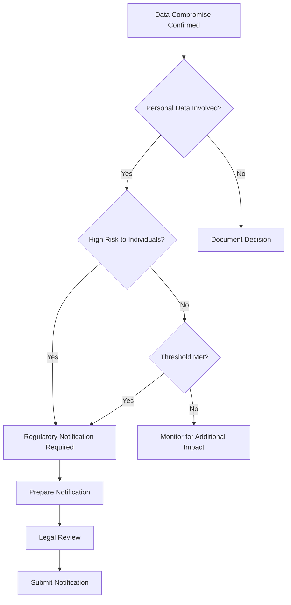
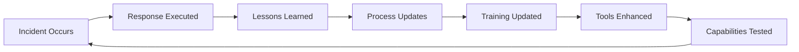

# 6.7: Post-Incident Activities

Post-incident activities transform incident experience into organizational learning and improved security posture. This phase ensures maximum value is extracted from the incident response effort and that future incidents can be prevented or handled more effectively.

---

## Lessons Learned Reviews

The lessons learned process is critical for continuous improvement and organizational learning.

### Lessons Learned Meeting Structure

#### **Meeting Planning and Preparation**

**Timeline**: Conduct within 2 weeks of incident closure
**Duration**: 2-3 hours for major incidents, 1 hour for minor incidents
**Participants**: All key stakeholders involved in the incident response

| Role | Representation | Contribution |
|------|---------------|--------------|
| **Incident Response Team** | IR Manager, Lead Analysts | Technical response effectiveness, process gaps |
| **Business Stakeholders** | Department heads, process owners | Business impact assessment, operational challenges |
| **Technical Teams** | System administrators, developers | System vulnerabilities, recovery challenges |
| **Support Functions** | Legal, HR, Communications | Regulatory compliance, external coordination |
| **Leadership** | Senior management | Strategic decisions, resource allocation |

#### **Meeting Agenda Template**

```markdown
# Lessons Learned Review - [Incident ID]
**Date**: [Meeting Date]
**Incident**: [Brief Description]
**Facilitator**: [Name]

## 1. Incident Overview (15 minutes)
- Timeline recap
- Business impact summary  
- Response actions taken

## 2. What Went Well (30 minutes)
- Effective detection methods
- Successful response actions
- Strong team coordination
- Positive stakeholder feedback

## 3. Areas for Improvement (45 minutes)
- Detection delays or gaps
- Response challenges
- Communication issues
- Resource constraints

## 4. Root Cause Analysis (30 minutes)
- Technical vulnerabilities
- Process weaknesses  
- Human factors
- Environmental issues

## 5. Action Items and Recommendations (30 minutes)
- Immediate fixes (< 30 days)
- Short-term improvements (< 90 days)
- Long-term initiatives (< 1 year)
- Resource requirements

## 6. Next Steps (15 minutes)
- Action item owners and timelines
- Follow-up schedule
- Success metrics
```

### Lessons Learned Analysis Framework

#### **The "Start, Stop, Continue" Method**

| Category | Focus | Example Questions |
|----------|-------|------------------|
| **Start** | What should we begin doing? | What tools or processes could have helped? What training do we need? |
| **Stop** | What should we discontinue? | What activities wasted time? What created confusion? |
| **Continue** | What worked well? | What should we maintain? What can we do more of? |

#### **Improvement Categorization Matrix**

| Impact | Quick Wins (< 30 days) | Major Projects (3-12 months) |
|--------|------------------------|------------------------------|
| **High Impact** | Critical fixes, immediate process changes | Major system upgrades, organizational restructuring |
| **Medium Impact** | Procedure updates, basic training | Enhanced tooling, extended training programs |
| **Low Impact** | Documentation updates, minor config changes | Nice-to-have improvements, research projects |

### Action Item Development and Tracking

#### **SMART Action Items**

Each improvement should follow SMART criteria:
- **Specific**: Clear, well-defined objective
- **Measurable**: Quantifiable success criteria  
- **Achievable**: Realistic given available resources
- **Relevant**: Addresses identified gaps or improvements
- **Time-bound**: Defined completion timeline

#### **Action Item Template**

```markdown
## Action Item: [ID-YYYY-NNN]

**Title**: [Brief description of improvement]
**Category**: [Technical/Process/Training/Communication]
**Priority**: [Critical/High/Medium/Low]

**Description**: 
[Detailed description of what needs to be done]

**Success Criteria**:
- [ ] [Specific outcome 1]
- [ ] [Specific outcome 2]
- [ ] [Specific outcome 3]

**Timeline**:
- Start Date: [Date]
- Milestone 1: [Date - Description]
- Milestone 2: [Date - Description]  
- Completion Date: [Date]

**Resources Required**:
- Budget: [Amount if applicable]
- Personnel: [Roles and time commitment]
- Technology: [Tools or systems needed]

**Success Metrics**:
[How will success be measured]

**Status Updates**:
- [Date]: [Progress update]
- [Date]: [Progress update]
```

---

## Documentation and Reporting

Comprehensive documentation serves legal, regulatory, and organizational learning purposes.

### Final Incident Report Structure

#### **Executive Summary Section**
```markdown
# Executive Summary

**Incident Overview**: [2-3 sentence description]
**Business Impact**: [Financial, operational, reputational impact]
**Root Cause**: [Primary cause in business terms]
**Key Actions Taken**: [Major response actions]
**Current Status**: [Resolution status and ongoing monitoring]
**Lessons Learned**: [Top 3-5 improvements identified]
```

#### **Technical Analysis Section**

| Component | Content | Purpose |
|-----------|---------|---------|
| **Attack Vector** | How the incident began | Prevention strategy development |
| **Timeline** | Detailed sequence of events | Understanding attack progression |
| **Systems Affected** | Complete inventory of impacted assets | Scope assessment and recovery validation |
| **Attack Techniques** | MITRE ATT&CK mapping | Detection rule improvement |
| **Evidence Summary** | Key forensic findings | Legal and regulatory compliance |

#### **Response Effectiveness Analysis**

**Detection Performance**:
```
Detection Timeline Analysis:
┌─────────────────────┬─────────────────────┐
│ Incident Start      │ [Date/Time]         │
├─────────────────────┼─────────────────────┤
│ First Alert         │ [Date/Time]         │
├─────────────────────┼─────────────────────┤
│ Analyst Review      │ [Date/Time]         │
├─────────────────────┼─────────────────────┤
│ Incident Declaration│ [Date/Time]         │
├─────────────────────┼─────────────────────┤
│ Containment Start   │ [Date/Time]         │
└─────────────────────┴─────────────────────┘

Mean Time to Detection (MTTD): [Duration]
Mean Time to Response (MTTR): [Duration]
Mean Time to Containment (MTTC): [Duration]
```

**Response Team Performance**:
- **Staffing Adequacy**: Were enough people available?
- **Skill Effectiveness**: Did team members have required capabilities?
- **Decision Making**: Were decisions made promptly and effectively?
- **Communication**: Was information shared clearly and timely?

### Stakeholder-Specific Reports

#### **Board of Directors Report**

```markdown
# Security Incident Report - Board Summary

## Incident Summary
**Date**: [Incident Date]
**Type**: [Incident Category]
**Severity**: [Business Impact Level]

## Business Impact
- **Financial**: [Direct costs and estimated losses]
- **Operational**: [Service disruption duration and scope]
- **Regulatory**: [Compliance implications and notifications]
- **Reputational**: [Customer and public impact assessment]

## Management Response
- **Immediate Actions**: [Key containment and recovery steps]
- **External Coordination**: [Law enforcement, regulators, vendors]
- **Communication Strategy**: [Internal and external messaging]

## Risk Management
- **Root Cause**: [Fundamental issue that enabled the incident]
- **Preventive Measures**: [Actions to prevent recurrence]
- **Investment Requirements**: [Budget needed for improvements]

## Strategic Implications
- **Industry Context**: [How this relates to industry threat landscape]
- **Competitive Impact**: [Effect on market position]
- **Future Preparedness**: [Organizational capability improvements]
```

#### **Regulatory Report Template**

```markdown
# Regulatory Notification Report

## Incident Classification
**Report Type**: [Initial/Updated/Final]
**Incident ID**: [Internal reference number]
**Classification**: [Per regulatory framework]

## Affected Data/Systems
**Data Types**: [Categories of data involved]
**Data Subjects**: [Number and types of individuals affected]
**Geographic Scope**: [Locations/jurisdictions involved]

## Timeline
**Incident Discovery**: [Date/Time]
**Initial Assessment**: [Date/Time]
**Regulatory Notification**: [Date/Time]
**Public Notification**: [Date/Time if required]

## Response Actions
**Immediate Response**: [Steps taken to contain incident]
**Investigation Status**: [Current investigation state]
**Affected Party Notification**: [Customer/partner notifications]

## Ongoing Actions
**Remediation Plan**: [Steps to address vulnerabilities]
**Monitoring**: [Enhanced surveillance measures]
**Reporting Schedule**: [Future update timeline]

## Contact Information
**Primary Contact**: [Name, title, phone, email]
**Legal Counsel**: [Firm name and contact]
**Technical Lead**: [Name and contact information]
```

---

## Legal and Regulatory Requirements

Post-incident legal and regulatory activities ensure compliance and prepare for potential litigation.

### Regulatory Notification Requirements

#### **Common Regulatory Frameworks**

| Regulation | Scope | Notification Timeline | Requirements |
|------------|-------|---------------------|--------------|
| **GDPR** | EU personal data | 72 hours to regulator, without undue delay to data subjects | Detailed incident description, impact assessment, response actions |
| **HIPAA** | US healthcare data | 60 days to HHS, without unreasonable delay to individuals | Risk assessment, affected individuals, mitigation actions |
| **PCI DSS** | Payment card data | Immediately to card brands, law enforcement if required | Forensic investigation, remediation plan, compliance validation |
| **SOX** | US public company financial data | Immediately to SEC if material | Internal control assessment, financial impact analysis |

#### **Notification Decision Framework**



### Evidence Preservation for Legal Proceedings

#### **Legal Hold Implementation**

**Legal Hold Notice Template**:
```markdown
# Legal Hold Notice - [Incident ID]

**To**: [Recipients]
**From**: [Legal Counsel]
**Date**: [Issue Date]
**Re**: Litigation Hold - Security Incident [ID]

You are hereby notified that [Organization] has initiated a litigation hold 
related to the security incident that occurred on [date]. This notice 
requires you to preserve all documents and data related to this incident.

**Scope of Hold**:
- All communications related to the incident (email, chat, documents)
- System logs and forensic evidence from [date range]
- All incident response documentation and reports
- Any external communications with vendors, law enforcement, or regulators

**Preservation Requirements**:
- Do not delete, modify, or destroy any relevant materials
- Suspend automatic deletion policies for relevant systems
- Notify IT immediately of any relevant data you are aware of
- Contact legal counsel with any questions

**Duration**: This hold remains in effect until written notice of release.

**Contact**: [Legal counsel contact information]
```

#### **Evidence Chain of Custody for Legal Use**

| Evidence Type | Legal Requirements | Preservation Method |
|---------------|-------------------|-------------------|
| **Digital Forensic Images** | Bit-for-bit integrity, expert testimony capability | Hardware write-blockers, cryptographic hashing |
| **Log Files** | Timestamp integrity, authenticity verification | Secure log management, digital signatures |
| **Communications** | Complete context, metadata preservation | Legal discovery platforms, native format retention |
| **Witness Statements** | Contemporaneous documentation, sworn affidavits | Formal interview process, notarized statements |

### Litigation Support and Expert Testimony

#### **Expert Witness Preparation**

**Technical Expert Qualifications**:
- Professional certifications (CISSP, CISM, GCIH)
- Industry experience and incident response expertise
- Previous testimony experience and communication skills
- Detailed knowledge of the specific incident

**Expert Report Components**:
1. **Qualifications Summary**: Education, experience, certifications
2. **Incident Analysis**: Technical findings and methodology
3. **Opinion and Conclusions**: Expert interpretation of evidence
4. **Industry Standards**: Comparison to accepted practices
5. **Supporting Documentation**: Evidence references and analysis

---

## Process Improvement

Systematic process improvement ensures organizational learning becomes embedded in future capabilities.

### Improvement Program Structure

#### **Continuous Improvement Cycle**



#### **Process Update Categories**

| Category | Update Type | Implementation | Validation |
|----------|-------------|----------------|------------|
| **Policy** | High-level strategic changes | Executive approval, organization-wide communication | Annual review and compliance audit |
| **Procedure** | Detailed process modifications | Team training, documentation updates | Quarterly tabletop exercises |
| **Technology** | Tool and system improvements | Pilot testing, phased rollout | Performance metrics and user feedback |
| **Training** | Skill and knowledge development | Curriculum updates, delivery scheduling | Competency assessments and certifications |

### Performance Metrics and KPI Development

#### **Incident Response Metrics Framework**

**Effectiveness Metrics**:
```
Response Effectiveness Dashboard:
┌─────────────────────┬─────────┬─────────┬─────────┐
│ Metric              │ Current │ Target  │ Trend   │
├─────────────────────┼─────────┼─────────┼─────────┤
│ Mean Time to Detect │ 4.2 hrs │ < 2 hrs │ ↓       │
├─────────────────────┼─────────┼─────────┼─────────┤
│ Mean Time to        │ 45 mins │ < 30min │ ↓       │
│ Response            │         │         │         │
├─────────────────────┼─────────┼─────────┼─────────┤
│ Containment Success │ 92%     │ > 95%   │ ↑       │
├─────────────────────┼─────────┼─────────┼─────────┤
│ False Positive Rate │ 18%     │ < 10%   │ ↓       │
└─────────────────────┴─────────┴─────────┴─────────┘
```

**Business Impact Metrics**:
- **Revenue Protection**: Prevented losses through rapid response
- **Compliance Maintenance**: Regulatory requirements met
- **Customer Satisfaction**: Service availability and communication effectiveness
- **Cost Management**: Response costs vs. prevented damages

#### **Benchmarking and Industry Comparison**

**Industry Benchmark Sources**:
- **SANS Survey Results**: Annual incident response capability surveys
- **Ponemon Institute**: Cost and effectiveness studies
- **NIST Metrics**: Government and industry standard measurements
- **Industry ISACs**: Sector-specific performance data

**Comparative Analysis Template**:
```markdown
## IR Performance Benchmarking

### Detection Performance
- **Our MTTD**: [Hours] vs Industry Average: [Hours]
- **Performance Gap**: [Analysis of difference]
- **Improvement Plan**: [Specific actions to close gap]

### Response Efficiency  
- **Our MTTR**: [Minutes] vs Industry Leaders: [Minutes]
- **Best Practices Identified**: [Leading practices to adopt]
- **Implementation Timeline**: [Schedule for improvements]

### Cost Effectiveness
- **Our Cost Per Incident**: $[Amount] vs Industry: $[Amount]
- **Cost Drivers**: [Analysis of major cost components]
- **Optimization Opportunities**: [Areas for cost reduction]
```

### Organizational Learning Integration

#### **Knowledge Management System**

**Incident Response Knowledge Base Structure**:
```
IR Knowledge Base/
├── Playbooks/
│   ├── Malware Response
│   ├── Data Breach Response
│   └── Insider Threat Response
├── Lessons Learned/
│   ├── By Year
│   ├── By Incident Type
│   └── By Business Unit
├── Best Practices/
│   ├── Technical Procedures
│   ├── Communication Templates
│   └── Decision Frameworks
└── Training Materials/
    ├── Scenario Exercises
    ├── Skill Assessments
    └── Reference Guides
