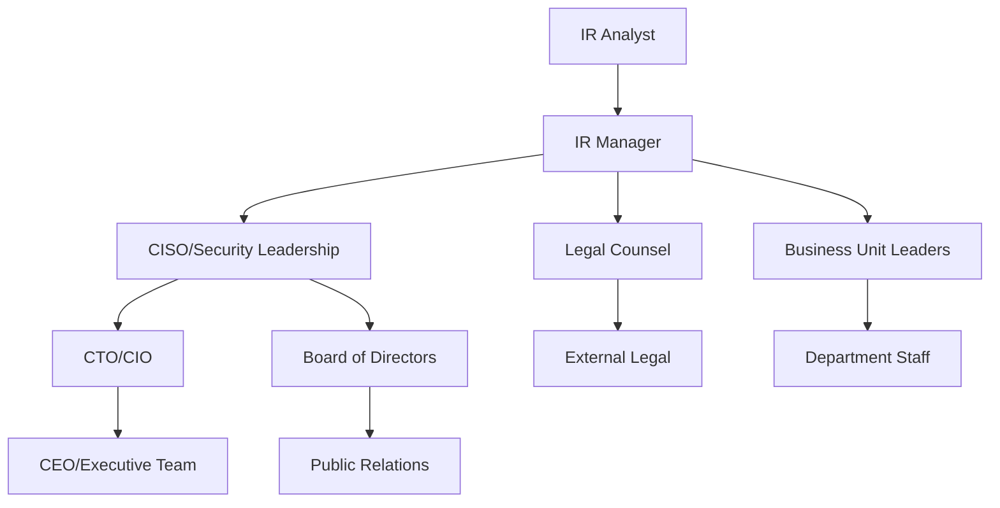
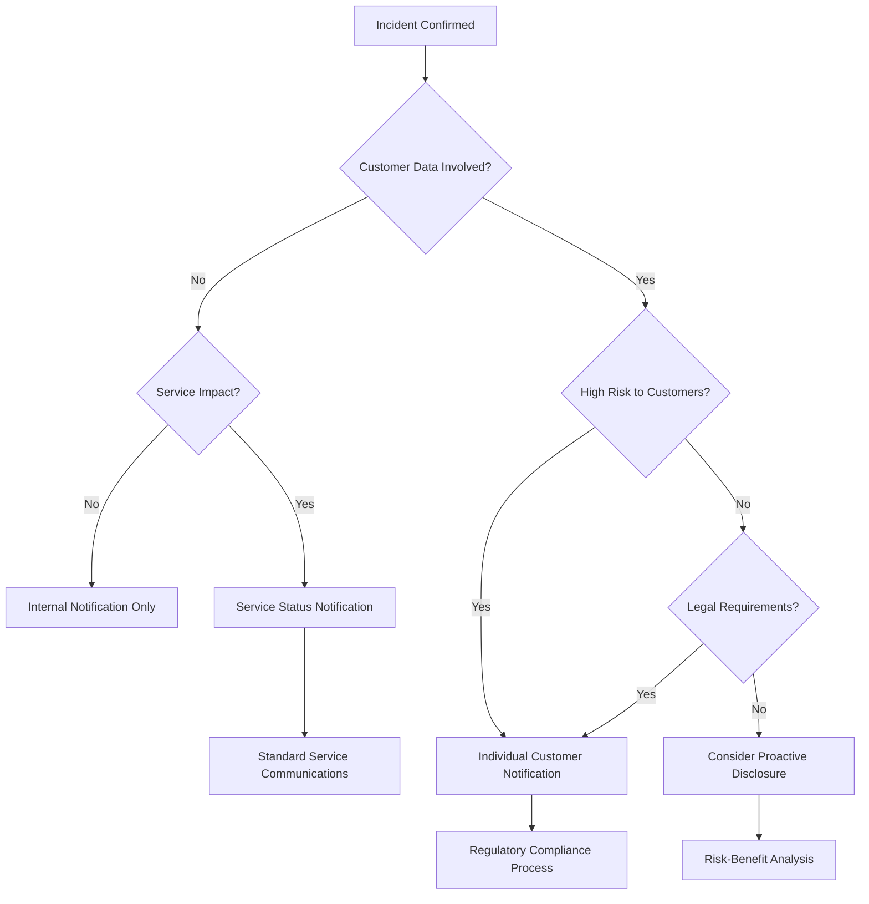

# 6.8: Communication and Coordination

Effective communication during a security incident is critical for coordinating response activities, managing stakeholder expectations, and maintaining organizational reputation. Poor communication can transform a manageable incident into a crisis.

---

## Internal Communication Protocols

Internal communication ensures all stakeholders have the information they need to make informed decisions and take appropriate actions.

### Communication Hierarchy and Escalation

#### **Standard Communication Flow**



#### **Escalation Triggers and Timelines**

| Severity Level | Initial Notification | Executive Briefing | Board Notification |
|----------------|---------------------|-------------------|-------------------|
| **Critical** | Immediate (within 15 minutes) | Within 1 hour | Within 4 hours |
| **High** | Within 30 minutes | Within 2 hours | Within 24 hours |
| **Medium** | Within 1 hour | Within 4 hours | Next board meeting |
| **Low** | Within 4 hours | Daily summary | Monthly report |

### Internal Notification Templates

#### **Initial Alert Notification**

```markdown
Subject: SECURITY ALERT - [Severity] - [Brief Description]

**Alert Summary:**
- Incident ID: [INC-YYYY-NNNN]
- Detection Time: [Timestamp]
- Severity: [Critical/High/Medium/Low]
- Affected Systems: [Primary systems identified]

**Current Situation:**
[2-3 sentences describing what is known]

**Immediate Actions Taken:**
• [Action 1]
• [Action 2]
• [Action 3]

**Next Steps:**
[Brief description of planned activities]

**Response Team:**
- IR Lead: [Name, Phone, Email]
- Technical Lead: [Name, Phone, Email]
- Business Lead: [Name, Phone, Email]

**CONFIDENTIAL** - Do not forward without authorization
```

#### **Executive Status Update**

```markdown
Subject: Security Incident Update - [Incident ID] - [Date/Time]

**Executive Summary:**
[Business-focused summary in 2-3 sentences]

**Business Impact Assessment:**
• Customer Impact: [Current and projected]
• Revenue Impact: [Financial implications]
• Regulatory/Legal: [Compliance considerations]
• Reputation: [Public/media considerations]

**Current Status:**
• Investigation: [% Complete] - [Key findings]
• Containment: [Status] - [Actions taken]
• Recovery: [Timeline] - [Expected restoration]

**Key Decisions Needed:**
[List any decisions requiring executive input]

**Resource Requirements:**
[Additional resources or approvals needed]

**Next Update:** [Scheduled time for next communication]

Contact: [IR Manager contact information]
```

### Communication Channels and Backup Plans

#### **Primary Communication Methods**

| Method | Use Case | Advantages | Limitations |
|--------|----------|------------|-------------|
| **Secure Messaging** | Real-time coordination | Encrypted, persistent, searchable | Requires app access |
| **Email** | Formal notifications | Documentation, wide reach | Security concerns, delays |
| **Phone/Conference** | Urgent decisions | Immediate, personal | No record, scheduling challenges |
| **Collaboration Platforms** | Team coordination | File sharing, integrated tools | Security and access issues |

#### **Backup Communication Plan**

**Primary System Failure Scenarios**:
- **Email System Compromise**: Use personal devices with encrypted messaging
- **Network Outage**: Activate cellular hotspots and satellite communications
- **Building Evacuation**: Implement remote work procedures with secure VPN
- **Key Personnel Unavailable**: Activate succession planning and cross-training

**Emergency Communication Kit**:
```markdown
## Emergency Communication Resources

**Backup Communication Methods:**
- Encrypted messaging app: [Signal/WhatsApp]
- Backup email: [Personal accounts for key personnel]
- Conference bridge: [Toll-free number and access code]
- Emergency contact list: [Physical and digital copies]

**Backup Equipment:**
- Cellular hotspots: [Device IDs and activation procedures]
- Satellite phones: [For complete infrastructure failure]
- Laptop computers: [Pre-configured with VPN access]
- Physical documentation: [Key contact lists and procedures]

**Remote Work Activation:**
- VPN access credentials: [Backup authentication methods]
- Cloud platform access: [Alternative access methods]
- Document repositories: [Offline access procedures]
```

---

## External Stakeholder Management

External communication requires careful coordination to manage legal, regulatory, and reputational risks.

### Stakeholder Identification and Classification

#### **External Stakeholder Categories**

| Stakeholder | Communication Priority | Key Concerns | Notification Trigger |
|-------------|----------------------|--------------|---------------------|
| **Customers** | High | Service availability, data protection | Service impact or data exposure |
| **Regulators** | Critical | Compliance, notification requirements | Regulatory threshold met |
| **Law Enforcement** | High | Criminal activity, evidence preservation | Criminal activity suspected |
| **Partners/Vendors** | Medium | Shared services, supply chain impact | Partner systems affected |
| **Investors** | Medium | Financial impact, material events | Material business impact |
| **Insurance** | Medium | Coverage claims, risk assessment | Covered incident occurs |

#### **Communication Authority Matrix**

| Stakeholder | Authorized Communicators | Approval Required | Legal Review |
|-------------|-------------------------|------------------|--------------|
| **Customers** | CEO, CMO, Customer Success | CEO + Legal | Always |
| **Regulators** | Legal Counsel, Compliance Officer | Legal Counsel | Always |
| **Law Enforcement** | Legal Counsel, CISO | Legal Counsel | Always |
| **Media** | CEO, CMO, PR Agency | CEO + Legal | Always |
| **Partners** | Business Relationship Owners | Business Unit Lead | If contractual |
| **Vendors** | CISO, Procurement | CISO | If sensitive |

### Customer Communication Strategy

#### **Customer Notification Decision Framework**



#### **Customer Notification Templates**

**Service Disruption Notice**:
```markdown
Subject: Service Update - [Service Name]

Dear [Customer Name],

We are writing to inform you of a temporary service disruption affecting 
[specific service/system]. 

**What Happened:**
[Brief, non-technical explanation of the issue]

**Impact:**
[Specific impact on customer services]

**Current Status:**
[What we're doing to resolve the issue]

**Expected Resolution:**
[Timeline estimate if available]

**What You Can Do:**
[Alternative options or workarounds if available]

We sincerely apologize for this disruption and are working diligently to 
restore full service as quickly as possible.

For updates, please visit: [Status page URL]
For questions, please contact: [Support contact information]

Sincerely,
[Authorized spokesperson]
```

**Data Breach Notification**:
```markdown
Subject: Important Security Notice - [Organization Name]

Dear [Customer Name],

We are writing to inform you of a security incident that may have affected 
some of your personal information in our systems.

**What Happened:**
[Clear explanation without excessive technical detail]

**Information Involved:**
[Specific categories of data that may have been accessed]
• [Data type 1]
• [Data type 2] 
• [Data type 3]

**What We're Doing:**
[Specific actions taken to address the incident]
• [Action 1]
• [Action 2]
• [Action 3]

**What You Can Do:**
[Specific recommendations for customers]
• [Recommendation 1]
• [Recommendation 2]
• [Recommendation 3]

**Additional Resources:**
• Credit monitoring: [If applicable]
• Identity theft protection: [If applicable]
• Regulatory resources: [Government websites]

**Contact Information:**
• Incident hotline: [Phone number]
• Email: [Dedicated incident email]
• Website: [Incident information page]

We take the security of your information very seriously and sincerely 
apologize for this incident.

Sincerely,
[Senior executive name and title]
```

---

## Media and Public Relations

Media management during a security incident can significantly impact organizational reputation and recovery.

### Media Response Strategy

#### **Media Engagement Decision Matrix**

| Scenario | Engagement Strategy | Key Messages | Spokesperson |
|----------|-------------------|--------------|-------------|
| **No Public Awareness** | Proactive minimal disclosure | Transparency, control measures | Technical expert |
| **Limited Media Interest** | Reactive measured response | Facts, customer protection | Senior manager |
| **High Media Attention** | Proactive comprehensive response | Leadership, accountability, improvement | CEO/Senior executive |
| **Crisis/Negative Coverage** | Aggressive reputation management | Empathy, action, commitment | CEO + PR professional |

#### **Media Response Timeline**

**Phase 1: Initial Response (0-4 hours)**
- [ ] Assess media interest and coverage
- [ ] Prepare holding statement
- [ ] Identify appropriate spokesperson
- [ ] Coordinate with legal counsel

**Phase 2: Formal Response (4-24 hours)**
- [ ] Issue formal statement if required
- [ ] Schedule media briefings if necessary
- [ ] Monitor media coverage and sentiment
- [ ] Prepare FAQ for common questions

**Phase 3: Ongoing Management (24+ hours)**
- [ ] Provide regular updates as appropriate
- [ ] Respond to specific media inquiries
- [ ] Monitor social media and online discussion
- [ ] Plan follow-up communications

### Press Release and Statement Templates

#### **Initial Public Statement**

```markdown
# [Organization Name] Statement on Security Incident

[City, Date] - [Organization Name] today announced that it recently 
identified and is responding to a cybersecurity incident that 
[brief description of impact].

**Incident Overview**
[Brief factual description of what occurred]

**Immediate Response**
Upon discovery of the incident on [date], we immediately:
• [Key response action 1]
• [Key response action 2]
• [Key response action 3]

**Customer Protection**
[Specific measures taken to protect customers]

**Investigation Status**
[Current status of investigation and remediation]

**Commitment to Security**
[Statement about organizational commitment to security]

**Contact Information**
Media Contact: [Name, Phone, Email]
Customer Questions: [Hotline number, website]

About [Organization Name]:
[Standard company boilerplate]

###
```

#### **Crisis Communication Script**

```markdown
# Crisis Communication Key Messages

**Core Message:**
"We take the security of our customers' information very seriously. We 
immediately launched a comprehensive investigation, engaged leading 
security experts, and are taking all appropriate steps to address this 
situation and strengthen our security measures."

**Supporting Messages:**

**Discovery and Response:**
"We discovered this incident on [date] through our security monitoring 
systems. We immediately began our incident response procedures and 
engaged leading cybersecurity experts to assist with the investigation."

**Customer Protection:**
"Protecting our customers is our top priority. We have [specific actions 
taken] and are providing [specific support offered] to affected individuals."

**Cooperation:**
"We are cooperating fully with law enforcement and have notified all 
appropriate regulatory authorities. We cannot comment further on the 
ongoing investigation."

**Transparency:**
"We are committed to transparency throughout this process. We will 
continue to provide updates as the investigation progresses and we have 
additional information to share."

**Prevention:**
"We are implementing additional security measures to prevent similar 
incidents in the future, including [general categories of improvements]."

**Bridging Phrases:**
• "What I can tell you is..."
• "The important thing to remember is..."
• "Let me be clear about..."
• "Our focus right now is on..."

**Difficult Question Responses:**
• "We're still investigating that aspect of the incident."
• "I can't speculate on that, but what I can tell you is..."
• "That information is part of the ongoing investigation."
• "We'll provide more details as they become available."
```

---

## Law Enforcement Coordination

Working with law enforcement requires careful coordination to balance investigation needs with business operations.

### Law Enforcement Engagement Decision

#### **When to Contact Law Enforcement**

**Mandatory Reporting Situations**:
- Criminal activity clearly evident (e.g., ransomware demands)
- Threats against individuals (executives, employees, customers)
- Critical infrastructure compromise
- Child exploitation material discovered
- Regulatory requirements mandate reporting

**Discretionary Reporting Considerations**:

| Factor | Report to LE | Don't Report | Considerations |
|--------|-------------|-------------|----------------|
| **Evidence Quality** | Strong forensic evidence | Circumstantial only | Quality of criminal case |
| **Business Impact** | Ongoing threat | One-time incident | Disruption to operations |
| **Attribution** | Known threat actor | Unknown/internal | Likelihood of prosecution |
| **Public Interest** | Widespread threat | Isolated incident | Community benefit |

#### **Law Enforcement Coordination Process**

**Initial Contact Procedure**:
```markdown
## Law Enforcement Initial Contact

**Before Calling:**
- [ ] Consult with legal counsel
- [ ] Prepare incident summary
- [ ] Identify potential evidence
- [ ] Designate primary contact

**Initial Information to Provide:**
• Organization name and contact information
• Brief incident description (avoid speculation)
• Potential criminal activity observed
• Evidence preservation status
• Immediate assistance needed

**Information to Avoid:**
• Speculation about attribution or motive
• Detailed technical information
• Business confidential information
• Personal opinions or theories

**Follow-up Actions:**
• Establish regular communication schedule
• Clarify evidence sharing procedures
• Understand investigation timeline expectations
• Coordinate public communication approach
```

### Evidence Sharing and Cooperation

#### **Evidence Sharing Framework**

**Information Sharing Categories**:

| Information Type | Sharing Level | Conditions | Legal Protection |
|------------------|---------------|------------|------------------|
| **Technical IOCs** | Full sharing | Anonymized if possible | Industry sharing agreements |
| **Attack Methods** | Full sharing | Remove organization-specific details | Law enforcement cooperation |
| **Forensic Evidence** | Controlled sharing | Legal review required | Chain of custody maintained |
| **Business Impact** | Limited sharing | Need-to-know basis | Confidentiality agreements |

#### **Joint Investigation Coordination**

**Roles and Responsibilities**:

| Party | Primary Responsibilities | Coordination Requirements |
|-------|-------------------------|---------------------------|
| **Organization** | Business recovery, internal investigation, stakeholder communication | Regular status updates, evidence access |
| **Law Enforcement** | Criminal investigation, evidence collection, prosecution | Coordination with business needs |
| **Legal Counsel** | Legal compliance, privilege protection, coordination | All parties communication |
| **Forensic Experts** | Technical analysis, evidence interpretation, expert testimony | Dual reporting structure |

**Communication Protocol**:
```python
# Joint investigation communication framework
def coordinate_law_enforcement_communication():
    communication_plan = {
        'frequency': 'daily_during_active_phase',
        'format': 'structured_status_updates',
        'participants': ['legal_counsel', 'ir_manager', 'le_liaison'],
        'information_sharing': 'predetermined_categories',
        'escalation_triggers': ['new_evidence', 'business_impact', 'media_attention']
    }
    
    return establish_communication_protocol(communication_plan)
```

### Managing Investigation Impact on Business

#### **Business Continuity During Investigation**

**Evidence Preservation vs. Business Operations**:

| Business Need | LE Requirement | Compromise Solution |
|---------------|----------------|-------------------|
| **System Recovery** | Evidence preservation | Parallel forensic imaging before recovery |
| **Customer Service** | Interview availability | Scheduled interviews during off-hours |
| **Public Communication** | Investigation confidentiality | Coordinated messaging strategy |
| **Vendor Coordination** | Evidence chain integrity | Supervised third-party access |

#### **Timeline Management**

**Investigation Phase Expectations**:
```
Criminal Investigation Timeline:
┌─────────────────────┬─────────────────────┐
│ Initial Response    │ 1-7 days            │
├─────────────────────┼─────────────────────┤
│ Evidence Collection │ 2-8 weeks           │
├─────────────────────┼─────────────────────┤
│ Analysis Phase      │ 2-6 months          │
├─────────────────────┼─────────────────────┤
│ Case Development    │ 6-18 months         │
├─────────────────────┼─────────────────────┤
│ Prosecution         │ 1-3 years           │
└─────────────────────┴─────────────────────┘
```

**Business Recovery Timeline**:
```
Business Recovery Parallel Track:
┌─────────────────────┬─────────────────────┐
│ Immediate Response  │ 0-72 hours          │
├─────────────────────┼─────────────────────┤
│ System Recovery     │ 3-14 days           │
├─────────────────────┼─────────────────────┤
│ Service Restoration │ 1-4 weeks           │
├─────────────────────┼─────────────────────┤
│ Normal Operations   │ 4-12 weeks          │
└─────────────────────┴─────────────────────┘
```

[⬆️ Back to Incident Response](./README.md)
