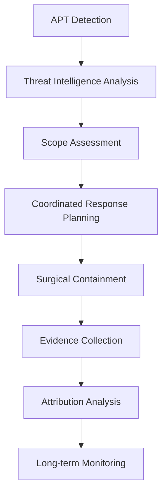
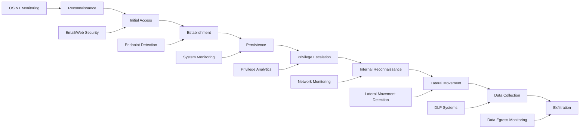
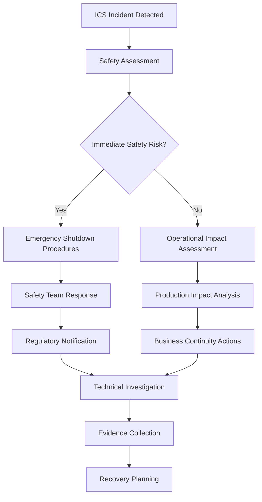

# 6.9: Specialized Incident Types

Different types of security incidents require specialized response approaches, tools, and considerations. This section covers the unique characteristics and response strategies for major incident categories.

---

## Malware Incidents

Malware incidents range from simple virus infections to sophisticated ransomware attacks and require tailored response approaches.

### Malware Classification and Response

#### **Malware Category Matrix**

| Type | Spread Method | Primary Impact | Response Priority | Containment Strategy |
|------|---------------|----------------|-------------------|---------------------|
| **Ransomware** | Email, RDP, vulnerabilities | Data encryption, business disruption | Critical | Immediate network isolation |
| **Banking Trojans** | Email, web exploits | Financial theft, credential harvesting | High | Account monitoring, system imaging |
| **Worms** | Network propagation | System overload, lateral spread | High | Network segmentation |
| **Rootkits** | Software vulnerabilities | Persistent access, stealth | Medium | Deep forensic analysis |
| **Adware/PUP** | Software bundling | Performance degradation | Low | Standard removal procedures |

#### **Ransomware Response Playbook**

**Phase 1: Immediate Response (0-30 minutes)**
```markdown
## Ransomware Immediate Response Checklist

**Detection Confirmation:**
- [ ] Verify ransomware indicators (encrypted files, ransom notes)
- [ ] Identify affected systems and scope
- [ ] Document ransom note content and contact information
- [ ] Photograph screens showing ransom messages

**Immediate Containment:**
- [ ] Isolate affected systems from network immediately
- [ ] Disable Wi-Fi and unplug network cables
- [ ] Identify and isolate backup systems
- [ ] Prevent automated backup operations

**Stakeholder Notification:**
- [ ] Alert executive leadership immediately
- [ ] Notify legal counsel
- [ ] Contact cyber insurance carrier
- [ ] Engage ransomware response specialists if available

**Evidence Preservation:**
- [ ] Power down systems in controlled manner
- [ ] Preserve ransom notes and communications
- [ ] Document all affected systems and file types
- [ ] Begin forensic imaging of critical systems
```

**Phase 2: Assessment and Analysis (30 minutes - 4 hours)**
```bash
# Ransomware identification and analysis
# Check for common ransomware file extensions
find /home -name "*.locked" -o -name "*.encrypted" -o -name "*.crypto" | head -20

# Look for ransom notes
find / -name "*README*" -o -name "*DECRYPT*" -o -name "*RANSOM*" | head -10

# Check running processes for suspicious activity
ps aux | grep -i -E "(encrypt|crypto|ransom|lock)"

# Network connection analysis
netstat -antlp | grep -E ":443|:80|:8080"
```

### Advanced Persistent Threat (APT) Response

#### **APT Characteristics and Detection**

**APT Indicators**:
- **Stealth**: Low and slow approach, avoiding detection
- **Persistence**: Multiple backdoors and access methods
- **Sophistication**: Custom tools and zero-day exploits
- **Targeting**: Specific organizations or data types
- **Attribution**: Often nation-state or organized criminal groups

**APT Response Strategy**:


#### **APT Investigation Framework**

**Intelligence-Driven Response**:

| Phase | Duration | Activities | Key Outputs |
|-------|----------|------------|-------------|
| **Threat Characterization** | 1-3 days | IOC analysis, threat intelligence correlation | Threat actor profile, campaign mapping |
| **Environmental Assessment** | 3-7 days | Network hunting, system analysis | Compromise scope, attack timeline |
| **Coordinated Containment** | 1-3 days | Simultaneous multi-system response | Threat isolation, evidence preservation |
| **Deep Investigation** | 2-8 weeks | Forensic analysis, malware reverse engineering | Attack methodology, data impact assessment |

---

## Data Breaches and Privacy Incidents

Data breach incidents require careful balance between technical response and legal/regulatory compliance.

### Data Breach Response Framework

#### **Breach Classification System**

**Breach Severity Assessment**:

| Factor | Weight | Score 1-5 | Calculation |
|--------|--------|-----------|-------------|
| **Data Sensitivity** | 30% | PII(5), Financial(4), Internal(3), Public(1) | Factor × Weight |
| **Number of Records** | 25% | >100K(5), 10K-100K(4), 1K-10K(3), <1K(2) | Factor × Weight |
| **Threat Actor** | 20% | Nation-state(5), Organized crime(4), Individual(2) | Factor × Weight |
| **Exposure Duration** | 15% | >1 year(5), 6-12mo(4), 1-6mo(3), <1mo(2) | Factor × Weight |
| **Exploitation Evidence** | 10% | Confirmed(5), Likely(4), Possible(2), None(1) | Factor × Weight |

**Total Score Interpretation**:
- **4.0-5.0**: Critical breach requiring immediate executive and regulatory response
- **3.0-3.9**: High-impact breach requiring comprehensive response
- **2.0-2.9**: Moderate breach with standard response procedures
- **1.0-1.9**: Low-impact incident with basic notification requirements

#### **Privacy Impact Assessment**

**Data Subject Impact Analysis**:

```markdown
## Privacy Impact Assessment Template

### Data Subjects Affected
**Total Number**: [Count]
**Geographic Distribution**: [Locations/jurisdictions]
**Demographic Categories**: [Age groups, customer types, etc.]

### Personal Data Categories
- [ ] Contact Information (Name, address, phone, email)
- [ ] Identity Information (SSN, passport, driver's license)
- [ ] Financial Information (Credit cards, bank accounts, payment history)
- [ ] Health Information (Medical records, insurance, health status)
- [ ] Biometric Information (Fingerprints, facial recognition, DNA)
- [ ] Location Information (GPS, IP addresses, travel history)
- [ ] Online Activity (Browsing history, search queries, social media)

### Risk Assessment
**Individual Risk Level**: [Low/Medium/High]
**Risk Factors**:
- Identity theft potential: [Assessment]
- Financial fraud risk: [Assessment]  
- Physical safety concerns: [Assessment]
- Reputational harm: [Assessment]
- Discrimination potential: [Assessment]

### Mitigation Measures
**Immediate Actions**: [List protective measures taken]
**Ongoing Monitoring**: [Long-term protection offered]
**Individual Remediation**: [Credit monitoring, identity protection, etc.]
```

### Regulatory Compliance Management

#### **Multi-Jurisdiction Compliance Matrix**

| Regulation | Jurisdiction | Notification Timeline | Key Requirements |
|------------|--------------|---------------------|------------------|
| **GDPR** | EU/EEA + transfers | 72 hours (regulator), without undue delay (individuals) | Detailed incident description, DPO involvement, impact assessment |
| **CCPA** | California, US | Without unreasonable delay | Consumer notification, Attorney General if >500 residents |
| **PIPEDA** | Canada | ASAP (regulator), ASAP (individuals if risk of significant harm) | Privacy Commissioner notification, breach register |
| **LGPD** | Brazil | 72 hours | ANPD notification, data subject notification if high risk |
| **PDPA** | Singapore | 72 hours | PDPC notification, affected individuals if significant harm |

#### **Regulatory Notification Workflow**

```python
# Regulatory compliance automation framework
def assess_notification_requirements(breach_data):
    requirements = {}
    
    # Analyze affected jurisdictions
    jurisdictions = identify_affected_jurisdictions(breach_data['affected_persons'])
    
    for jurisdiction in jurisdictions:
        regulation = get_applicable_regulation(jurisdiction)
        
        requirements[jurisdiction] = {
            'regulation': regulation,
            'notification_deadline': calculate_deadline(regulation, breach_data['discovery_date']),
            'authority_contact': get_regulatory_authority(jurisdiction),
            'notification_template': get_template(regulation),
            'individual_notification_required': assess_individual_notification_requirement(
                regulation, breach_data['risk_assessment']
            )
        }
    
    return requirements
```

---

## Insider Threats

Insider threat incidents require special handling due to employment law, privacy considerations, and the trusted access that insiders possess.

### Insider Threat Categories

#### **Insider Threat Classification**

| Type | Motivation | Characteristics | Detection Methods |
|------|------------|----------------|------------------|
| **Malicious Insider** | Revenge, financial gain, espionage | Deliberate harmful actions | Behavioral analytics, access monitoring |
| **Negligent Insider** | Carelessness, convenience | Unintentional security violations | Security awareness, technical controls |
| **Compromised Insider** | Account takeover | Legitimate user, illegitimate actions | Authentication anomalies, behavioral changes |
| **Third-Party Insider** | Vendor/contractor access | Elevated access, external loyalty | Privileged access monitoring, background checks |

#### **Insider Threat Investigation Process**

**Phase 1: Discrete Assessment (24-48 hours)**
```markdown
## Insider Threat Initial Assessment

**Information Gathering (Discrete):**
- [ ] Review user access logs and recent activity
- [ ] Check data access patterns and downloads
- [ ] Analyze email and communication patterns
- [ ] Review HR records and recent incidents
- [ ] Assess privileged access usage

**Risk Assessment:**
- [ ] Determine potential data exposure
- [ ] Evaluate ongoing access risk
- [ ] Assess evidence sufficiency
- [ ] Consider legal and HR implications

**Decision Point:**
- [ ] Continue investigation
- [ ] Escalate to HR and Legal
- [ ] Implement protective measures
- [ ] Close as false positive
```

**Phase 2: Coordinated Response (If warranted)**
```markdown
## Coordinated Insider Threat Response

**HR Coordination:**
- [ ] Brief HR leadership on situation
- [ ] Review employment contracts and policies
- [ ] Plan employee interview approach
- [ ] Coordinate with legal counsel

**Technical Actions:**
- [ ] Preserve current state of user accounts
- [ ] Enhanced monitoring implementation
- [ ] Access restriction planning
- [ ] Evidence collection preparation

**Legal Considerations:**
- [ ] Review employee privacy rights
- [ ] Assess potential criminal activity
- [ ] Plan evidence collection approach
- [ ] Consider law enforcement coordination
```

### Insider Threat Monitoring and Detection

#### **Behavioral Analytics Framework**

**User Behavior Baselines**:

| Activity Type | Baseline Metrics | Alert Thresholds |
|---------------|------------------|------------------|
| **Data Access** | Files per day, data volume, access patterns | 3x normal volume, unusual file types |
| **System Usage** | Login times, locations, duration | Off-hours access, geographic anomalies |
| **Network Activity** | Bandwidth usage, external connections | Large uploads, suspicious domains |
| **Application Usage** | Tools used, administrative actions | Privilege escalation, new tool usage |

**Risk Scoring Algorithm**:
```python
def calculate_insider_threat_risk(user_activity):
    risk_factors = {
        'data_access_anomaly': weight_data_access_patterns(user_activity),
        'temporal_anomaly': analyze_time_patterns(user_activity),
        'geographic_anomaly': check_location_patterns(user_activity),
        'privilege_usage': assess_privilege_escalation(user_activity),
        'external_communication': monitor_external_contacts(user_activity)
    }
    
    # Weighted risk calculation
    total_risk = sum(
        factor_score * get_weight(factor_name) 
        for factor_name, factor_score in risk_factors.items()
    )
    
    return classify_risk_level(total_risk)
```

---

## Advanced Persistent Threats (APTs)

APT incidents represent the most sophisticated and persistent cyber threats, requiring specialized long-term response strategies.

### APT Detection and Response

#### **APT Lifecycle and Intervention Points**



#### **APT Response Methodology**

**Intelligence-Led Response Process**:

| Phase | Duration | Key Activities | Success Metrics |
|-------|----------|----------------|-----------------|
| **Threat Intelligence** | 1-2 days | IOC correlation, campaign analysis, threat actor profiling | Threat actor identification, attack vector understanding |
| **Hunt Operations** | 3-10 days | Proactive threat hunting, compromise assessment | Complete compromise scope, attack timeline |
| **Coordinated Disruption** | 1-2 days | Simultaneous containment across all affected systems | Adversary access termination, evidence preservation |
| **Remediation** | 2-6 weeks | System rebuilding, security improvements, monitoring | Threat elimination verification, security enhancement |

**APT Investigation Toolkit**:

```bash
# APT hunting commands and techniques
# Network connection analysis for C2 communications
netstat -antlp | awk '{print $5}' | grep -v '127.0.0.1' | sort -u

# Process analysis for living-off-the-land techniques
ps aux | grep -E "(powershell|wmic|rundll32|regsvr32)"

# Persistence mechanism checks
ls -la /etc/cron* /var/spool/cron*
find /home -name ".ssh" -type d

# Memory analysis indicators
strings /proc/*/mem | grep -E "(http://|https://)" | head -20
```

#### **APT Eradication Strategy**

**Coordinated Response Planning**:

```markdown
## APT Eradication Coordination Plan

### Pre-Eradication Preparation (24-48 hours)
**Intelligence Gathering:**
- [ ] Complete compromise assessment
- [ ] Map all affected systems and accounts
- [ ] Identify all persistence mechanisms
- [ ] Document attack infrastructure

**Response Coordination:**
- [ ] Assemble specialized response team
- [ ] Coordinate with external experts
- [ ] Plan simultaneous response actions
- [ ] Prepare backup systems and processes

### Coordinated Eradication (Simultaneous Execution)
**System Actions (Execute simultaneously):**
- [ ] Disable compromised accounts
- [ ] Remove malware and persistence mechanisms
- [ ] Update all system credentials
- [ ] Apply security patches and configurations

**Network Actions:**
- [ ] Block C2 infrastructure
- [ ] Update firewall and proxy rules
- [ ] Implement enhanced monitoring
- [ ] Activate threat hunting protocols

**Monitoring Phase (30-90 days):**
- [ ] Enhanced logging and monitoring
- [ ] Regular threat hunting activities
- [ ] IOC monitoring and alerting
- [ ] Behavioral analytics tuning
```

### Long-term APT Defense

#### **APT-Focused Security Architecture**

**Defense in Depth for APT Protection**:

| Layer | Primary Controls | APT-Specific Enhancements |
|-------|-----------------|---------------------------|
| **Perimeter** | Firewalls, IPS, email security | Threat intelligence integration, behavioral analysis |
| **Network** | Segmentation, monitoring, NAC | East-west traffic inspection, anomaly detection |
| **Endpoint** | EDR, antivirus, hardening | Memory protection, application whitelisting |
| **Application** | WAF, secure coding, testing | Runtime protection, privilege management |
| **Data** | Classification, DLP, encryption | Data flow monitoring, access analytics |
| **Identity** | MFA, PAM, IAM | Behavioral analytics, privilege escalation detection |

#### **APT Threat Hunting Program**

**Continuous Hunting Methodology**:

```python
# APT threat hunting automation framework
class APTHuntingEngine:
    def __init__(self):
        self.hunt_cycles = ['weekly', 'monthly', 'quarterly']
        self.hunt_techniques = self.load_mitre_techniques()
        self.threat_intelligence = self.load_ti_feeds()
    
    def execute_hunt_cycle(self, cycle_type):
        hunt_plan = self.generate_hunt_plan(cycle_type)
        
        for hunt_technique in hunt_plan:
            results = self.execute_hunt_technique(hunt_technique)
            
            if results.has_findings():
                self.escalate_to_incident_response(results)
                
            self.document_hunt_results(hunt_technique, results)
    
    def generate_hunt_hypotheses(self, threat_landscape):
        """Generate hunting hypotheses based on current threat intelligence"""
        hypotheses = []
        
        for apt_group in self.threat_intelligence.active_groups:
            for technique in apt_group.known_techniques:
                if technique.applicable_to_environment():
                    hypotheses.append(
                        self.create_hunt_hypothesis(apt_group, technique)
                    )
        
        return hypotheses
```

**Hunt Team Structure and Responsibilities**:

| Role | Responsibilities | Skills Required |
|------|-----------------|-----------------|
| **Hunt Lead** | Strategy, coordination, stakeholder communication | Leadership, threat intelligence, business context |
| **Threat Intelligence Analyst** | IOC research, campaign tracking, attribution | TI platforms, OSINT, analytical thinking |
| **Technical Analyst** | Data analysis, tool operation, hypothesis testing | SIEM, scripting, network/host forensics |
| **Malware Analyst** | Reverse engineering, IOC extraction | Assembly, debugging, virtualization |

---

## Incident-Specific Response Considerations

### Cloud Service Provider Incidents

#### **Shared Responsibility Considerations**

**AWS/Azure/GCP Incident Response**:

| Service Type | Customer Responsibility | Provider Responsibility | Investigation Approach |
|-------------|------------------------|------------------------|----------------------|
| **IaaS (EC2/VM)** | OS, applications, data, network configs | Physical security, hypervisor | Full customer investigation |
| **PaaS (RDS/App Service)** | Applications, data, access management | Platform security, patching | Coordinated investigation |
| **SaaS (O365/G Suite)** | User behavior, access policies | Application security, infrastructure | Provider-led with customer coordination |

#### **Cloud-Specific Evidence Collection**

```bash
# AWS evidence collection examples
# CloudTrail logs for API activity
aws logs describe-log-groups --log-group-name-prefix CloudTrail

# VPC Flow Logs for network activity
aws ec2 describe-flow-logs

# Security Group and NACL analysis
aws ec2 describe-security-groups
aws ec2 describe-network-acls

# Instance metadata and configuration
aws ec2 describe-instances --instance-ids i-1234567890abcdef0
```

### Industrial Control System (ICS/SCADA) Incidents

#### **ICS Incident Unique Characteristics**

**Critical Considerations**:
- **Safety Impact**: Physical safety and environmental consequences
- **Operational Continuity**: Production and service delivery impacts
- **Specialized Systems**: Legacy systems with limited security controls
- **Regulatory Requirements**: Industry-specific compliance obligations
- **Air-Gapped Networks**: Isolated systems requiring specialized forensics

#### **ICS Response Priorities**



### Supply Chain Compromise Incidents

#### **Third-Party Risk Assessment**

**Vendor Impact Analysis Framework**:

| Vendor Category | Access Level | Impact Assessment | Response Actions |
|-----------------|--------------|-------------------|------------------|
| **Critical Infrastructure** | Core system access | Business operation disruption | Immediate isolation, alternative sourcing |
| **Software Vendors** | Code deployment, updates | Potential widespread compromise | Software integrity verification, rollback |
| **Service Providers** | Managed services, cloud | Data exposure, service disruption | Contract review, security validation |
| **Business Partners** | Limited system access | Data sharing compromise | Access review, communication coordination |

#### **Supply Chain Response Coordination**

```markdown
## Supply Chain Incident Response Plan

### Immediate Actions (0-4 hours)
**Vendor Coordination:**
- [ ] Contact vendor security team
- [ ] Request incident details and timeline
- [ ] Assess vendor response capabilities
- [ ] Establish communication protocol

**Internal Assessment:**
- [ ] Inventory vendor access and systems
- [ ] Review data sharing arrangements
- [ ] Assess potential compromise scope
- [ ] Implement precautionary measures

### Investigation Coordination (4-24 hours)
**Joint Investigation:**
- [ ] Share relevant threat intelligence
- [ ] Coordinate forensic analysis efforts
- [ ] Align investigation timelines
- [ ] Plan coordinated public communications

**Risk Mitigation:**
- [ ] Implement additional monitoring
- [ ] Review and restrict vendor access
- [ ] Validate data integrity
- [ ] Prepare contingency procedures
```

[⬆️ Back to Incident Response](./README.md)
