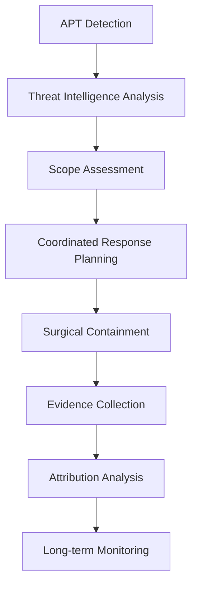

# 6.9: Specialized Incident Types

Different types of security incidents require specialized response approaches, tools, and considerations. This section covers the unique characteristics and response strategies for major incident categories.

---

## Malware Incidents

Malware incidents range from simple virus infections to sophisticated ransomware attacks and require tailored response approaches.

### Malware Classification and Response

#### **Malware Category Matrix**

| Type | Spread Method | Primary Impact | Response Priority | Containment Strategy |
|------|---------------|----------------|-------------------|---------------------|
| **Ransomware** | Email, RDP, vulnerabilities | Data encryption, business disruption | Critical | Immediate network isolation |
| **Banking Trojans** | Email, web exploits | Financial theft, credential harvesting | High | Account monitoring, system imaging |
| **Worms** | Network propagation | System overload, lateral spread | High | Network segmentation |
| **Rootkits** | Software vulnerabilities | Persistent access, stealth | Medium | Deep forensic analysis |
| **Adware/PUP** | Software bundling | Performance degradation | Low | Standard removal procedures |

#### **Ransomware Response Playbook**

**Phase 1: Immediate Response (0-30 minutes)**
```markdown
## Ransomware Immediate Response Checklist

**Detection Confirmation:**
- [ ] Verify ransomware indicators (encrypted files, ransom notes)
- [ ] Identify affected systems and scope
- [ ] Document ransom note content and contact information
- [ ] Photograph screens showing ransom messages

**Immediate Containment:**
- [ ] Isolate affected systems from network immediately
- [ ] Disable Wi-Fi and unplug network cables
- [ ] Identify and isolate backup systems
- [ ] Prevent automated backup operations

**Stakeholder Notification:**
- [ ] Alert executive leadership immediately
- [ ] Notify legal counsel
- [ ] Contact cyber insurance carrier
- [ ] Engage ransomware response specialists if available

**Evidence Preservation:**
- [ ] Power down systems in controlled manner
- [ ] Preserve ransom notes and communications
- [ ] Document all affected systems and file types
- [ ] Begin forensic imaging of critical systems
```

**Phase 2: Assessment and Analysis (30 minutes - 4 hours)**
```bash
# Ransomware identification and analysis
# Check for common ransomware file extensions
find /home -name "*.locked" -o -name "*.encrypted" -o -name "*.crypto" | head -20

# Look for ransom notes
find / -name "*README*" -o -name "*DECRYPT*" -o -name "*RANSOM*" | head -10

# Check running processes for suspicious activity
ps aux | grep -i -E "(encrypt|crypto|ransom|lock)"

# Network connection analysis
netstat -antlp | grep -E ":443|:80|:8080"
```

### Advanced Persistent Threat (APT) Response

#### **APT Characteristics and Detection**

**APT Indicators**:
- **Stealth**: Low and slow approach, avoiding detection
- **Persistence**: Multiple backdoors and access methods
- **Sophistication**: Custom tools and zero-day exploits
- **Targeting**: Specific organizations or data types
- **Attribution**: Often nation-state or organized criminal groups

**APT Response Strategy**:


#### **APT Investigation Framework**

**Intelligence-Driven Response**:

| Phase | Duration | Activities | Key Outputs |
|-------|----------|------------|-------------|
| **Threat Characterization** | 1-3 days | IOC analysis, threat intelligence correlation | Threat actor profile, campaign mapping |
| **Environmental Assessment** | 3-7 days | Network hunting, system analysis | Compromise scope, attack timeline |
| **Coordinated Containment** | 1-3 days | Simultaneous multi-system response | Threat isolation, evidence preservation |
| **Deep Investigation** | 2-8 weeks | Forensic analysis, malware reverse engineering | Attack methodology, data impact assessment |

---

## Data Breaches and Privacy Incidents

Data breach incidents require careful balance between technical response and legal/regulatory compliance.

### Data Breach Response Framework

#### **Breach Classification System**

**Breach Severity Assessment**:

| Factor | Weight | Score 1-5 | Calculation |
|--------|--------|-----------|-------------|
| **Data Sensitivity** | 30% | PII(5), Financial(4), Internal(3), Public(1) | Factor × Weight |
| **Number of Records** | 25% | >100K(5), 10K-100K(4), 1K-10K(3), <1K(2) | Factor × Weight |
| **Threat Actor** | 20% | Nation-state(5), Organized crime(4), Individual(2) | Factor × Weight |
| **Exposure Duration** | 15% | >1 year(5), 6-12mo(4), 1-6mo(3), <1mo(2) | Factor × Weight |
| **Exploitation Evidence** | 10% | Confirmed(5), Likely(4), Possible(2), None(1) | Factor × Weight |

**Total Score Interpretation**:
- **4.0-5.0**: Critical breach requiring immediate executive and regulatory response
- **3.0-3.9**: High-impact breach requiring comprehensive response
- **2.0-2.9**: Moderate breach with standard response procedures
- **1.0-1.9**: Low-impact incident with basic notification requirements

#### **Privacy Impact Assessment**

**Data Subject Impact Analysis**:

```markdown
## Privacy Impact Assessment Template

### Data Subjects Affected
**Total Number**: [Count]
**Geographic Distribution**: [Locations/jurisdictions]
**Demographic Categories**: [Age groups, customer types, etc.]

### Personal Data Categories
- [ ] Contact Information (Name, address, phone, email)
- [ ] Identity Information (SSN, passport, driver's license)
- [ ] Financial Information (Credit cards, bank accounts, payment history)
- [ ] Health Information (Medical records, insurance, health status)
- [ ] Biometric Information (Fingerprints, facial recognition, DNA)
- [ ] Location Information (GPS, IP addresses, travel history)
- [ ] Online Activity (Browsing history, search queries, social media)

### Risk Assessment
**Individual Risk Level**: [Low/Medium/High]
**Risk Factors**:
- Identity theft potential: [Assessment]
- Financial fraud risk: [Assessment]  
- Physical safety concerns: [Assessment]
- Reputational harm: [Assessment]
- Discrimination potential: [Assessment]

### Mitigation Measures
**Immediate Actions**: [List protective measures taken]
**Ongoing Monitoring**: [Long-term protection offered]
**Individual Remediation**: [Credit monitoring, identity protection, etc.]
```

### Regulatory Compliance Management

#### **Multi-Jurisdiction Compliance Matrix**

| Regulation | Jurisdiction | Notification Timeline | Key Requirements |
|------------|--------------|---------------------|------------------|
| **GDPR** | EU/EEA + transfers | 72 hours (regulator), without undue delay (individuals) | Detailed incident description, DPO involvement, impact assessment |
| **CCPA** | California, US | Without unreasonable delay | Consumer notification, Attorney General if >500 residents |
| **PIPEDA** | Canada | ASAP (regulator), ASAP (individuals if risk of significant harm) | Privacy Commissioner notification, breach register |
| **LGPD** | Brazil | 72 hours | ANPD notification, data subject notification if high risk |
| **PDPA** | Singapore | 72 hours | PDPC notification, affected individuals if significant harm |

#### **Regulatory Notification Workflow**

```python
# Regulatory compliance automation framework
def assess_notification_requirements(breach_data):
    requirements = {}
    
    # Analyze affected jurisdictions
    jurisdictions = identify_affected_jurisdictions(breach_data['affected_persons'])
    
    for jurisdiction in jurisdictions:
        regulation = get_applicable_regulation(jurisdiction)
        
        requirements[jurisdiction] = {
            'regulation': regulation,
            'notification_deadline': calculate_deadline(regulation, breach_data['discovery_date']),
            'authority_contact': get_regulatory_authority(jurisdiction),
            'notification_template': get_template(regulation),
            'individual_notification_required': assess_individual_notification_requirement(
                regulation, breach_data['risk_assessment']
            )
        }
    
    return requirements
```

---

## Insider Threats

Insider threat incidents require special handling due to employment law, privacy considerations, and the trusted access that insiders possess.

### Insider Threat Categories

#### **Insider Threat Classification**

| Type | Motivation | Characteristics | Detection Methods |
|------|------------|----------------|------------------|
| **Malicious Insider** | Revenge, financial gain, espionage | Deliberate harmful actions | Behavioral analytics, access monitoring |
| **Negligent Insider** | Carelessness, convenience | Unintentional security violations | Security awareness, technical controls |
| **Compromised Insider** | Account takeover | Legitimate user, illegitimate actions | Authentication anomalies, behavioral changes |
| **Third-Party Insider** | Vendor/contractor access | Elevated access, external loyalty | Privileged access monitoring, background checks |

#### **Insider Threat Investigation Process**

**Phase 1: Discrete Assessment (24-48 hours)**
```markdown
## Insider Threat Initial Assessment

**Information Gathering (Discrete):**
- [ ] Review user access logs and recent activity
- [ ] Check data access patterns and downloads
- [ ] Analyze email and communication patterns
- [ ] Review HR records and recent incidents
- [ ] Assess privileged access usage

**Risk Assessment:**
- [ ] Determine potential data exposure
- [ ] Evaluate ongoing access risk
- [ ] Assess evidence sufficiency
- [ ] Consider legal and HR implications

**Decision Point:**
- [ ] Continue investigation
- [ ] Escalate to HR and Legal
- [ ] Implement protective measures
- [ ] Close as false positive
```

**Phase 2: Coordinated Response (If warranted)**
```markdown
## Coordinated Insider Threat Response

**HR Coordination:**
- [ ] Brief HR leadership on situation
- [ ] Review employment contracts and policies
- [ ] Plan employee interview approach
- [ ] Coordinate with legal counsel

**Technical Actions:**
- [ ] Preserve current state of user accounts
- [ ] Enhanced monitoring implementation
- [ ] Access restriction planning
- [ ] Evidence collection preparation

**Legal Considerations:**
- [ ] Review employee privacy rights
- [ ] Assess potential criminal activity
- [ ] Plan evidence collection approach
- [ ] Consider law enforcement coordination
```

### Insider Threat Monitoring and Detection

#### **Behavioral Analytics Framework**

**User Behavior Baselines**:

| Activity Type | Baseline Metrics | Alert Thresholds |
|---------------|------------------|------------------|
| **Data Access** | Files per day, data volume, access patterns | 3x normal volume, unusual file types |
| **System Usage** | Login times, locations, duration | Off-hours access, geographic anomalies |
| **Network Activity** | Bandwidth usage, external connections | Large uploads, suspicious domains |
| **Application Usage** | Tools used, administrative actions | Privilege escalation, new tool usage |

**Risk Scoring Algorithm**:
```python
def calculate_insider_threat_risk(user_activity):
    risk_factors = {
        'data_access_anomaly': weight_data_access_patterns(user_activity),
        'temporal_anomaly': analyze_time_patterns(user_activity),
        'geographic_anomaly': check_location_patterns(user_activity),
        'privilege_usage': assess_privilege_escalation(user_activity),
        'external_communication': monitor_external_contacts(user_activity)
    }
    
    # Weighted risk calculation
    total_risk = sum(
