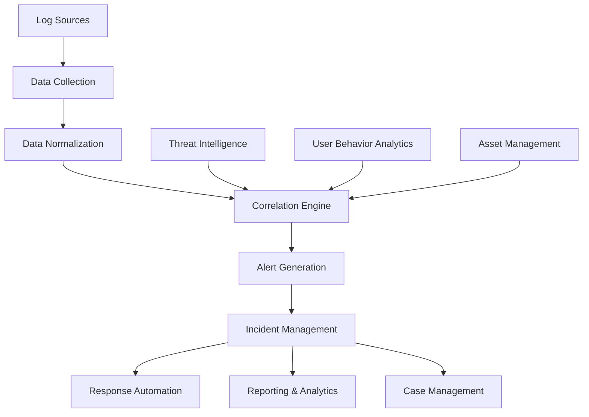
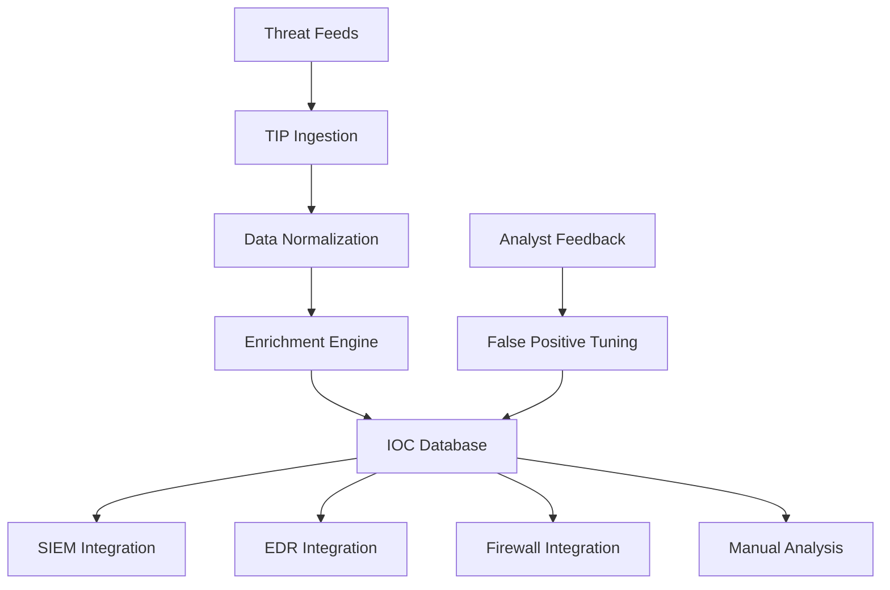
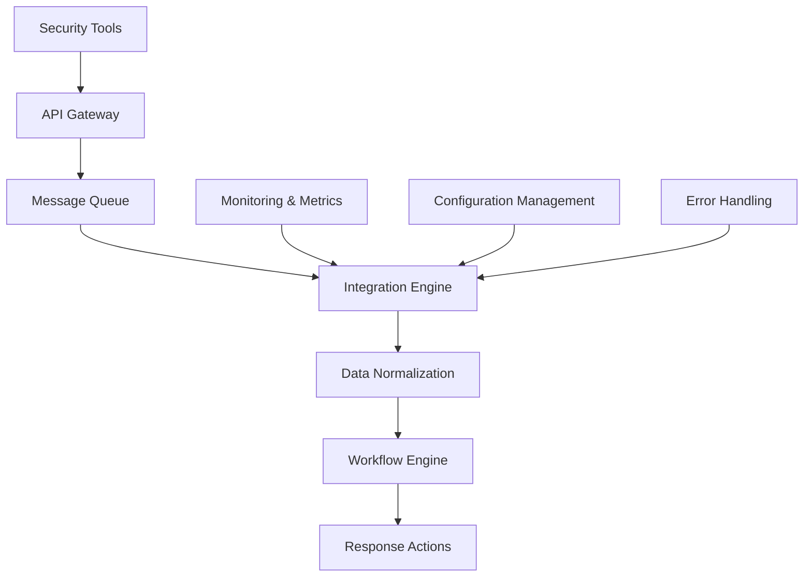

# 6.10: Tools and Technologies

Modern incident response relies heavily on specialized tools and technologies to detect, analyze, contain, and recover from security incidents. This section covers the essential tools and their integration into an effective IR program.

---

## SIEM and Log Analysis

Security Information and Event Management (SIEM) platforms serve as the central nervous system for incident detection and analysis.

### SIEM Architecture and Capabilities

#### **Core SIEM Components**



#### **SIEM Data Sources and Integration**

| Source Category | Data Types | Integration Method | Analysis Value |
|-----------------|------------|-------------------|----------------|
| **Network Infrastructure** | Firewall logs, router logs, IDS/IPS alerts | Syslog, SNMP, API | Attack vectors, lateral movement |
| **Endpoints** | Windows Event Logs, Linux syslogs, EDR telemetry | Agents, WMI, SSH | Host compromise indicators |
| **Applications** | Web server logs, database audit logs, app logs | Log forwarding, API integration | Application-layer attacks |
| **Identity Systems** | Active Directory, LDAP, SSO logs | WMI, LDAP queries, API | Account compromise, privilege abuse |
| **Cloud Platforms** | AWS CloudTrail, Azure Activity Logs, O365 logs | API connectors, streaming | Cloud-specific attack patterns |

### SIEM Rule Development and Tuning

#### **Detection Rule Categories**

**Signature-Based Rules**:
```sql
-- Example: Detect known malware hashes
SELECT timestamp, hostname, process_name, file_hash, user
FROM process_events 
WHERE file_hash IN (
    '5d41402abc4b2a76b9719d911017c592',
    '098f6bcd4621d373cade4e832627b4f6'
) 
AND timestamp > DATE_SUB(NOW(), INTERVAL 24 HOUR)
```

**Anomaly-Based Rules**:
```sql
-- Example: Detect unusual data transfer volumes
SELECT src_ip, dest_ip, SUM(bytes_out) as total_bytes
FROM network_traffic
WHERE timestamp > DATE_SUB(NOW(), INTERVAL 1 HOUR)
GROUP BY src_ip, dest_ip
HAVING total_bytes > (
    SELECT AVG(hourly_bytes) * 5 
    FROM baseline_traffic 
    WHERE src_ip = network_traffic.src_ip
)
```

**Behavioral Rules**:
```sql
-- Example: Detect privilege escalation attempts
SELECT user_account, COUNT(*) as escalation_attempts
FROM authentication_events
WHERE event_type = 'privilege_escalation'
AND timestamp > DATE_SUB(NOW(), INTERVAL 15 MINUTE)
GROUP BY user_account
HAVING escalation_attempts > 3
```

#### **Rule Tuning Methodology**

**Tuning Process Cycle**:

| Phase | Duration | Activities | Success Metrics |
|-------|----------|------------|-----------------|
| **Baseline Establishment** | 2-4 weeks | Normal behavior analysis, false positive identification | <10% false positive rate |
| **Initial Tuning** | 1-2 weeks | Threshold adjustment, exception creation | <5% false positive rate |
| **Fine Tuning** | Ongoing | Weekly review, gradual refinement | <2% false positive rate |
| **Optimization** | Quarterly | Performance review, rule consolidation | Optimal detection coverage |

### Advanced Analytics and Machine Learning

#### **User and Entity Behavior Analytics (UEBA)**

**UEBA Implementation Framework**:

```python
# UEBA risk scoring example
class UEBARiskScoring:
    def __init__(self):
        self.baseline_models = self.load_baseline_models()
        self.risk_factors = {
            'temporal_anomaly': 0.25,
            'access_anomaly': 0.30,
            'volume_anomaly': 0.20,
            'geographic_anomaly': 0.15,
            'behavioral_anomaly': 0.10
        }
    
    def calculate_risk_score(self, user_activity):
        risk_components = {}
        
        # Temporal analysis
        risk_components['temporal'] = self.analyze_time_patterns(
            user_activity.login_times,
            self.baseline_models[user_activity.user_id].normal_hours
        )
        
        # Access pattern analysis
        risk_components['access'] = self.analyze_access_patterns(
            user_activity.resources_accessed,
            self.baseline_models[user_activity.user_id].normal_resources
        )
        
        # Calculate weighted risk score
        total_risk = sum(
            risk_components[component] * self.risk_factors[f"{component}_anomaly"]
            for component in risk_components
        )
        
        return self.normalize_risk_score(total_risk)
```

---

## Forensic Analysis Tools

Digital forensics tools enable detailed investigation and evidence collection during incident response.

### Forensic Tool Categories

#### **Disk and Memory Forensics**

| Tool | Platform | Capabilities | Best Use Cases |
|------|----------|-------------|----------------|
| **Autopsy** | Cross-platform | Disk analysis, timeline generation, keyword search | General purpose investigations |
| **FTK Imager** | Windows | Disk imaging, memory acquisition, file carving | Evidence acquisition |
| **Volatility** | Cross-platform | Memory analysis, process investigation, malware detection | Memory forensics |
| **KAPE** | Windows | Rapid artifact collection, parsing, analysis | Live response, triage |
| **X-Ways** | Windows | Advanced disk analysis, file recovery, expert features | Complex investigations |

#### **Network Forensics Tools**

**Packet Analysis Workflow**:

```bash
# Wireshark command-line analysis examples
# Extract HTTP objects from packet capture
tshark -r capture.pcap --export-objects http,extracted_files/

# Analyze DNS queries for suspicious domains
tshark -r capture.pcap -Y "dns.flags.response == 0" -T fields -e dns.qry.name | sort -u

# Identify potential data exfiltration
tshark -r capture.pcap -Y "tcp.len > 1000" -T fields -e ip.src -e ip.dst -e tcp.len

# Extract SSL/TLS certificate information
tshark -r capture.pcap -Y "ssl.handshake.type == 11" -T fields -e ssl.handshake.certificate
```

### Automated Forensic Analysis

#### **DFIR Automation Frameworks**

**GRR (Google Rapid Response) Implementation**:

```python
# GRR automation example for incident response
from grr_api_client import api

def automated_triage_collection(client_id, incident_id):
    """Automated evidence collection for incident response"""
    
    # Initialize GRR client
    grrapi = api.InitHttp(api_endpoint="http://localhost:8080", auth=("admin", "admin"))
    
    # Define collection artifacts
    artifacts_to_collect = [
        "WindowsEventLogs",
        "WindowsRunKeys",
        "WindowsPrefetchFiles",
        "BrowserHistory",
        "WindowsScheduledTasks"
    ]
    
    # Start artifact collection
    flow = grrapi.Client(client_id).CreateFlow(
        name="ArtifactCollectorFlow",
        args={"artifact_list": artifacts_to_collect}
    )
    
    # Monitor collection progress
    while flow.Get().data.state != "TERMINATED":
        time.sleep(10)
        flow = flow.Get()
    
    # Download collected artifacts
    collected_files = flow.ListResults()
    for result in collected_files:
        download_path = f"/evidence/{incident_id}/{result.payload.pathspec.path}"
        result.GetFilesArchive().WriteToFile(download_path)
    
    return f"Evidence collected for incident {incident_id}"
```

#### **Timeline Analysis Automation**

**Automated Timeline Generation**:

```bash
#!/bin/bash
# Automated timeline analysis script

CASE_NAME=$1
EVIDENCE_DIR=$2
OUTPUT_DIR=$3

# Create case directory structure
mkdir -p "${OUTPUT_DIR}/${CASE_NAME}"/{timelines,analysis,reports}

# Generate super timeline using log2timeline
log2timeline.py --storage-file "${OUTPUT_DIR}/${CASE_NAME}/timeline.plaso" \
    --source-type "directory" "${EVIDENCE_DIR}"

# Convert to CSV for analysis
psort.py -o l2tcsv -w "${OUTPUT_DIR}/${CASE_NAME}/timelines/supertimeline.csv" \
    "${OUTPUT_DIR}/${CASE_NAME}/timeline.plaso"

# Generate focused timelines
psort.py -o l2tcsv \
    --filter "date > '2024-01-01 00:00:00' AND date < '2024-01-02 23:59:59'" \
    -w "${OUTPUT_DIR}/${CASE_NAME}/timelines/incident_day.csv" \
    "${OUTPUT_DIR}/${CASE_NAME}/timeline.plaso"

echo "Timeline analysis complete for case: ${CASE_NAME}"
```

---

## Threat Intelligence Integration

Integrating threat intelligence into incident response improves detection accuracy and provides context for analysis.

### Threat Intelligence Platforms (TIPs)

#### **TIP Architecture and Integration**



#### **MISP (Malware Information Sharing Platform) Integration**

**MISP API Integration Example**:

```python
from pymisp import PyMISP

class MISPThreatIntelligence:
    def __init__(self, misp_url, misp_key):
        self.misp = PyMISP(misp_url, misp_key, ssl=False)
    
    def query_ioc(self, ioc_value, ioc_type):
        """Query MISP for IOC information"""
        search_results = self.misp.search(
            controller='attributes',
            type=ioc_type,
            value=ioc_value,
            include_context=True,
            include_correlations=True
        )
        
        return self.process_misp_results(search_results)
    
    def enrich_incident_iocs(self, incident_iocs):
        """Enrich incident IOCs with threat intelligence"""
        enriched_data = {}
        
        for ioc in incident_iocs:
            threat_data = self.query_ioc(ioc['value'], ioc['type'])
            enriched_data[ioc['value']] = {
                'original_ioc': ioc,
                'threat_intelligence': threat_data,
                'risk_score': self.calculate_risk_score(threat_data),
                'recommended_actions': self.get_recommended_actions(threat_data)
            }
        
        return enriched_data
```

### Automated IOC Processing

#### **IOC Extraction and Processing Pipeline**

**Automated IOC Processing Framework**:

```python
import re
import hashlib
from typing import List, Dict, Any

class IOCProcessor:
    def __init__(self):
        self.ioc_patterns = {
            'ip_address': r'\b(?:[0-9]{1,3}\.){3}[0-9]{1,3}\b',
            'domain': r'\b[a-zA-Z0-9]([a-zA-Z0-9\-]{0,61}[a-zA-Z0-9])?(\.[a-zA-Z0-9]([a-zA-Z0-9\-]{0,61}[a-zA-Z0-9])?)*\b',
            'email': r'\b[A-Za-z0-9._%+-]+@[A-Za-z0-9.-]+\.[A-Z|a-z]{2,}\b',
            'hash_md5': r'\b[a-fA-F0-9]{32}\b',
            'hash_sha1': r'\b[a-fA-F0-9]{40}\b',
            'hash_sha256': r'\b[a-fA-F0-9]{64}\b',
            'url': r'https?://[^\s<>"{}|\\^`\[\]]+',
        }
    
    def extract_iocs_from_text(self, text: str) -> Dict[str, List[str]]:
        """Extract IOCs from free text"""
        extracted_iocs = {}
        
        for ioc_type, pattern in self.ioc_patterns.items():
            matches = re.findall(pattern, text, re.IGNORECASE)
            if matches:
                # Remove duplicates and filter false positives
                cleaned_matches = list(set(matches))
                filtered_matches = self.filter_false_positives(cleaned_matches, ioc_type)
                extracted_iocs[ioc_type] = filtered_matches
        
        return extracted_iocs
    
    def process_incident_artifacts(self, incident_data: Dict) -> Dict:
        """Process incident artifacts to extract and enrich IOCs"""
        all_iocs = {}
        
        # Extract IOCs from various incident fields
        text_fields = ['description', 'analysis_notes', 'email_content', 'log_entries']
        
        for field in text_fields:
            if field in incident_data:
                field_iocs = self.extract_iocs_from_text(incident_data[field])
                all_iocs = self.merge_ioc_dictionaries(all_iocs, field_iocs)
        
        # Enrich with threat intelligence
        enriched_iocs = self.enrich_with_threat_intelligence(all_iocs)
        
        return {
            'extracted_iocs': all_iocs,
            'enriched_iocs': enriched_iocs,
            'processing_timestamp': datetime.utcnow(),
            'total_ioc_count': sum(len(iocs) for iocs in all_iocs.values())
        }
```

---

## Automation and Orchestration

Security Orchestration, Automation, and Response (SOAR) platforms enable automated incident response workflows.

### SOAR Platform Capabilities

#### **Automation Workflow Components**

| Component | Purpose | Examples |
|-----------|---------|----------|
| **Triggers** | Initiate automated workflows | SIEM alerts, email reports, API calls |
| **Actions** | Automated response tasks | Block IPs, quarantine files, create tickets |
| **Decision Points** | Logic-based workflow routing | Risk scoring, approval gates, escalation |
| **Integrations** | Third-party tool connectivity | Security tools, IT systems, communication platforms |
| **Reporting** | Workflow execution documentation | Audit logs, metrics, performance reports |

#### **Incident Response Automation Playbook**

**Phishing Email Response Automation**:

```python
# SOAR playbook example - Phishing email response
class PhishingResponsePlaybook:
    def __init__(self, soar_platform):
        self.soar = soar_platform
        self.integrations = {
            'email_gateway': EmailGatewayAPI(),
            'siem': SIEMPlatformAPI(),
            'threat_intel': ThreatIntelligenceAPI(),
            'ticketing': TicketingSystemAPI()
        }
    
    def execute_phishing_response(self, phishing_alert):
        """Automated phishing email response workflow"""
        
        # Step 1: Extract email metadata and IOCs
        email_data = self.integrations['email_gateway'].get_email_details(
            phishing_alert.message_id
        )
        
        # Step 2: Enrich IOCs with threat intelligence
        ioc_analysis = self.integrations['threat_intel'].analyze_iocs(
            email_data.extracted_iocs
        )
        
        # Step 3: Automated decision making
        risk_score = self.calculate_risk_score(ioc_analysis)
        
        if risk_score >= 8:  # High risk threshold
            response_actions = self.execute_high_risk_response(email_data)
        elif risk_score >= 5:  # Medium risk threshold
            response_actions = self.execute_medium_risk_response(email_data)
        else:
            response_actions = self.execute_low_risk_response(email_data)
        
        # Step 4: Create incident ticket
        incident_ticket = self.integrations['ticketing'].create_incident({
            'title': f'Phishing Email - {email_data.sender}',
            'description': self.generate_incident_description(email_data, ioc_analysis),
            'risk_score': risk_score,
            'automated_actions': response_actions,
            'manual_review_required': risk_score >= 5
        })
        
        return {
            'incident_id': incident_ticket.id,
            'risk_score': risk_score,
            'automated_actions': response_actions,
            'manual_review_required': risk_score >= 5
        }
```

### Custom Automation Development

#### **API-Based Integration Framework**

**Multi-Platform Integration Example**:

```python
class SecurityToolsOrchestrator:
    def __init__(self):
        self.tools = {
            'siem': self.init_siem_connection(),
            'edr': self.init_edr_connection(),
            'firewall': self.init_firewall_connection(),
            'threat_intel': self.init_threat_intel_connection()
        }
    
    def coordinate_threat_response(self, threat_indicators):
        """Coordinate response across multiple security tools"""
        
        response_actions = []
        
        # SIEM: Create correlation rule
        siem_rule = self.tools['siem'].create_correlation_rule({
            'name': f'Threat Response - {threat_indicators.campaign_id}',
            'indicators': threat_indicators.iocs,
            'severity': 'high'
        })
        response_actions.append(f'SIEM rule created: {siem_rule.id}')
        
        # EDR: Deploy IOC hunting query
        edr_hunt = self.tools['edr'].deploy_hunting_query({
            'query_type': 'ioc_search',
            'indicators': threat_indicators.file_hashes,
            'scope': 'all_endpoints'
        })
        response_actions.append(f'EDR hunt deployed: {edr_hunt.id}')
        
        # Firewall: Block malicious IPs
        for ip in threat_indicators.ip_addresses:
            block_rule = self.tools['firewall'].create_block_rule({
                'source_ip': ip,
                'action': 'deny',
                'duration': '24h'
            })
            response_actions.append(f'IP blocked: {ip}')
        
        # Threat Intelligence: Add indicators to blocklist
        ti_update = self.tools['threat_intel'].add_indicators({
            'indicators': threat_indicators.all_iocs,
            'confidence': 'high',
            'source': 'incident_response'
        })
        response_actions.append(f'TI indicators added: {len(threat_indicators.all_iocs)}')
        
        return {
            'coordination_id': self.generate_coordination_id(),
            'actions_taken': response_actions,
            'timestamp': datetime.utcnow(),
            'tools_coordinated': list(self.tools.keys())
        }
```

#### **Metrics and Performance Monitoring**

**Automation Effectiveness Metrics**:

```python
class AutomationMetrics:
    def __init__(self, metrics_database):
        self.db = metrics_database
        
    def calculate_automation_roi(self, time_period):
        """Calculate ROI of incident response automation"""
        
        metrics = {
            'incidents_processed': self.get_incident_count(time_period),
            'automation_rate': self.get_automation_percentage(time_period),
            'time_saved': self.calculate_time_savings(time_period),
            'cost_avoidance': self.calculate_cost_avoidance(time_period),
            'accuracy_rate': self.calculate_automation_accuracy(time_period)
        }
        
        # ROI calculation
        automation_investment = self.get_automation_costs(time_period)
        total_benefits = metrics['cost_avoidance']
        roi_percentage = ((total_benefits - automation_investment) / automation_investment) * 100
        
        return {
            'roi_percentage': roi_percentage,
            'automation_metrics': metrics,
            'recommendations': self.generate_optimization_recommendations(metrics)
        }
```

---

## Tool Integration and Workflow Optimization

Effective incident response requires seamless integration between tools and optimized workflows.

### Integration Architecture

#### **Hub and Spoke vs. Mesh Integration**

**Integration Pattern Comparison**:

| Pattern | Advantages | Disadvantages | Best For |
|---------|------------|---------------|----------|
| **Hub and Spoke** | Centralized control, easier management, consistent data format | Single point of failure, bottleneck potential | Small to medium environments |
| **Mesh Integration** | Distributed resilience, direct tool communication, flexibility | Complex management, inconsistent formats | Large, complex environments |
| **Hybrid Approach** | Balance of control and flexibility, scalable | More complex initial setup | Most enterprise environments |

#### **API-First Integration Strategy**

**Integration Layer Architecture**:



### Workflow Optimization Techniques

#### **Process Automation Maturity Model**

| Maturity Level | Characteristics | Automation Scope | Time to Response |
|----------------|----------------|-------------------|------------------|
| **Level 1: Manual** | All processes manual, documentation-driven | None | Hours to days |
| **Level 2: Tool-Assisted** | Individual tools with some automation | Single-tool workflows | 1-4 hours |
| **Level 3: Orchestrated** | Multi-tool workflows, decision automation | Cross-platform processes | 15-60 minutes |
| **Level 4: Intelligent** | AI-assisted decision making, adaptive workflows | Dynamic response optimization | 1-15 minutes |
| **Level 5: Autonomous** | Self-healing, predictive response | Proactive threat mitigation | Real-time |

#### **Workflow Performance Optimization**

**Performance Metrics and KPIs**:

```python
class WorkflowPerformanceAnalyzer:
    def __init__(self):
        self.metrics_collector = MetricsCollector()
        self.performance_thresholds = {
            'workflow_execution_time': 300,  # seconds
            'error_rate': 0.05,  # 5%
            'resource_utilization': 0.80,  # 80%
            'throughput': 100  # workflows per hour
        }
    
    def analyze_workflow_performance(self, workflow_id, time_period):
        """Analyze workflow performance and identify optimization opportunities"""
        
        performance_data = self.metrics_collector.get_workflow_metrics(
            workflow_id, time_period
        )
        
        analysis_results = {
            'average_execution_time': performance_data.avg_execution_time,
            'success_rate': performance_data.success_rate,
            'bottlenecks': self.identify_bottlenecks(performance_data),
            'resource_utilization': performance_data.resource_usage,
            'optimization_recommendations': []
        }
        
        # Generate optimization recommendations
        if analysis_results['average_execution_time'] > self.performance_thresholds['workflow_execution_time']:
            analysis_results['optimization_recommendations'].append({
                'type': 'performance',
                'priority': 'high',
                'recommendation': 'Parallelize long-running tasks',
                'expected_improvement': '30-50% execution time reduction'
            })
        
        if analysis_results['success_rate'] < (1 - self.performance_thresholds['error_rate']):
            analysis_results['optimization_recommendations'].append({
                'type': 'reliability',
                'priority': 'critical',
                'recommendation': 'Implement better error handling and retry logic',
                'expected_improvement': 'Improved workflow reliability'
            })
        
        return analysis_results
    
    def generate_optimization_report(self, analysis_results):
        """Generate actionable optimization report"""
        
        report = {
            'executive_summary': self.create_executive_summary(analysis_results),
            'performance_metrics': analysis_results,
            'implementation_roadmap': self.create_implementation_roadmap(
                analysis_results['optimization_recommendations']
            ),
            'roi_projection': self.calculate_optimization_roi(analysis_results)
        }
        
        return report
```

### Tool Selection and Evaluation Framework

#### **Tool Assessment Matrix**

**Evaluation Criteria Framework**:

| Category | Weight | Evaluation Factors | Scoring Method |
|----------|--------|-------------------|----------------|
| **Functionality** | 35% | Feature completeness, use case coverage, performance | Feature checklist, benchmark testing |
| **Integration** | 25% | API quality, standard compliance, existing tool compatibility | Integration testing, documentation review |
| **Usability** | 20% | User interface, learning curve, workflow efficiency | User testing, training time measurement |
| **Scalability** | 10% | Performance under load, growth capacity, resource efficiency | Load testing, capacity planning |
| **Support & Maintenance** | 10% | Vendor support, documentation, community, update frequency | Support evaluation, documentation audit |

#### **Total Cost of Ownership (TCO) Analysis**

**IR Tool TCO Calculator**:

```python
class IRToolTCOCalculator:
    def __init__(self):
        self.cost_categories = {
            'acquisition': ['license_fees', 'implementation_costs', 'hardware_requirements'],
            'operational': ['maintenance_fees', 'support_costs', 'training_costs'],
            'personnel': ['admin_time', 'user_training', 'specialized_skills'],
            'opportunity': ['deployment_time', 'learning_curve', 'feature_gaps']
        }
    
    def calculate_tco(self, tool_data, evaluation_period_years=3):
        """Calculate total cost of ownership for incident response tools"""
        
        tco_breakdown = {}
        
        # Acquisition costs
        tco_breakdown['acquisition'] = {
            'license_fees': tool_data['license_cost_per_year'] * evaluation_period_years,
            'implementation': tool_data['implementation_cost'],
            'hardware': tool_data.get('hardware_cost', 0),
            'professional_services': tool_data.get('professional_services', 0)
        }
        
        # Operational costs
        tco_breakdown['operational'] = {
            'annual_maintenance': tool_data['maintenance_percentage'] * tool_data['license_cost_per_year'] * evaluation_period_years,
            'support_costs': tool_data.get('support_cost_per_year', 0) * evaluation_period_years,
            'infrastructure': tool_data.get('infrastructure_cost_per_year', 0) * evaluation_period_years
        }
        
        # Personnel costs
        tco_breakdown['personnel'] = {
            'admin_time': self.calculate_admin_overhead(tool_data) * evaluation_period_years,
            'training': tool_data.get('training_cost', 0),
            'specialized_skills': self.calculate_skill_premium(tool_data) * evaluation_period_years
        }
        
        # Calculate total TCO
        total_tco = sum(
            sum(category_costs.values()) 
            for category_costs in tco_breakdown.values()
        )
        
        return {
            'total_tco': total_tco,
            'annual_tco': total_tco / evaluation_period_years,
            'cost_breakdown': tco_breakdown,
            'cost_per_incident': total_tco / tool_data['expected_incidents_per_year'] / evaluation_period_years
        }
```

### Future Technology Trends

#### **Emerging Technologies in IR**

**Technology Trend Impact Assessment**:

| Technology | Maturity Level | IR Application | Expected Impact | Implementation Timeline |
|------------|---------------|----------------|-----------------|------------------------|
| **Artificial Intelligence/ML** | Mature | Automated analysis, pattern recognition | High - Enhanced detection and response speed | 1-2 years |
| **Extended Reality (XR)** | Emerging | Immersive incident visualization, training | Medium - Improved understanding and training | 3-5 years |
| **Quantum Computing** | Research | Cryptographic analysis, complex correlations | High - Enhanced analysis capabilities | 5-10 years |
| **Edge Computing** | Early adoption | Distributed incident response, real-time processing | Medium - Faster response times | 2-3 years |
| **Blockchain** | Early adoption | Evidence integrity, audit trails | Low - Specialized use cases | 3-5 years |

#### **AI and Machine Learning Integration**

**AI-Enhanced Incident Response Framework**:

```python
class AIEnhancedIncidentResponse:
    def __init__(self):
        self.ml_models = {
            'threat_classification': self.load_threat_classification_model(),
            'severity_prediction': self.load_severity_prediction_model(),
            'response_recommendation': self.load_response_recommendation_model(),
            'timeline_prediction': self.load_timeline_prediction_model()
        }
    
    def ai_assisted_incident_analysis(self, incident_data):
        """Use AI to enhance incident analysis and response recommendations"""
        
        # Classify threat type
        threat_classification = self.ml_models['threat_classification'].predict(
            incident_data.features
        )
        
        # Predict severity and business impact
        severity_prediction = self.ml_models['severity_prediction'].predict(
            incident_data.impact_features
        )
        
        # Generate response recommendations
        response_recommendations = self.ml_models['response_recommendation'].predict(
            {
                'threat_type': threat_classification,
                'predicted_severity': severity_prediction,
                'organization_context': incident_data.org_context
            }
        )
        
        # Predict resolution timeline
        timeline_prediction = self.ml_models['timeline_prediction'].predict(
            {
                'threat_type': threat_classification,
                'severity': severity_prediction,
                'response_plan': response_recommendations
            }
        )
        
        return {
            'ai_analysis': {
                'threat_type': threat_classification,
                'confidence_score': self.calculate_confidence(incident_data),
                'predicted_severity': severity_prediction,
                'estimated_timeline': timeline_prediction
            },
            'recommended_actions': response_recommendations,
            'human_review_required': self.assess_human_review_need(
                threat_classification, severity_prediction
            )
        }
    
    def continuous_learning(self, incident_outcomes):
        """Continuously improve AI models based on incident outcomes"""
        
        # Update models with new training data
        for model_name, model in self.ml_models.items():
            relevant_outcomes = self.filter_relevant_outcomes(
                incident_outcomes, model_name
            )
            
            if len(relevant_outcomes) >= self.minimum_training_threshold:
                updated_model = self.retrain_model(model, relevant_outcomes)
                
                # Validate improved performance
                if self.validate_model_improvement(model, updated_model):
                    self.ml_models[model_name] = updated_model
                    self.log_model_update(model_name, len(relevant_outcomes))
```

[⬆️ Back to Incident Response](./README.md)
