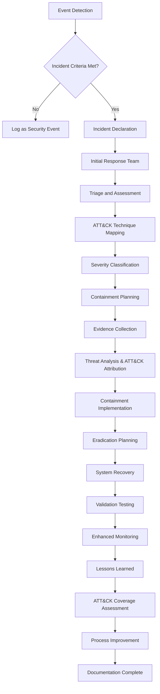
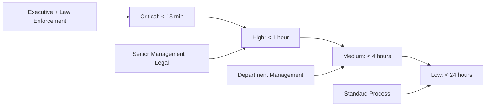

# Module 6: Incident Response

Incident Response (IR) represents the organized approach to addressing and managing cybersecurity incidents to minimize damage, reduce recovery time, and prevent future occurrences. This module covers the complete IR lifecycle from preparation through post-incident improvement.

---

## 🎯 Learning Objectives

By completing this module, you will understand:
- IR fundamentals and organizational maturity models
- Industry-standard frameworks (NIST SP 800-61, SANS methodology)
- Complete incident lifecycle from detection through lessons learned
- Specialized incident types including APTs, insider threats, and data breaches
- Modern IR technologies including SIEM, SOAR, and automation platforms
- Legal, regulatory, and communication requirements for effective response
- MITRE ATT&CK framework integration for enhanced incident analysis

---

## 📚 Module Contents

### Foundation and Frameworks
- [**01: Introduction to Incident Response**](./01-introduction-to-incident-response.md)
  - Defining security incidents vs. events
  - Business impact and cost analysis
  - IR team structure and organizational maturity

- [**02: IR Frameworks and Methodologies**](./02-ir-frameworks-and-methodologies.md)
  - NIST SP 800-61 four-phase framework
  - SANS six-step incident response process
  - Incident classification and severity assessment

### Preparation and Response Execution
- [**03: Preparation and Planning**](./03-preparation-and-planning.md)
  - IR policy development and team training
  - Tabletop exercises and communication templates
  - Tool requirements and playbook development

- [**04: Detection and Analysis**](./04-detection-and-analysis.md)
  - Multi-source incident detection methods
  - Triage decision frameworks and evidence collection
  - Attack vector analysis and timeline development

- [**05: Containment Strategies**](./05-containment-strategies.md)
  - Short-term vs. long-term containment planning
  - Network segmentation and system isolation
  - Business continuity integration

### Recovery and Improvement
- [**06: Eradication and Recovery**](./06-eradication-and-recovery.md)
  - Root cause analysis methodologies
  - Malware removal and system hardening
  - Recovery validation and monitoring strategies

- [**07: Post-Incident Activities**](./07-post-incident-activities.md)
  - Structured lessons learned processes
  - Executive and regulatory reporting
  - Continuous process improvement

### Coordination and Specialized Scenarios
- [**08: Communication and Coordination**](./08-communication-and-coordination.md)
  - Internal stakeholder communication protocols
  - External notifications and media relations
  - Law enforcement coordination

- [**09: Specialized Incident Types**](./09-specialized-incident-types.md)
  - Malware and ransomware response
  - Data breach and privacy incident handling
  - Insider threats and APT investigations

- [**10: Tools and Technologies**](./10-tools-and-technologies.md)
  - SIEM configuration and forensic platforms
  - Threat intelligence integration
  - SOAR and response automation

- [**11: MITRE ATT&CK Framework Integration**](./11-mitre-attack-framework-integration.md)
  - ATT&CK-driven threat hunting and detection
  - Incident analysis and attack reconstruction
  - Adversary emulation and program maturity

---

## 🔧 Essential Tools and Technologies

| Tool Category | Tools | Purpose | Key Features |
|---------------|-------|---------|---------------|
| **SIEM Platforms** | Splunk, QRadar, Sentinel, ELK | Centralized monitoring and correlation | Real-time alerting, historical analysis |
| **Forensic Tools** | FTK Imager, Volatility, Autopsy, KAPE | Evidence collection and analysis | Memory analysis, disk imaging, artifact parsing |
| **Communication** | Secure messaging, conference systems | Incident coordination | Encrypted channels, stakeholder management |
| **Automation** | SOAR platforms, custom scripts | Response orchestration | Workflow automation, multi-tool integration |
| **Documentation** | Case management, ticketing systems | Incident tracking | Chain of custody, audit trails |
| **Threat Intel** | MISP, TIPs, IOC platforms | Context enhancement | Attribution, IOC correlation, campaign tracking |
| **ATT&CK Tools** | Navigator, CALDERA, DeTT&CK | Framework integration | Technique mapping, coverage analysis, emulation |

---

## 📊 Complete Incident Response Workflow



---

## 🏗️ IR Framework Comparison

| Framework | Phases | Key Strengths | Best Application |
|-----------|--------|---------------|------------------|
| **NIST SP 800-61** | 4-phase cyclical | Comprehensive, widely adopted, continuous improvement focus | Government, regulated industries |
| **SANS Methodology** | 6-step linear | Practical procedures, detailed guidance, industry-proven | Commercial organizations |
| **ISO/IEC 27035** | 5-phase structured | International standard, risk-based approach | Global organizations |
| **MITRE ATT&CK Enhanced** | Framework-agnostic integration | Technique-driven analysis, threat actor context | Advanced security programs |

---

## 🔍 Enhanced Incident Classification

### ATT&CK-Informed Severity Assessment

| Factor | Weight | Critical (5) | High (4) | Medium (3) | Low (2) | Minimal (1) |
|--------|--------|-------------|----------|------------|---------|-------------|
| **Business Impact** | 25% | Complete service outage | Major degradation | Moderate impact | Minor impact | No service impact |
| **Data Sensitivity** | 20% | PII/PHI/Financial exposed | Internal sensitive | Business confidential | Public info | No data involved |
| **ATT&CK Sophistication** | 20% | Advanced persistent threat | Multi-stage attack | Single technique | Basic technique | Accidental |
| **System Criticality** | 15% | Core production | Important production | Development/test | Isolated systems | Non-production |
| **Threat Actor Profile** | 10% | Nation-state APT | Organized crime | Skilled individual | Script kiddie | Insider/accidental |
| **Technique Coverage** | 10% | Zero detection | Limited detection | Partial detection | Good detection | Full coverage |

### Response Timeline Matrix



---

## 📈 Specialized Incident Response Approaches

### Ransomware Response with ATT&CK

| Phase | Duration | Key Activities | ATT&CK Techniques | Success Criteria |
|-------|----------|----------------|-------------------|------------------|
| **Immediate** | 0-30 minutes | Network isolation, scope assessment | T1486, T1490 analysis | Spread contained, C2 blocked |
| **Analysis** | 30 min - 4 hours | Malware family ID, ATT&CK mapping | Full technique timeline | Attribution completed, impact assessed |
| **Recovery** | 4-48 hours | System restoration, validation | T1059 cleanup verification | Services restored, no persistence |
| **Monitoring** | 48+ hours | Enhanced surveillance, hunting | T1055, T1027 detection | No reinfection, gaps addressed |

### Data Breach Response Framework
- **ATT&CK Analysis** - Map data access techniques (T1005, T1039, T1025)
- **Risk Assessment** - Impact analysis using technique sophistication
- **Stakeholder Notification** - Timeline based on attack progression evidence
- **Remediation Planning** - Technique-specific defensive improvements

### APT Investigation with ATT&CK
- **Intelligence-Led Analysis** - Threat actor TTPs and campaign correlation
- **Coordinated Response** - Multi-system technique-based containment
- **Long-term Monitoring** - Persistence technique surveillance
- **Attribution Support** - Technique evidence for threat attribution

---

## ⚖️ Legal and Regulatory Integration

### Enhanced Notification Requirements

| Regulation | Jurisdiction | Timeline | ATT&CK Enhancement |
|------------|--------------|----------|-------------------|
| **GDPR** | EU/EEA | 72 hours | Technique sophistication affects risk assessment |
| **CCPA** | California, US | Without unreasonable delay | Attack progression timeline informs urgency |
| **HIPAA** | US Healthcare | 60 days | Data access techniques (T1005, T1039) determine scope |
| **PCI DSS** | Payment cards | Immediately | Financial data techniques trigger specific requirements |

### Evidence Management with ATT&CK Context
- **Chain of Custody** - ATT&CK technique artifacts preserved with context
- **Legal Hold** - Technique-specific evidence preservation requirements
- **Expert Testimony** - ATT&CK framework provides technical credibility
- **Discovery Support** - Structured technique evidence for legal proceedings

---

## 🧠 Enhanced IR Team Development

### ATT&CK-Integrated Competency Framework

| Role | Technical Skills | ATT&CK Competencies | Certification Targets |
|------|-----------------|-------------------|----------------------|
| **IR Manager** | IR frameworks, risk management | ATT&CK program strategy, maturity assessment | CISSP, CISM, GCIH |
| **Security Analyst** | SIEM, threat hunting, forensics | Technique identification, hunt hypothesis development | GCIH, GNFA, CySA+ |
| **Forensic Specialist** | Digital forensics, malware analysis | Technique reconstruction, evidence mapping | GCFA, GCFE, EnCE |
| **Threat Hunter** | Proactive hunting, analytics | ATT&CK-driven hunting, technique coverage | GCTI, GNFA, GDAT |
| **Detection Engineer** | Rule development, automation | Technique-based detection, coverage analysis | GCDA, GIAC, Custom |

### Enhanced Training Program
- **ATT&CK Foundation** - 16 hours covering framework fundamentals and navigation
- **Technique Mastery** - 24 hours hands-on technique identification and analysis
- **Hunt Development** - 16 hours ATT&CK-driven hunting methodology
- **Detection Engineering** - 20 hours technique-based rule development
- **Program Management** - 12 hours maturity assessment and strategic planning

---

## 📊 Advanced IR Metrics and Performance

### ATT&CK-Enhanced KPIs

| Metric Category | Traditional KPI | ATT&CK Enhancement | Target |
|-----------------|-----------------|-------------------|--------|
| **Detection Performance** | Mean Time to Detection | Technique-specific MTTD | < 4 hours average, < 1 hour for high-priority techniques |
| **Response Effectiveness** | Mean Time to Response | ATT&CK-informed response prioritization | < 30 minutes for advanced techniques |
| **Coverage Assessment** | Alert volume metrics | Technique coverage percentage | > 80% coverage of relevant techniques |
| **Hunt Effectiveness** | Hunt success rate | Technique-based hunt success | > 15% of hunts identify new techniques |
| **Program Maturity** | Compliance metrics | ATT&CK maturity level progression | Level 3+ (Defined) within 12 months |

### Comprehensive Maturity Model
```
Level 1 (Initial): Basic incident response, ad-hoc ATT&CK usage
    ↓
Level 2 (Managed): Documented procedures, systematic technique tracking
    ↓  
Level 3 (Defined): ATT&CK-integrated processes, technique-based detection
    ↓
Level 4 (Quantitative): Metrics-driven improvement, coverage analytics
    ↓
Level 5 (Optimizing): Predictive capabilities, community contribution
```

---

## 🔗 Essential Resources and References

### Official Framework Documentation
- [NIST SP 800-61 Rev 2](https://csrc.nist.gov/publications/detail/sp/800-61/rev-2/final) - Computer Security Incident Handling Guide
- [MITRE ATT&CK Framework](https://attack.mitre.org/) - Adversary tactics, techniques, and procedures
- [SANS Incident Response Process](https://www.sans.org/white-papers/504/) - Six-Step methodology
- [ISO/IEC 27035](https://www.iso.org/standard/78973.html) - Information security incident management

### ATT&CK Resources and Tools
- [ATT&CK Navigator](https://mitre-attack.github.io/attack-navigator/) - Interactive technique visualization
- [CALDERA](https://caldera.mitre.org/) - Automated adversary emulation platform
- [ATT&CK Workbench](https://github.com/center-for-threat-informed-defense/attack-workbench-frontend) - Customizable knowledge base
- [DeTT&CK](https://github.com/rabobank-cdc/DeTTECT) - Detection engineering and coverage analysis

### Training and Certification Programs
- [SANS FOR508](https://www.sans.org/cyber-security-courses/advanced-incident-response-threat-hunting-digital-forensics/) - Advanced incident response and forensics
- [SANS FOR578](https://www.sans.org/cyber-security-courses/cyber-threat-intelligence/) - Cyber threat intelligence with ATT&CK focus
- [MITRE ATT&CK Training](https://attack.mitre.org/resources/training/) - Official framework training materials
- [GCIH Certification](https://www.giac.org/certification/certified-incident-handler-gcih) - GIAC Certified Incident Handler

### Open Source Tools and Platforms
- [TheHive](https://thehive-project.org/) - Scalable incident response platform
- [MISP](https://www.misp-project.org/) - Malware information sharing with ATT&CK integration
- [Volatility](https://www.volatilityfoundation.org/) - Advanced memory forensics framework
- [Yara](https://virustotal.github.io/yara/) - Pattern matching engine for malware research

### Legal and Compliance Resources
- [GDPR Breach Notification Guidelines](https://edpb.europa.eu/our-work-tools/our-documents/guidelines_en) - European data protection requirements
- [NIST Cybersecurity Framework](https://www.nist.gov/cyberframework) - Risk management approach
- [State Breach Laws](https://www.ncsl.org/research/telecommunications-and-information-technology/security-breach-notification-laws.aspx) - US state notification requirements
- [ENISA Incident Response Guidelines](https://www.enisa.europa.eu/) - European cybersecurity guidance

### Industry Communities and Standards
- [FIRST.org](https://www.first.org/) - Forum of Incident Response and Security Teams
- [US-CERT](https://www.cisa.gov/uscert) - US Computer Emergency Readiness Team
- [ATT&CK Community](https://medium.com/mitre-attack) - Framework updates and research
- [OASIS CTI](https://www.oasis-open.org/committees/tc_home.php?wg_abbrev=cti) - Cyber threat intelligence standards

### Advanced Research and Development
- [MITRE Engenuity](https://mitre-engenuity.org/) - ATT&CK evaluations and research
- [Center for Threat-Informed Defense](https://ctid.mitre-engenuity.org/) - Community-driven security research
- [ATT&CK Data Sources](https://attack.mitre.org/datasources/) - Detection data source project
- [Security Stack Mappings](https://center-for-threat-informed-defense.github.io/security-stack-mappings/) - Technology mapping to ATT&CK

---

[⬆️ Back to Main Course](../README.md)
