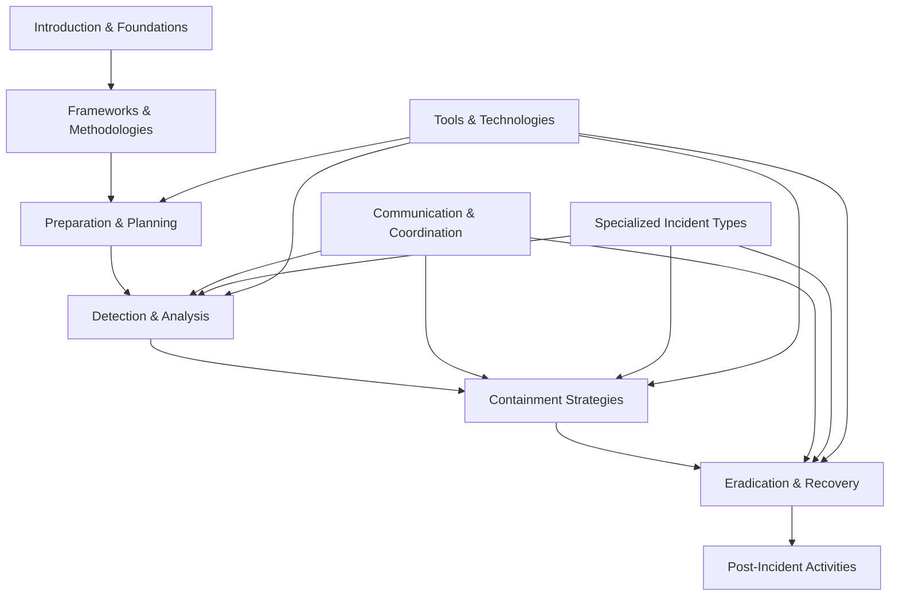

# Module 6: Incident Response

This module provides comprehensive coverage of cybersecurity incident response, from foundational concepts through advanced automation and specialized incident types. Built around industry-standard frameworks like NIST SP 800-61 and SANS, it offers both theoretical knowledge and practical guidance for effective incident management.

---

## Core Learning Objectives

By completing this module, you will understand:

- **IR Fundamentals**: What constitutes a security incident and how to build effective response capabilities
- **Industry Frameworks**: NIST and SANS methodologies with practical implementation guidance  
- **Response Lifecycle**: Complete incident lifecycle from detection through lessons learned
- **Specialized Scenarios**: Advanced threats including APTs, insider threats, and data breaches
- **Modern Technologies**: SIEM, SOAR, threat intelligence, and AI-enhanced response capabilities

---

## Module Structure and Flow

---

## Table of Contents

### **Foundations and Frameworks**
-   [**01: Introduction to Incident Response**](./01-introduction-to-incident-response.md)
    -   Defining Security Incidents vs. Events
    -   Business Impact and Cost Analysis
    -   IR Team Structure and Roles
    -   Organizational Maturity Models
-   [**02: IR Frameworks and Methodologies**](./02-ir-frameworks-and-methodologies.md)
    -   NIST SP 800-61 Four-Phase Framework
    -   SANS Six-Step Incident Response Process
    -   Incident Classification and Severity Assessment
    -   Metrics and Performance Measurement

### **Preparation and Response Execution**
-   [**03: Preparation and Planning**](./03-preparation-and-planning.md)
    -   IR Policy and Procedure Development
    -   Team Training and Tabletop Exercises
    -   Tool and Technology Requirements
    -   Communication Templates and Playbooks
-   [**04: Detection and Analysis**](./04-detection-and-analysis.md)
    -   Multi-Source Incident Detection Methods
    -   Triage Decision Frameworks
    -   Evidence Collection and Chain of Custody
    -   Attack Vector Analysis and Timeline Development
-   [**05: Containment Strategies**](./05-containment-strategies.md)
    -   Short-term vs. Long-term Containment Planning
    -   Network Segmentation and System Isolation
    -   Quarantine Procedures and Automation
    -   Business Continuity Integration

### **Recovery and Improvement**
-   [**06: Eradication and Recovery**](./06-eradication-and-recovery.md)
    -   Root Cause Analysis Methodologies
    -   Malware Removal and System Hardening
    -   Recovery Planning and Validation
    -   Post-Recovery Monitoring Strategies
-   [**07: Post-Incident Activities**](./07-post-incident-activities.md)
    -   Structured Lessons Learned Processes
    -   Executive and Regulatory Reporting
    -   Legal Evidence Preservation
    -   Continuous Process Improvement

### **Coordination and Specialized Scenarios**
-   [**08: Communication and Coordination**](./08-communication-and-coordination.md)
    -   Internal Stakeholder Communication
    -   Customer and External Notifications
    -   Media Relations and Crisis Communication
    -   Law Enforcement Coordination
-   [**09: Specialized Incident Types**](./09-specialized-incident-types.md)
    -   Ransomware and Advanced Malware Response
    -   Data Breach and Privacy Incident Handling
    -   Insider Threat Investigation Procedures
    -   APT Detection and Long-term Response
    -   Cloud and Supply Chain Incidents

### **Technology and Automation**
-   [**10: Tools and Technologies**](./10-tools-and-technologies.md)
    -   SIEM Configuration and Rule Development
    -   Digital Forensics and Analysis Platforms
    -   Threat Intelligence Integration
    -   SOAR and Response Automation
    -   AI/ML Enhanced Incident Response

---

## Key Frameworks Covered

| Framework | Focus | Application |
|-----------|-------|-------------|
| **NIST SP 800-61** | Comprehensive IR lifecycle | Primary methodology and process structure |
| **SANS Methodology** | Practical implementation | Detailed procedures and best practices |
| **MITRE ATT&CK** | Adversary behavior analysis | Threat intelligence and detection rules |
| **GDPR/Privacy Laws** | Legal compliance | Data breach response and notification |
| **ISO 27035** | International standards | Global incident management practices |

---

## Practical Resources Included

### **Templates and Checklists**
- Incident classification matrices and severity assessments
- Communication templates for various stakeholder types  
- Evidence collection and chain of custody forms
- Post-incident review and lessons learned frameworks

### **Technical Procedures**
- SIEM rule development and tuning methodologies
- Forensic evidence collection and analysis workflows
- Containment automation scripts and procedures
- Threat hunting and IOC development processes

### **Decision Frameworks**
- Escalation and notification decision trees
- Containment strategy selection matrices
- Legal and regulatory notification requirements
- Risk assessment and business impact calculations

---

## Integration with Other Modules

This module builds upon and integrates with several other BTL1 areas:

- **[Digital Forensics](../04-digital-forensics/)**: Evidence collection, analysis tools, and legal procedures
- **[Threat Intelligence](../03-threat-intelligence/)**: IOC development, threat actor analysis, and intelligence-driven response
- **[SIEM & Monitoring](../05-siem-and-monitoring/)**: Detection capabilities, log analysis, and alerting systems
- **[Security Fundamentals](../01-security-fundamentals/)**: Core security concepts, network controls, and compliance frameworks

---

## Study Approach Recommendations

### **For BTL1 Certification**
1. **Start with Frameworks** (Sections 1-2): Understand core concepts and methodologies
2. **Focus on Lifecycle** (Sections 3-7): Master the complete incident response process
3. **Apply to Scenarios** (Section 9): Practice with specialized incident types
4. **Understand Technology** (Section 10): Learn tool capabilities and integration

### **For Practical Application**
1. **Assess Current State**: Use maturity models to evaluate existing capabilities
2. **Develop Procedures**: Create organization-specific playbooks and templates
3. **Build Skills**: Practice with tabletop exercises and simulation scenarios
4. **Implement Technology**: Deploy and tune detection and response tools

### **For Career Development**
1. **Master Fundamentals**: Deep understanding of IR principles and frameworks
2. **Develop Specializations**: Focus on areas like malware analysis, forensics, or automation
3. **Practice Communication**: Develop skills for stakeholder management and crisis communication
4. **Stay Current**: Follow emerging trends in AI, automation, and threat landscape

---

## Real-World Application

This module emphasizes practical, actionable guidance that can be immediately applied in professional environments:

- **Scenario-Based Learning**: Each section includes realistic incident scenarios
- **Tool Integration**: Practical examples of SIEM, SOAR, and forensic tool usage
- **Compliance Focus**: Real-world regulatory and legal requirements
- **Automation Examples**: Code samples and automation frameworks for efficiency

The content balances academic rigor required for certification with practical applicability needed for effective incident response in modern organizations.
