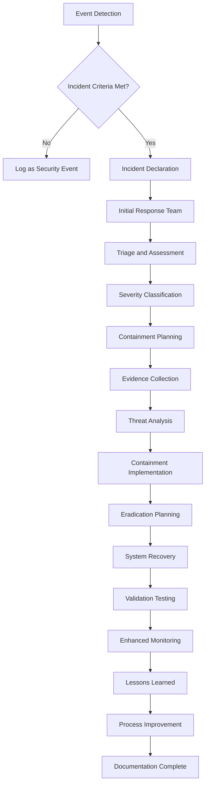
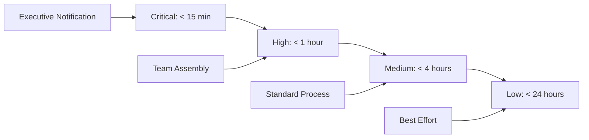

# Module 6: Incident Response

Incident Response (IR) represents the organized approach to addressing and managing cybersecurity incidents to minimize damage, reduce recovery time, and prevent future occurrences. This module covers the complete IR lifecycle from preparation through post-incident improvement.

---

## 🎯 Learning Objectives

By completing this module, you will understand:
- IR fundamentals and organizational maturity models
- Industry-standard frameworks (NIST SP 800-61, SANS methodology)
- Complete incident lifecycle from detection through lessons learned
- Specialized incident types including APTs, insider threats, and data breaches
- Modern IR technologies including SIEM, SOAR, and automation platforms
- Legal, regulatory, and communication requirements for effective response

---

## 📚 Module Contents

### Foundation and Frameworks
- [**01: Introduction to Incident Response**](./01-introduction-to-incident-response.md)
  - Defining security incidents vs. events
  - Business impact and cost analysis
  - IR team structure and organizational maturity

- [**02: IR Frameworks and Methodologies**](./02-ir-frameworks-and-methodologies.md)
  - NIST SP 800-61 four-phase framework
  - SANS six-step incident response process
  - Incident classification and severity assessment

### Preparation and Response Execution
- [**03: Preparation and Planning**](./03-preparation-and-planning.md)
  - IR policy development and team training
  - Tabletop exercises and communication templates
  - Tool requirements and playbook development

- [**04: Detection and Analysis**](./04-detection-and-analysis.md)
  - Multi-source incident detection methods
  - Triage decision frameworks and evidence collection
  - Attack vector analysis and timeline development

- [**05: Containment Strategies**](./05-containment-strategies.md)
  - Short-term vs. long-term containment planning
  - Network segmentation and system isolation
  - Business continuity integration

### Recovery and Improvement
- [**06: Eradication and Recovery**](./06-eradication-and-recovery.md)
  - Root cause analysis methodologies
  - Malware removal and system hardening
  - Recovery validation and monitoring strategies

- [**07: Post-Incident Activities**](./07-post-incident-activities.md)
  - Structured lessons learned processes
  - Executive and regulatory reporting
  - Continuous process improvement

### Coordination and Specialized Scenarios
- [**08: Communication and Coordination**](./08-communication-and-coordination.md)
  - Internal stakeholder communication protocols
  - External notifications and media relations
  - Law enforcement coordination

- [**09: Specialized Incident Types**](./09-specialized-incident-types.md)
  - Malware and ransomware response
  - Data breach and privacy incident handling
  - Insider threats and APT investigations

- [**10: Tools and Technologies**](./10-tools-and-technologies.md)
  - SIEM configuration and forensic platforms
  - Threat intelligence integration
  - SOAR and response automation

---

## 🔧 Essential Tools and Technologies

| Tool Category | Tools | Purpose | Key Features |
|---------------|-------|---------|---------------|
| **SIEM Platforms** | Splunk, QRadar, Sentinel, ELK | Centralized monitoring and correlation | Real-time alerting, historical analysis |
| **Forensic Tools** | FTK Imager, Volatility, Autopsy, KAPE | Evidence collection and analysis | Memory analysis, disk imaging, artifact parsing |
| **Communication** | Secure messaging, conference systems | Incident coordination | Encrypted channels, stakeholder management |
| **Automation** | SOAR platforms, custom scripts | Response orchestration | Workflow automation, multi-tool integration |
| **Documentation** | Case management, ticketing systems | Incident tracking | Chain of custody, audit trails |
| **Threat Intel** | MISP, TIPs, IOC platforms | Context enhancement | Attribution, IOC correlation, campaign tracking |

---

## 📊 Incident Response Workflow



---

## 🏗️ IR Framework Comparison

| Framework | Phases | Advantages | Best For |
|-----------|--------|------------|----------|
| **NIST SP 800-61** | 4-phase cyclical | Comprehensive, widely adopted | Government, regulated industries |
| **SANS Methodology** | 6-step linear | Practical, detailed procedures | Commercial organizations |
| **ISO/IEC 27035** | 5-phase structured | International standard | Global organizations |
| **Custom Hybrid** | Organization-specific | Tailored to specific needs | Unique operational requirements |

---

## 🔍 Incident Classification Matrix

### Severity Assessment Factors

| Factor | Critical (5) | High (4) | Medium (3) | Low (2) | Minimal (1) |
|--------|-------------|----------|------------|---------|-------------|
| **Business Impact** | Complete service outage | Major degradation | Moderate impact | Minor impact | No service impact |
| **Data Sensitivity** | PII/PHI/Financial exposed | Internal sensitive | Business confidential | Public info | No data involved |
| **System Criticality** | Core production | Important production | Development/test | Isolated systems | Non-production |
| **Threat Sophistication** | APT/Nation-state | Organized crime | Skilled individual | Script kiddie | Accidental |

### Response Timeline Requirements



---

## 📈 Specialized Incident Response

### Ransomware Response Priorities

| Phase | Duration | Key Activities | Success Criteria |
|-------|----------|----------------|------------------|
| **Immediate** | 0-30 minutes | Network isolation, scope assessment | Spread contained, executive notified |
| **Analysis** | 30 min - 4 hours | Malware identification, impact assessment | Threat characterized, recovery plan |
| **Recovery** | 4-48 hours | System restoration, validation testing | Services restored, security validated |
| **Monitoring** | 48+ hours | Enhanced surveillance, threat hunting | No reinfection, lessons documented |

### Data Breach Response Framework
- **Risk Assessment** - Impact analysis and regulatory requirements
- **Stakeholder Notification** - Internal, external, and regulatory communications
- **Evidence Preservation** - Legal hold and forensic collection procedures
- **Remediation Planning** - Technical fixes and process improvements

### APT Investigation Approach
- **Intelligence-Led Analysis** - Threat actor profiling and campaign mapping
- **Coordinated Response** - Simultaneous multi-system containment
- **Long-term Monitoring** - Extended surveillance and threat hunting
- **Attribution Support** - Evidence collection for potential prosecution

---

## ⚖️ Legal and Regulatory Integration

### Notification Requirements Matrix

| Regulation | Jurisdiction | Timeline | Requirements |
|------------|--------------|----------|--------------|
| **GDPR** | EU/EEA | 72 hours (regulator) | Detailed incident description, impact assessment |
| **CCPA** | California, US | Without unreasonable delay | Consumer notification, AG if >500 residents |
| **HIPAA** | US Healthcare | 60 days (HHS) | Risk assessment, affected individuals |
| **PCI DSS** | Payment cards | Immediately (brands) | Forensic investigation, remediation plan |

### Evidence Management Standards
- **Chain of Custody** - Documented handling from collection to court
- **Legal Hold** - Preservation of relevant documents and data
- **Expert Testimony** - Technical witness preparation and qualification
- **Discovery Support** - Evidence production for legal proceedings

---

## 🧠 IR Team Development

### Core Competency Framework

| Role | Technical Skills | Soft Skills | Certification Targets |
|------|-----------------|-------------|----------------------|
| **IR Manager** | IR frameworks, risk management | Leadership, communication | CISSP, CISM, GCIH |
| **Security Analyst** | SIEM, threat hunting, forensics | Analytical thinking, documentation | GCIH, GNFA, CySA+ |
| **Forensic Specialist** | Digital forensics, malware analysis | Attention to detail, persistence | GCFA, GCFE, EnCE |
| **Communications Lead** | Crisis communication, media relations | Public speaking, writing | No specific technical certs |

### Training and Exercise Program
- **Initial Training** - 40 hours covering IR fundamentals and organization-specific procedures
- **Ongoing Development** - 20 hours annually including advanced techniques and emerging threats
- **Tabletop Exercises** - Quarterly scenario-based discussion exercises
- **Functional Exercises** - Semi-annual hands-on simulations with actual tools

---

## 📊 IR Metrics and Performance

### Key Performance Indicators

| Metric | Target | Measurement Method | Improvement Actions |
|--------|--------|--------------------|-------------------|
| **Mean Time to Detection** | < 4 hours | Time from incident start to detection | Enhanced monitoring, threat hunting |
| **Mean Time to Response** | < 30 minutes | Time from detection to initial response | Process automation, staff training |
| **Mean Time to Containment** | < 2 hours | Time from response to threat containment | Playbook optimization, tool integration |
| **False Positive Rate** | < 5% | Alerts requiring no action / total alerts | Rule tuning, analyst training |

### Maturity Assessment Framework
```
Level 1 (Initial): Ad-hoc processes, reactive approach
    ↓
Level 2 (Managed): Documented procedures, defined roles
    ↓  
Level 3 (Defined): Standardized processes, regular testing
    ↓
Level 4 (Quantitative): Metrics-driven, continuous improvement
    ↓
Level 5 (Optimizing): Innovation, industry leadership
```

---

## 🔗 Essential Resources

### Official Documentation
- [NIST SP 800-61](https://csrc.nist.gov/publications/detail/sp/800-61/rev-2/final) - Computer Security Incident Handling Guide
- [SANS Incident Response Process](https://www.sans.org/white-papers/504/) - Six-Step Incident Response Methodology
- [MITRE ATT&CK](https://attack.mitre.org/) - Adversary tactics and techniques framework

### Training and Certification
- [SANS FOR508](https://www.sans.org/cyber-security-courses/advanced-incident-response-threat-hunting-digital-forensics/) - Advanced Incident Response
- [GCIH Certification](https://www.giac.org/certification/certified-incident-handler-gcih) - GIAC Certified Incident Handler
- [EC-Council CHFI](https://www.eccouncil.org/programs/computer-hacking-forensic-investigator-chfi/) - Computer Hacking Forensic Investigator

### Tools and Platforms
- [TheHive](https://thehive-project.org/) - Open source incident response platform
- [MISP](https://www.misp-project.org/) - Malware Information Sharing Platform
- [Volatility](https://www.volatilityfoundation.org/) - Advanced memory forensics framework

### Legal and Compliance
- [State Breach Notification Laws](https://www.ncsl.org/research/telecommunications-and-information-technology/security-breach-notification-laws.aspx) - US state requirements
- [GDPR Guidance](https://edpb.europa.eu/our-work-tools/our-documents/guidelines_en) - European Data Protection Board
- [Incident Response Legal Guide](https://www.sans.org/white-papers/33901/) - Legal considerations for IR teams

### Industry Resources  
- [FIRST.org](https://www.first.org/) - Forum of Incident Response and Security Teams
- [US-CERT](https://www.cisa.gov/uscert) - United States Computer Emergency Readiness Team
- [ENISA](https://www.enisa.europa.eu/) - European Union Agency for Cybersecurity

---

[⬆️ Back to Main Course](../README.md)
