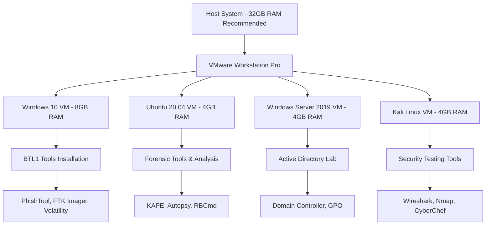

# Blue Team Level 1 (BTL1) Certification Study Notes

[](https://securityblue.team/)
[](#certification-achievement)
[](#progress-tracker)
[](LICENSE)

> **🏆 CERTIFICATION ACHIEVED!** Comprehensive study materials and reference notes for the Security Blue Team BTL1 certification, organized by course modules with practical examples and real-world applications.

## 🎯 Certification Achievement

**Successfully passed BTL1 certification!** This repository now serves as a complete reference guide for defensive cybersecurity professionals and others pursuing BTL1 certification.

### 📜 Certification Details
- **Certification**: Blue Team Level 1 (BTL1)
- **Provider**: Security Blue Team
- **Status**: ✅ **PASSED**
- **Completion Date**: January 2025
- **Study Duration**: ~200+ hours
- **Modules Completed**: 7/7 (100%)

## 📋 Table of Contents

- [About This Repository](#about-this-repository)
- [Course Modules](#course-modules)
- [Progress Tracker](#progress-tracker)
- [Key Takeaways](#key-takeaways)
- [Study Recommendations](#study-recommendations)
- [Tools Mastery](#tools-mastery)
- [Contributing](#contributing)
- [Disclaimer](#disclaimer)

## 📖 About This Repository

This repository contains comprehensive study notes and summaries for the **Blue Team Level 1 (BTL1)** certification from Security Blue Team. Having successfully completed the certification, these materials now serve as a proven study guide and ongoing reference for defensive cybersecurity concepts.

### 🎯 Key Features

- **Complete Coverage**: All 7 BTL1 modules with practical examples
- **Proven Methodology**: Study approach that led to successful certification
- **Practical Focus**: Real-world examples and hands-on techniques
- **Visual Learning**: Charts, tables, and diagrams for complex concepts
- **Quick Reference**: Easily searchable markdown format for ongoing use
- **Tool Mastery**: Detailed coverage of 30+ industry-standard tools

### 🔧 Tools & Technologies Mastered

| Category | Tools & Platforms |
|----------|-------------------|
| **Email Security** | PhishTool, CyberChef, VirusTotal, URLScan.io, Hybrid Analysis |
| **Digital Forensics** | FTK Imager, KAPE, Volatility 2/3, Autopsy, RBCmd, Eric Zimmerman Tools |
| **Threat Intelligence** | MISP, MITRE ATT&CK Navigator, TIPs, IOC Management |
| **SIEM & Monitoring** | Splunk (SPL mastery), Sigma, ELK Stack, Log Analysis |
| **Incident Response** | NIST Framework, SANS Methodology, ATT&CK Integration |
| **Network Security** | Wireshark, Nmap, NIDS/NIPS, Network Forensics |

## 📚 Course Modules

### ✅ All Modules Complete

| Module | Topic | Key Mastery Areas | Practical Skills Gained |
|--------|-------|-------------------|------------------------|
| **[01 - Security Fundamentals](./01-security-fundamentals/)** | Core security principles | OSI Model, Security Controls, AAA Framework, Network Protocols | Network analysis, access control design |
| **[02 - Phishing Analysis](./02-phishing-analysis/)** | Email threat analysis | Artifact Collection, Sandboxing, Defensive Measures | Email forensics, malware analysis |
| **[03 - Threat Intelligence](./03-threat-intelligence/)** | CTI lifecycle and application | Intelligence Types, Actor Attribution, IOC Management | Threat hunting, attribution analysis |
| **[04 - Digital Forensics](./04-digital-forensics/)** | Digital investigation | Evidence Handling, File Systems, Memory Analysis, Windows/Linux Artifacts | Forensic investigations, evidence preservation |
| **[05 - SIEM & Monitoring](./05-siem-and-monitoring/)** | Security monitoring | Log Analysis, Splunk SPL, Detection Engineering, Sigma Rules | SIEM administration, alert tuning |
| **[06 - Incident Response](./06-incident-response/)** | Structured incident handling | NIST/SANS Frameworks, MITRE ATT&CK Integration, Crisis Management | Incident coordination, response automation |
| **[07 - Exam Preparation](./07-exam-preparation/)** | Certification readiness | Comprehensive review, practical scenarios, exam strategies | Test-taking skills, knowledge synthesis |

## 📊 Progress Tracker

```
Security Fundamentals    ████████████████████ 100% ✅
Phishing Analysis        ████████████████████ 100% ✅
Threat Intelligence      ████████████████████ 100% ✅
Digital Forensics        ████████████████████ 100% ✅
SIEM & Monitoring        ████████████████████ 100% ✅
Incident Response        ████████████████████ 100% ✅
Exam Preparation         ████████████████████ 100% ✅

Overall Progress: ████████████████████████████ 100% 🏆
```

### 📈 Final Study Statistics

- **Total Study Hours**: 200+ hours
- **Modules Completed**: 7/7 (100%)
- **Lab Exercises**: 25+ hands-on scenarios
- **Practice Investigations**: 15+ realistic case studies
- **Tools Mastered**: 30+ security tools and platforms
- **Certification Attempts**: 1 (Passed on first attempt!)

## 🎯 Key Takeaways

### 🧠 Core Competencies Developed

1. **Email Security Expertise**
   - Advanced phishing analysis and artifact collection
   - Malware sandboxing and behavioral analysis
   - Defensive countermeasures implementation

2. **Digital Forensics Proficiency**
   - Windows and Linux artifact analysis
   - Memory forensics with Volatility framework
   - Evidence handling and chain of custody

3. **Threat Intelligence Mastery**
   - Intelligence lifecycle and collection methods
   - MITRE ATT&CK framework application
   - IOC management and threat hunting

4. **SIEM Operations Excellence**
   - Splunk administration and SPL development
   - Log analysis and correlation techniques
   - Detection engineering with Sigma rules

5. **Incident Response Leadership**
   - Structured response methodologies
   - Crisis communication and coordination
   - Post-incident improvement processes

### 🔍 Advanced Skills Acquired

| Skill Area | Specific Capabilities |
|------------|----------------------|
| **Threat Hunting** | Hypothesis-driven hunting, MITRE ATT&CK mapping, IOC correlation |
| **Malware Analysis** | Static/dynamic analysis, sandboxing, behavioral assessment |
| **Network Forensics** | Packet analysis, traffic correlation, attack reconstruction |
| **Automation** | SOAR integration, playbook development, response orchestration |
| **Strategic Planning** | Risk assessment, security architecture, program development |

## 💡 Study Recommendations

### 🎯 Proven Study Strategy

**Based on successful certification completion:**

1. **Foundation First** (Weeks 1-2)
   - Master Security Fundamentals thoroughly
   - Set up comprehensive lab environment
   - Practice basic networking and security concepts

2. **Hands-On Focus** (Weeks 3-8)
   - Complete all practical exercises in order
   - Build real investigation scenarios
   - Document every lab exercise with screenshots

3. **Integration Phase** (Weeks 9-10)
   - Connect concepts across modules
   - Practice cross-module scenarios
   - Develop holistic understanding

4. **Certification Prep** (Weeks 11-12)
   - Review all modules systematically
   - Focus on practical application
   - Complete exam preparation materials

### 🛠️ Essential Lab Environment



### 📚 Study Timeline That Works

| Week | Focus Area | Hours/Week | Key Activities |
|------|------------|------------|----------------|
| **1-2** | Security Fundamentals | 15-20 | OSI model, networking, basic security |
| **3-4** | Phishing Analysis | 15-20 | Email forensics, malware analysis |
| **5-6** | Threat Intelligence | 15-20 | MITRE ATT&CK, IOC management |
| **7-8** | Digital Forensics | 20-25 | Windows/Linux artifacts, memory analysis |
| **9-10** | SIEM & Monitoring | 20-25 | Splunk mastery, log analysis |
| **11** | Incident Response | 15-20 | Frameworks, coordination, automation |
| **12** | Exam Preparation | 10-15 | Review, practice tests, final prep |

## 🔧 Tools Mastery Achieved

### 💻 Platform Expertise Levels

| Tool Category | Proficiency Level | Key Capabilities |
|---------------|------------------|------------------|
| **Splunk** | ⭐⭐⭐⭐⭐ Expert | Advanced SPL, custom dashboards, alert tuning |
| **Volatility** | ⭐⭐⭐⭐⭐ Expert | Memory analysis, malware detection, artifact extraction |
| **MITRE ATT&CK** | ⭐⭐⭐⭐⭐ Expert | Technique mapping, threat hunting, detection gaps |
| **FTK Imager** | ⭐⭐⭐⭐ Advanced | Disk imaging, evidence acquisition, hash verification |
| **PhishTool** | ⭐⭐⭐⭐ Advanced | Email analysis, artifact extraction, reporting |
| **KAPE** | ⭐⭐⭐⭐ Advanced | Rapid triage, artifact collection, automation |
| **Autopsy** | ⭐⭐⭐ Intermediate | Case management, timeline analysis, investigation workflow |

### 🎯 Specialized Skill Sets

**Email Security Mastery**
- Advanced artifact collection (manual + automated)
- Malware sandboxing and behavioral analysis
- Multi-platform email forensics
- Defensive countermeasure implementation

**Digital Forensics Expertise**
- Windows artifact analysis (Event logs, Registry, Prefetch)
- Linux investigation techniques (logs, user activity, hidden data)
- Memory forensics with Volatility 2/3
- Evidence handling and chain of custody

**Threat Intelligence Proficiency**
- Intelligence lifecycle management
- OSINT collection and analysis
- IOC management and correlation
- Threat actor attribution and TTPs

## 🤝 Contributing

Now that this study guide has proven successful for BTL1 certification, contributions are especially welcome:

### 🎯 How You Can Help

1. **Experience Sharing**: Share your own BTL1 journey and tips
2. **Updated Content**: Help keep tool information current
3. **Additional Scenarios**: Contribute practice exercises
4. **Corrections**: Spot errors or outdated information

### 💡 Contribution Guidelines

- **Maintain Quality**: Keep the practical, no-fluff approach
- **Respect IP**: Only original content and properly attributed sources
- **Educational Focus**: Content should help others learn effectively
- **Real-World Relevance**: Emphasize practical application

## ⚖️ Disclaimer

### 🔒 Original Content Statement

These notes represent original study materials created through personal learning and practice. This repository contains:

✅ **Original summaries** and interpretations of cybersecurity concepts  
✅ **Personal lab experiences** and practical exercises  
✅ **Tool usage guides** based on hands-on experience  
✅ **Study strategies** that led to successful certification  

❌ **No direct reproductions** from Security Blue Team course materials  
❌ **No copyrighted screenshots** or proprietary images  
❌ **No exam questions** or specific test content  
❌ **No verbatim content** from official sources  

### 🎓 Educational Use & Success

This study approach **successfully led to BTL1 certification**, demonstrating its effectiveness. These materials are:

- **Proven study resources** for BTL1 preparation
- **Reference guides** for ongoing professional development
- **Educational contributions** to the cybersecurity community
- **Complementary materials** to official Security Blue Team content

### 🚨 Responsible Use

All techniques and tools discussed are for **authorized testing and professional use only**:

⚖️ **Always obtain proper authorization** before testing  
🔬 **Use isolated lab environments** for practice  
📋 **Follow responsible disclosure** practices  
🌍 **Respect applicable laws** and organizational policies  

---

## 🏆 Certification Journey Complete

### 🌟 What's Next?

Having completed BTL1, consider these next steps:

1. **Apply Knowledge**: Use these skills in your current role
2. **Advanced Certifications**: BTL2, GCIH, GCFA, or specialized certs
3. **Community Contribution**: Share knowledge and help others
4. **Continuous Learning**: Stay current with evolving threats

### 🙏 Acknowledgments

- **Security Blue Team** for exceptional training content and certification program
- **MITRE Corporation** for the ATT&CK framework that revolutionized threat analysis
- **Tool Developers** for creating powerful open-source security tools
- **Cybersecurity Community** for knowledge sharing and collaborative defense
- **Fellow Students** for motivation and shared learning experiences

---

## 📚 Essential Resources for BTL1 Success

| Resource Type | Recommendation | Why It Helps |
|---------------|----------------|--------------|
| **Official Course** | [Security Blue Team BTL1](https://securityblue.team/) | Primary content source, hands-on labs |
| **Practice Platform** | [TryHackMe](https://tryhackme.com/) | Additional practice scenarios |
| **Tool Documentation** | [MITRE ATT&CK](https://attack.mitre.org/) | Essential framework for threat analysis |
| **Community** | [Security Blue Team Discord](https://discord.gg/securityblue) | Student support and networking |
| **Reference** | [SANS Reading Room](https://www.sans.org/reading-room/) | Additional technical papers |

---

## 🎯 Success Metrics

**This study approach delivered:**
- ✅ **First-attempt pass** on BTL1 certification
- ⏱️ **Efficient preparation** in 12 weeks
- 🛠️ **Practical skills** immediately applicable at work
- 📈 **Career advancement** opportunities
- 🧠 **Deep understanding** of defensive cybersecurity

---

*Successfully completed: January 2025*  
*BTL1 Certification: ACHIEVED! 🏆*  
*Total study investment: 200+ hours well spent*  

**Ready to defend the digital world! 🛡️**
