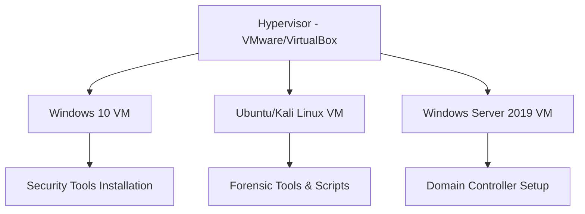

# Blue Team Level 1 (BTL1) Certification Study Notes

[](https://securityblue.team/)
[](#progress-tracker)
[](LICENSE)

> Comprehensive study materials and reference notes for the Security Blue Team BTL1 certification, organized by course modules with practical examples and real-world applications.

## 📋 Table of Contents

- [About This Repository](#about-this-repository)
- [Course Modules](#course-modules)
- [Progress Tracker](#progress-tracker)
- [Study Tips](#study-tips)
- [Contributing](#contributing)
- [Disclaimer](#disclaimer)

## 📖 About This Repository

This repository contains my personal study notes and summaries for the **Blue Team Level 1 (BTL1)** certification from Security Blue Team. The content is structured to align with official course modules and serves as a comprehensive reference for defensive cybersecurity concepts.

### 🎯 Key Features

- **Modular Organization**: Content organized by official BTL1 course structure
- **Practical Focus**: Real-world examples and hands-on techniques
- **Visual Learning**: Charts, tables, and diagrams for complex concepts
- **Quick Reference**: Easily searchable markdown format
- **Tool Coverage**: Detailed coverage of industry-standard tools and platforms

### 🔧 Tools & Technologies Covered

| Category | Tools |
|----------|-------|
| **Email Security** | PhishTool, CyberChef, VirusTotal, URLScan.io |
| **Digital Forensics** | FTK Imager, KAPE, Volatility, Autopsy, RBCmd |
| **Threat Intelligence** | MISP, MITRE ATT&CK, OSINT frameworks |
| **Network Security** | Wireshark, Nmap, SIEM platforms |
| **Incident Response** | Playbooks, forensic methodologies |

## 📚 Course Modules

### ✅ Completed Modules

| Module | Topic | Key Concepts | Status |
|--------|-------|-------------|---------|
| **[01 - Security Fundamentals](./01-security-fundamentals/)** | Core security principles and networking | OSI Model, Security Controls, AAA Framework | ✅ Complete |
| **[02 - Phishing Analysis](./02-phishing-analysis/)** | Email threat analysis and response | Artifact Collection, Sandboxing, Defensive Measures | ✅ Complete |
| **[03 - Threat Intelligence](./03-threat-intelligence/)** | Cyber threat intelligence lifecycle | Intelligence Types, Actor Attribution, IOCs | ✅ Complete |
| **[04 - Digital Forensics](./04-digital-forensics/)** | Digital evidence and investigation | Evidence Handling, File Systems, Memory Analysis | ✅ Complete |
| **[05 - SIEM & Monitoring](./05-siem-and-monitoring/)** | Security monitoring and log analysis | Log Management, Correlation Rules, Dashboards | ✅ Complete |

### 🚧 In Progress

| Module | Topic | Expected Completion |
|--------|-------|-------------------|
| **[06 - Incident Response](./06-incident-response/)** | Structured incident handling | TBD |

### 📝 Planned

| Module | Topic | Priority |
|--------|-------|----------|
| **[07 - Exam Preparation](./07-exam-preparation/)** | Final review and practice | High |

## 📊 Progress Tracker

```
Security Fundamentals    ████████████████████ 100%
Phishing Analysis        ████████████████████ 100%
Threat Intelligence      ████████████████████ 100%
Digital Forensics        ████████████████████ 100%
SIEM & Monitoring        ████████████████████ 100%
Incident Response        ░░░░░░░░░░░░░░░░░░░░   0%
Exam Preparation         ░░░░░░░░░░░░░░░░░░░░   0%

Overall Progress: ████████████████████████░░░░ 83%
```

### 📈 Study Statistics

- **Total Study Hours**: ~150 hours
- **Modules Completed**: 5/7 (71%)
- **Lab Exercises**: 15+ hands-on scenarios
- **Practice Scenarios**: Phishing investigations, forensic analysis
- **Tools Mastered**: 20+ security tools and platforms

## 💡 Study Tips

### 🎯 Effective Study Strategies

1. **Hands-On Practice**: Set up lab environments for each module
2. **Real-World Scenarios**: Practice with actual malware samples (safely)
3. **Documentation**: Take detailed notes during practical exercises
4. **Community Engagement**: Join Security Blue Team Discord for support
5. **Regular Review**: Revisit completed modules periodically

### 🛠️ Recommended Lab Setup



### 📝 Note-Taking Strategy

- **Concept Mapping**: Visual relationships between topics
- **Practical Examples**: Real-world application scenarios
- **Tool Commands**: Quick reference for common operations
- **Troubleshooting**: Common issues and solutions

## 🤝 Contributing

While these are personal study notes, contributions and suggestions are welcome:

1. **Error Corrections**: Spot a mistake? Open an issue
2. **Additional Resources**: Know of helpful tools or references?
3. **Practice Scenarios**: Share interesting lab exercises
4. **Study Tips**: Effective learning strategies

### 📧 Contact

- **GitHub Issues**: For technical corrections or suggestions
- **Discussions**: Use GitHub Discussions for study-related questions

## ⚖️ Disclaimer

### 🔒 Original Content

These notes represent original summaries and interpretations created for educational purposes. They do not contain:

- Direct reproductions from Security Blue Team course materials
- Copyrighted screenshots or images
- Verbatim content from official sources
- Exam questions or answers

### 🎓 Educational Use

All intellectual property belongs to Security Blue Team and respective tool vendors. These notes are:

- **Personal study materials** for BTL1 preparation
- **Reference guides** for defensive security concepts
- **Educational resources** for the cybersecurity community
- **Not official** Security Blue Team content

### 🚨 Safety Notice

Some techniques and tools discussed in these notes are for **authorized testing only**. Always:

- Obtain proper authorization before testing
- Use isolated lab environments
- Follow responsible disclosure practices
- Respect applicable laws and regulations

---

## 🌟 Acknowledgments

- **Security Blue Team** for creating excellent training content
- **MITRE Corporation** for the ATT&CK framework
- **Tool Developers** for creating amazing open-source security tools
- **Cybersecurity Community** for knowledge sharing and support

---

### 📚 Additional Resources

| Resource Type | Link | Description |
|---------------|------|-------------|
| **Official Course** | [Security Blue Team](https://securityblue.team/) | Original BTL1 certification program |
| **Practice Labs** | [TryHackMe](https://tryhackme.com/) | Hands-on cybersecurity challenges |
| **Documentation** | [MITRE ATT&CK](https://attack.mitre.org/) | Adversary tactics and techniques |
| **Tools** | [SANS DFIR Tools](https://www.sans.org/tools/) | Digital forensics and incident response tools |

---

*Last Updated: January 2025*
*Study Progress: 5/7 modules complete*

**Happy Learning! 🔐**
